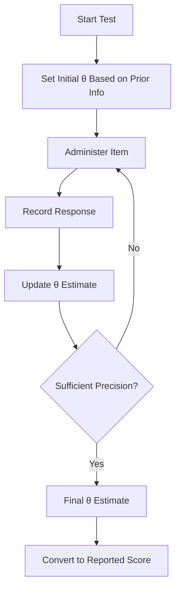
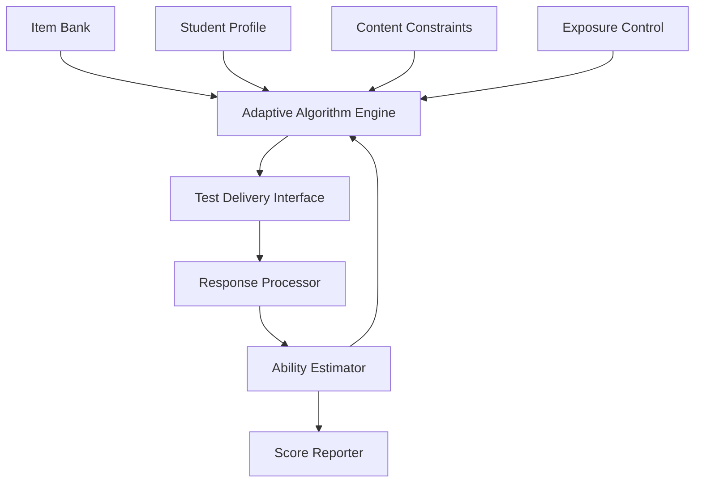

# Adaptive Testing using IRT

Adaptive Testing Using Item Response Theory (IRT)

### Overview

The LearnerLabs SAT Prep App implements a sophisticated adaptive testing system based on Item Response Theory (IRT). This document provides a comprehensive explanation of how IRT is used to deliver personalized, efficient, and precise assessments that adapt to each student's ability level in real-time.

### Fundamentals of Item Response Theory

#### What is IRT?

Item Response Theory is a psychometric framework that describes the relationship between:

* A student's underlying ability (latent trait)
* The characteristics of test items (questions)
* The probability of a correct response

Unlike classical test theory, which focuses on test-level statistics, IRT operates at the item level, allowing for more precise measurement and adaptive testing.

#### IRT Models Implemented

The app implements three primary IRT models:

1. **1-Parameter Logistic Model (1PL/Rasch)**
2. Considers only item difficulty
3. Simplest model with good robustness
4. Used for initial calibration and basic skills
5. **2-Parameter Logistic Model (2PL)**
6. Considers item difficulty and discrimination
7. Better fit for most SAT-style questions
8. Primary model for the adaptive system
9. **3-Parameter Logistic Model (3PL)**
10. Considers difficulty, discrimination, and guessing
11. Used for multiple-choice questions
12. Accounts for correct answers by guessing

#### Key IRT Parameters

The system tracks and utilizes several key parameters:

**Item Parameters**

1. **Difficulty (b)**:
2. Ranges typically from -3 (very easy) to +3 (very difficult)
3. Represents the ability level at which a student has a 50% probability of answering correctly
4. Calibrated for each question in the item bank
5. **Discrimination (a)**:
6. Typically ranges from 0.5 to 2.5
7. Indicates how well an item differentiates between students of different ability levels
8. Higher values mean the item better distinguishes between ability levels
9. **Guessing (c)**:
10. Ranges from 0 to 1 (typically 0.2-0.25 for 4-option MCQs)
11. Represents the probability of getting the item correct by random guessing
12. Applied primarily to multiple-choice questions

**Person Parameter**

1. **Ability (θ - theta)**:
2. Typically scaled from -3 (low ability) to +3 (high ability)
3. Represents the student's proficiency level
4. Continuously updated during adaptive testing

#### IRT Functions

The system utilizes several key IRT functions:

**Item Characteristic Curve (ICC)**

The probability of a correct response given ability level and item parameters:

For the 3PL model:

```plaintext
P(θ) = c + (1-c) / (1 + e^(-1.7a(θ-b)))
```

Where:

* P(θ) is the probability of a correct response
* θ is the student's ability
* a, b, c are the item parameters
* e is the base of the natural logarithm

**Item Information Function (IIF)**

Measures how much information an item provides at different ability levels:

```plaintext
I(θ) = a² * (P(θ) - c)² / ((1-c)² * P(θ) * (1-P(θ)))
```

**Test Information Function (TIF)**

The sum of all item information functions in a test:

```plaintext
TIF(θ) = ∑I_i(θ)
```

### Item Calibration Process

#### Initial Item Bank Development

The app's item bank undergoes a rigorous calibration process:

1. **Content Development**:
2. Items created by subject matter experts
3. Aligned with SAT specifications
4. Tagged with content domains and skills
5. **Pilot Testing**:
6. Items administered to representative sample
7. Fixed-form tests with common items
8. Large sample sizes (>1000 students per item)
9. **Classical Analysis**:
10. P-values (proportion correct)
11. Point-biserial correlations
12. Distractor analysis
13. Flagging of problematic items

#### IRT Calibration

The calibration process employs sophisticated psychometric methods:

1. **Model Selection**:
2. Item type determines appropriate model
3. Model fit statistics evaluated
4. Parsimony considerations
5. **Parameter Estimation**:
6. Marginal maximum likelihood estimation (MMLE)
7. Expectation-maximization algorithm
8. BILOG-MG or similar software packages
9. **Scale Linking**:
10. Common item equating
11. Mean/sigma or Stocking-Lord methods
12. Transformation to SAT score scale

#### Ongoing Calibration

The system continuously refines item parameters:

1. **Parameter Drift Detection**:
2. Monitoring for changes in parameters over time
3. Statistical tests for drift significance
4. Flagging items for review
5. **New Item Calibration**:
6. Online calibration during operational testing
7. Seeding new items into adaptive tests
8. Bayesian updating of parameter estimates
9. **Quality Control**:
10. Regular psychometric reviews
11. Differential item functioning (DIF) analysis
12. Content alignment verification

### Ability Estimation

#### Initial Ability Estimation

The system establishes a starting point for each student:

1. **Prior Information**:
2. Diagnostic test results
3. Self-reported preparation level
4. Previous standardized test scores
5. Grade level and course history
6. **Bayesian Priors**:
7. Informative priors based on student characteristics
8. Population distribution considerations
9. Conservative initial estimates to avoid extreme starting points

#### Interim Ability Estimation

During adaptive testing, ability estimates are continuously updated:

1. **Maximum Likelihood Estimation (MLE)**:
2. Used when sufficient responses are available
3. Finds θ that maximizes the likelihood function:

```mathml
L(θ) = ∏ P_i(θ)^u_i * (1-P_i(θ))^(1-u_i)
```

Where u\_i is 1 for correct and 0 for incorrect responses

2. **Expected A Posteriori (EAP)**:
3. Used for early in the test or with sparse data
4. Incorporates prior distribution information
5. More stable than MLE with few items
6. **Maximum A Posteriori (MAP)**:
7. Compromise between MLE and EAP
8. Used for intermediate stages of testing
9. Balances prior information with response data

#### Ability Estimation Algorithm



#### Precision Metrics

The system tracks estimation precision through:

1. **Standard Error of Measurement (SEM)**:

```plaintext
SEM(θ) = 1/√(Information(θ))
```

2. **Confidence Intervals**:

```plaintext
CI = θ ± (z * SEM)
```

Where z is the z-score for desired confidence level

3. **Reliability Indices**:
4. Test-retest reliability estimates
5. Internal consistency measures
6. Decision consistency for mastery decisions

### Adaptive Item Selection

#### Item Selection Algorithms

The system employs several item selection algorithms depending on the testing purpose:

1. **Maximum Information**:
2. Selects items that provide maximum information at current θ estimate
3. Optimal for precision but can lead to predictable item exposure
4. Primary algorithm for diagnostic assessments
5. **a-Stratified**:
6. Stratifies item bank by discrimination parameter
7. Selects from progressively higher strata as test progresses
8. Balances measurement precision with item exposure control
9. **Shadow Test Approach**:
10. Constructs optimal full-length test meeting all constraints
11. Selects next item from current shadow test
12. Recalculates shadow test after each response
13. Used for full-length practice tests

#### Content Balancing

The system ensures appropriate content coverage:

1. **Content Specification Constraints**:
2. Predefined proportions of content domains
3. Skill coverage requirements
4. Cognitive complexity distribution
5. **Constrained CAT Algorithm**:
6. Weighted deviation model
7. Penalty function for constraint violations
8. Multi-objective optimization
9. **Adaptive Content Balancing**:
10. Adjusts content proportions based on performance
11. Emphasizes areas of weakness
12. Maintains minimum coverage across all domains

#### Exposure Control

To maintain test security and item bank integrity:

1. **Randomesque Procedure**:
2. Selects randomly from top-n most informative items
3. Adjustable n parameter based on bank size
4. Balance between optimality and unpredictability
5. **Sympson-Hetter Method**:
6. Probabilistic exposure control
7. Pre-computed exposure control parameters
8. Targets maximum exposure rates
9. **Item Eligibility Tracking**:
10. Cooldown periods for recently used items
11. Student-specific exposure tracking
12. Eligibility rules based on previous exposures

### Test Assembly and Termination

#### Adaptive Test Structure

The system supports various adaptive test structures:

1. **Variable-Length CAT**:
2. Continues until precision threshold is met
3. Different lengths for different students
4. Optimal measurement efficiency
5. **Fixed-Length CAT**:
6. Predetermined number of items
7. Comparable testing experience
8. Used for full-length practice tests
9. **Multi-Stage Testing (MST)**:
10. Pre-assembled modules of items
11. Routing between modules based on performance
12. Balance between adaptation and test review capability

#### Termination Criteria

Tests may terminate based on several criteria:

1. **Precision-Based**:
2. Terminates when SEM falls below threshold
3. Different thresholds for different score regions
4. Ensures consistent measurement precision
5. **Information-Based**:
6. Terminates when cumulative information exceeds threshold
7. Related to reliability requirements
8. Ensures sufficient measurement quality
9. **Hybrid Approaches**:
10. Minimum and maximum test length constraints
11. Precision targets within length constraints
12. Content coverage verification

#### Scoring and Reporting

The final ability estimate is transformed into meaningful scores:

1. **Score Transformation**:
2. IRT θ scale to SAT score scale (400-1600)
3. Section scores (200-800)
4. Subscores for content domains
5. **Score Precision**:
6. Conditional standard error of measurement
7. Confidence bands on score reports
8. Reliability indices
9. **Diagnostic Reporting**:
10. Skill mastery profiles
11. Strength/weakness identification
12. Next steps recommendations

### Technical Implementation

#### System Architecture

The adaptive testing system consists of several components:

```mermaid
Adaptive Testing System Architecture.download-icon {
            cursor: pointer;
            transform-origin: center;
        }
        .download-icon .arrow-part {
            transition: transform 0.35s cubic-bezier(0.35, 0.2, 0.14, 0.95);
             transform-origin: center;
        }
        button:has(.download-icon):hover .download-icon .arrow-part, button:has(.download-icon):focus-visible .download-icon .arrow-part {
          transform: translateY(-1.5px);
        }
        #mermaid-diagram-r1eaq{font-family:var(--font-geist-sans);font-size:12px;fill:#000000;}#mermaid-diagram-r1eaq .error-icon{fill:#552222;}#mermaid-diagram-r1eaq .error-text{fill:#552222;stroke:#552222;}#mermaid-diagram-r1eaq .edge-thickness-normal{stroke-width:1px;}#mermaid-diagram-r1eaq .edge-thickness-thick{stroke-width:3.5px;}#mermaid-diagram-r1eaq .edge-pattern-solid{stroke-dasharray:0;}#mermaid-diagram-r1eaq .edge-thickness-invisible{stroke-width:0;fill:none;}#mermaid-diagram-r1eaq .edge-pattern-dashed{stroke-dasharray:3;}#mermaid-diagram-r1eaq .edge-pattern-dotted{stroke-dasharray:2;}#mermaid-diagram-r1eaq .marker{fill:#666;stroke:#666;}#mermaid-diagram-r1eaq .marker.cross{stroke:#666;}#mermaid-diagram-r1eaq svg{font-family:var(--font-geist-sans);font-size:12px;}#mermaid-diagram-r1eaq p{margin:0;}#mermaid-diagram-r1eaq .label{font-family:var(--font-geist-sans);color:#000000;}#mermaid-diagram-r1eaq .cluster-label text{fill:#333;}#mermaid-diagram-r1eaq .cluster-label span{color:#333;}#mermaid-diagram-r1eaq .cluster-label span p{background-color:transparent;}#mermaid-diagram-r1eaq .label text,#mermaid-diagram-r1eaq span{fill:#000000;color:#000000;}#mermaid-diagram-r1eaq .node rect,#mermaid-diagram-r1eaq .node circle,#mermaid-diagram-r1eaq .node ellipse,#mermaid-diagram-r1eaq .node polygon,#mermaid-diagram-r1eaq .node path{fill:#eee;stroke:#999;stroke-width:1px;}#mermaid-diagram-r1eaq .rough-node .label text,#mermaid-diagram-r1eaq .node .label text{text-anchor:middle;}#mermaid-diagram-r1eaq .node .katex path{fill:#000;stroke:#000;stroke-width:1px;}#mermaid-diagram-r1eaq .node .label{text-align:center;}#mermaid-diagram-r1eaq .node.clickable{cursor:pointer;}#mermaid-diagram-r1eaq .arrowheadPath{fill:#333333;}#mermaid-diagram-r1eaq .edgePath .path{stroke:#666;stroke-width:2.0px;}#mermaid-diagram-r1eaq .flowchart-link{stroke:#666;fill:none;}#mermaid-diagram-r1eaq .edgeLabel{background-color:white;text-align:center;}#mermaid-diagram-r1eaq .edgeLabel p{background-color:white;}#mermaid-diagram-r1eaq .edgeLabel rect{opacity:0.5;background-color:white;fill:white;}#mermaid-diagram-r1eaq .labelBkg{background-color:rgba(255, 255, 255, 0.5);}#mermaid-diagram-r1eaq .cluster rect{fill:hsl(0, 0%, 98.9215686275%);stroke:#707070;stroke-width:1px;}#mermaid-diagram-r1eaq .cluster text{fill:#333;}#mermaid-diagram-r1eaq .cluster span{color:#333;}#mermaid-diagram-r1eaq div.mermaidTooltip{position:absolute;text-align:center;max-width:200px;padding:2px;font-family:var(--font-geist-sans);font-size:12px;background:hsl(-160, 0%, 93.3333333333%);border:1px solid #707070;border-radius:2px;pointer-events:none;z-index:100;}#mermaid-diagram-r1eaq .flowchartTitleText{text-anchor:middle;font-size:18px;fill:#000000;}#mermaid-diagram-r1eaq .flowchart-link{stroke:hsl(var(--gray-400));stroke-width:1px;}#mermaid-diagram-r1eaq .marker,#mermaid-diagram-r1eaq marker,#mermaid-diagram-r1eaq marker *{fill:hsl(var(--gray-400))!important;stroke:hsl(var(--gray-400))!important;}#mermaid-diagram-r1eaq .label,#mermaid-diagram-r1eaq text,#mermaid-diagram-r1eaq text>tspan{fill:hsl(var(--black))!important;color:hsl(var(--black))!important;}#mermaid-diagram-r1eaq .background,#mermaid-diagram-r1eaq rect.relationshipLabelBox{fill:hsl(var(--white))!important;}#mermaid-diagram-r1eaq .entityBox,#mermaid-diagram-r1eaq .attributeBoxEven{fill:hsl(var(--gray-150))!important;}#mermaid-diagram-r1eaq .attributeBoxOdd{fill:hsl(var(--white))!important;}#mermaid-diagram-r1eaq .label-container,#mermaid-diagram-r1eaq rect.actor{fill:hsl(var(--white))!important;stroke:hsl(var(--gray-400))!important;}#mermaid-diagram-r1eaq line{stroke:hsl(var(--gray-400))!important;}#mermaid-diagram-r1eaq :root{--mermaid-font-family:var(--font-geist-sans);}Item BankAdaptive Algorithm EngineStudent ProfileTest Delivery InterfaceResponse ProcessorAbility EstimatorScore ReporterContent ConstraintsExposure Control
```



#### Item Bank Structure

The item bank is organized as:

```typescript
type ItemBank = {
  items: TestItem[];
  itemSets: ItemSet[];
  passages: Passage[];
  stimuli: Stimulus[];
}

type TestItem = {
  id: string;
  content: string;
  type: "mcq" | "gridIn" | "essay";
  answers: Answer[];
  correctAnswer: string;
  irtParameters: {
    model: "1PL" | "2PL" | "3PL";
    a?: number; // discrimination
    b: number;  // difficulty
    c?: number; // guessing
  };
  contentDomain: string;
  skills: string[];
  cognitiveLevel: "knowledge" | "application" | "analysis";
  exposureCount: number;
  lastRevised: string;
}
```

#### Adaptive Algorithm Implementation

The core adaptive algorithm is implemented as:

```typescript
function selectNextItem(
  currentAbility: number,
  administeredItems: string[],
  contentConstraints: ContentConstraints,
  exposureControl: ExposureControl
): string {
  // Get eligible items
  const eligibleItems = getEligibleItems(
    administeredItems,
    contentConstraints,
    exposureControl
  );
  
  // Calculate information for each eligible item
  const itemsWithInfo = eligibleItems.map(item => ({
    id: item.id,
    info: calculateInformation(item, currentAbility)
  }));
  
  // Sort by information
  itemsWithInfo.sort((a, b) => b.info - a.info);
  
  // Select from top N items
  const topN = itemsWithInfo.slice(0, RANDOMESQUE_COUNT);
  const selectedIndex = Math.floor(Math.random() * topN.length);
  
  // Update exposure control
  updateExposureControl(topN[selectedIndex].id);
  
  return topN[selectedIndex].id;
}
```

#### Ability Estimation Implementation

The ability estimation algorithm is implemented as:

```typescript
function estimateAbility(
  responses: Response[],
  items: TestItem[],
  priorAbility?: number
): AbilityEstimate {
  if (responses.length < 3) {
    return estimateEAP(responses, items, priorAbility);
  } else if (responses.length < 8) {
    return estimateMAP(responses, items, priorAbility);
  } else {
    return estimateMLE(responses, items);
  }
}

function estimateMLE(responses: Response[], items: TestItem[]): AbilityEstimate {
  // Newton-Raphson implementation for MLE
  let theta = 0; // Start at middle of scale
  let delta = 1;
  
  while (Math.abs(delta) > 0.001) {
    const [ll, ll1, ll2] = calculateLogLikelihoodAndDerivatives(responses, items, theta);
    delta = ll1 / ll2;
    theta -= delta;
    
    // Bound theta to prevent extreme estimates
    theta = Math.max(-3, Math.min(3, theta));
  }
  
  // Calculate standard error
  const information = calculateTestInformation(items, theta);
  const sem = 1 / Math.sqrt(information);
  
  return {
    theta,
    sem,
    confidence95: [theta - 1.96 * sem, theta + 1.96 * sem]
  };
}
```

### Practical Applications

#### Diagnostic Assessment

The IRT-based adaptive testing is used for initial diagnostics:

1. **Broad Coverage**:
2. Samples across all content domains
3. Efficiently identifies skill levels
4. Establishes baseline for study plan
5. **Precision Targeting**:
6. More items near student's ability level
7. Fewer items in mastered or very difficult areas
8. Efficient use of testing time
9. **Confidence-Based Recommendations**:
10. Study recommendations with confidence levels
11. Prioritization based on measurement precision
12. Clear distinction between confirmed and suspected gaps

#### Progress Monitoring

Ongoing adaptive assessments track progress:

1. **Targeted Reassessment**:
2. Focus on previously weak areas
3. Verification of improvement
4. Efficient confirmation of mastery
5. **Adaptive Difficulty Progression**:
6. Gradually increasing difficulty as skills improve
7. Challenge level matched to current ability
8. Motivation through achievable challenge
9. **Growth Measurement**:
10. Precise measurement of ability changes
11. Statistical significance of improvements
12. Growth trajectory prediction

#### Full-Length Practice Tests

Simulated SAT experiences with adaptive elements:

1. **Personalized Starting Point**:
2. Initial difficulty based on current ability
3. Realistic challenge level
4. Efficient use of practice time
5. **Realistic Score Prediction**:
6. IRT-based score estimates
7. Confidence intervals for predicted scores
8. Comparison to official SAT scoring
9. **Targeted Review**:
10. Item-level difficulty and discrimination context
11. Personalized explanation depth
12. Focus on boundary-level items (just beyond current mastery)

### Advantages of IRT-Based Adaptive Testing

#### Measurement Efficiency

1. **Reduced Test Length**:
2. 50-70% fewer items for same precision
3. Focus on informative items
4. Elimination of too easy/difficult items
5. **Increased Precision**:
6. More accurate ability estimates
7. Smaller confidence intervals
8. Better differentiation at all ability levels
9. **Tailored Difficulty**:
10. Appropriate challenge level
11. Reduced frustration and boredom
12. Better engagement during assessment

#### Educational Benefits

1. **Personalized Learning Path**:
2. Precise identification of knowledge gaps
3. Targeted remediation
4. Efficient learning progression
5. **Motivational Aspects**:
6. Success experiences at appropriate level
7. Visible progress through increasing difficulty
8. Confidence building through mastery experiences
9. **Realistic Preparation**:
10. Authentic assessment experience
11. Accurate performance prediction
12. Strategic test-taking development

### Limitations and Considerations

#### Statistical Assumptions

1. **Unidimensionality**:
2. Assumes single underlying ability
3. May be violated in multifaceted skills
4. Addressed through careful item design
5. **Local Independence**:
6. Items should be independent given ability
7. Challenging with passage-based questions
8. Managed through testlet models
9. **Model Fit**:
10. Empirical verification required
11. Ongoing monitoring of fit statistics
12. Model adjustments as needed

#### Practical Challenges

1. **Item Bank Requirements**:
2. Large calibrated item pool needed
3. Continuous refreshment required
4. Significant development investment
5. **Technical Infrastructure**:
6. Real-time computation demands
7. Reliable delivery system
8. Data security considerations
9. **Student Adaptation**:
10. Familiarity with adaptive format
11. Strategy adjustments needed
12. Potential anxiety about difficulty changes

### Future Enhancements

#### Advanced Psychometric Models

1. **Multidimensional IRT**:
2. Simultaneous measurement of multiple abilities
3. Better representation of complex skills
4. More nuanced diagnostic information
5. **Cognitive Diagnostic Models**:
6. Attribute mastery profiles
7. Fine-grained skill diagnosis
8. Explicit mapping to learning progressions
9. **Response Time Modeling**:
10. Joint modeling of accuracy and speed
11. Efficiency metrics
12. Strategic behavior identification

#### AI Integration

1. **Neural Network Parameter Estimation**:
2. Deep learning for response pattern analysis
3. Improved parameter estimation
4. Detection of novel response patterns
5. **Reinforcement Learning Item Selection**:
6. Dynamic optimization of item selection
7. Long-term information maximization
8. Adaptive strategy based on response patterns
9. **Natural Language Processing**:
10. Automated item generation
11. Response analysis for constructed responses
12. Personalized feedback generation

### Conclusion

The LearnerLabs SAT Prep App's implementation of adaptive testing using Item Response Theory represents a sophisticated approach to assessment that provides significant advantages in efficiency, precision, and educational value. By tailoring the testing experience to each student's ability level, the system delivers more accurate measurements while creating a more engaging and effective learning experience.

The integration of IRT-based adaptive testing with the personalized study plan system creates a powerful educational tool that continuously adapts to student needs, providing the right content at the right time to maximize learning efficiency and achievement.

***

_This documentation provides a comprehensive overview of the adaptive testing system using Item Response Theory in the LearnerLabs SAT Prep App. For implementation details or API documentation, please refer to the technical specifications or contact the development team._
