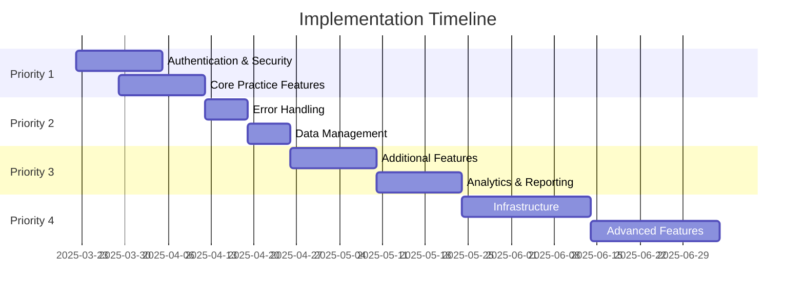

# Implementation Plan for Learner Lab Improvements

## Summary

This document outlines a prioritized implementation plan to address the identified gaps in the Learner Lab application. The plan is organized by priority level and includes specific tasks, technical approaches, and estimated timelines.

### Priority 1: Critical Security & Core Functionality

#### 1. Authentication & Security (1-2 weeks)

**1.1 Implement Proper OAuth Flow**

* **Current Issue**: OAuth implementation is mocked with fake tokens
*   **Solution**:

    ```javascript
    // Replace mock implementation with actual OAuth flow
    const handleOAuthSignup = async (provider: string) => {
      setError(null);
      try {
        setLoading(true);
        
        // Redirect to OAuth provider
        window.location.href = `${API_URL}/auth/${provider}`;
        // The backend will handle the OAuth flow and redirect back with tokens
      } catch (err) {
        setError(err instanceof Error ? err.message : `${provider} authentication failed`);
        setLoading(false);
      }
    };
    ```
* **Backend Changes**:
  * Add OAuth provider configurations
  * Implement callback handlers
  * Create user accounts from OAuth profiles

**1.2 Add Session Persistence**

* **Current Issue**: No session persistence across page reloads
*   **Solution**:

    ```javascript
    // Create a session management service
    export const checkSession = async () => {
      const token = localStorage.getItem('accessToken');
      if (!token) return null;
      
      try {
        const response = await fetch(`${API_URL}/auth/me`, {
          headers: {
            'Authorization': `Bearer ${token}`
          }
        });
        
        if (!response.ok) {
          // Try to refresh the token
          return await refreshAccessToken();
        }
        
        return await response.json();
      } catch (error) {
        console.error('Session check failed:', error);
        return null;
      }
    };
    ```
* **Implementation**:
  * Create a user context provider
  * Add session check on app initialization
  * Implement token refresh mechanism

**1.3 Add CSRF Protection**

* **Current Issue**: Missing CSRF protection
* **Solution**:
  * Add CSRF token generation on the backend
  * Include CSRF tokens in forms and API requests
  * Validate tokens on the server side

**1.4 Implement Proper Input Validation**

* **Current Issue**: Basic input validation
* **Solution**:
  * Add server-side validation using a library like Joi or Zod
  * Enhance client-side validation
  * Sanitize inputs to prevent injection attacks

**1.5 Add Rate Limiting**

* **Current Issue**: No rate limiting
*   **Solution**:

    ```javascript
    // Add rate limiting middleware
    import rateLimit from 'express-rate-limit';

    const authLimiter = rateLimit({
      windowMs: 15 * 60 * 1000, // 15 minutes
      max: 5, // 5 requests per window
      message: 'Too many login attempts, please try again later'
    });

    // Apply to authentication routes
    app.use('/api/auth/login', authLimiter);
    app.use('/api/auth/register', authLimiter);
    ```

#### 2. Core Practice Functionality (1-2 weeks)

**2.1 Add Session Recovery After Refresh**

* **Current Issue**: Practice sessions are lost on page refresh
*   **Solution**:

    ```javascript
    // Store session state in localStorage
    useEffect(() => {
      // Save state when it changes
      if (currentQuestion && selectedDomain) {
        localStorage.setItem('practiceSession', JSON.stringify({
          currentQuestion,
          answeredQuestions,
          stats,
          selectedDomain,
          selectedSkill
        }));
      }
    }, [currentQuestion, answeredQuestions, stats]);

    // Restore state on component mount
    useEffect(() => {
      const savedSession = localStorage.getItem('practiceSession');
      if (savedSession) {
        const session = JSON.parse(savedSession);
        setCurrentQuestion(session.currentQuestion);
        setAnsweredQuestions(session.answeredQuestions);
        setStats(session.stats);
        // Only restore if domain/skill match
        if (session.selectedDomain === selectedDomain && 
            session.selectedSkill === selectedSkill) {
          // Restore session
        } else {
          // Start new session
          localStorage.removeItem('practiceSession');
        }
      }
    }, []);
    ```

**2.2 Implement Progress Persistence**

* **Current Issue**: Limited progress tracking
* **Solution**:
  * Create a progress tracking service
  * Store progress data in the database
  * Add API endpoints for progress retrieval

**2.3 Add Basic Analytics Tracking**

* **Current Issue**: Limited analytics capabilities
* **Solution**:
  * Track key user interactions
  * Store analytics data in the database
  * Create basic reporting endpoints

**2.4 Fix Practice Session State Management**

* **Current Issue**: Practice session state is not properly managed
* **Solution**:
  * Refactor state management using context or Redux
  * Implement proper state transitions
  * Add error recovery mechanisms

### Priority 2: User Experience & Data Integrity

#### 3. Enhanced Error Handling (1 week)

**3.1 Implement Comprehensive Error Handling**

* **Current Issue**: Basic error handling
*   **Solution**:

    ```javascript
    // Create a central error handling service
    export class ErrorService {
      static async handleApiError(error: unknown, fallbackMessage: string): Promise<string> {
        if (error instanceof Response) {
          try {
            const data = await error.json();
            return data.message || fallbackMessage;
          } catch {
            return `${error.status}: ${error.statusText}` || fallbackMessage;
          }
        }
        
        if (error instanceof Error) {
          return error.message;
        }
        
        return fallbackMessage;
      }
      
      static logError(error: unknown, context: string): void {
        console.error(`Error in ${context}:`, error);
        // In production, send to error tracking service
      }
    }
    ```

**3.2 Add User-Friendly Error Messages**

* **Current Issue**: Generic error messages
* **Solution**:
  * Create a message catalog for common errors
  * Add contextual error messages
  * Implement error codes for easier troubleshooting

**3.3 Improve Form Validation Feedback**

* **Current Issue**: Limited form validation feedback
* **Solution**:
  * Add real-time validation feedback
  * Highlight form fields with errors
  * Provide clear instructions for fixing errors

**3.4 Add Loading State Indicators**

* **Current Issue**: Inconsistent loading states
* **Solution**:
  * Implement a consistent loading state system
  * Add skeleton loaders for content
  * Provide progress indicators for long operations

#### 4. Data Management (1 week)

**4.1 Implement Caching Strategy**

* **Current Issue**: No caching implementation
* **Solution**:
  * Add Redis or in-memory caching for frequently accessed data
  * Implement browser caching for static assets
  * Add cache invalidation mechanisms

**4.2 Add Data Validation Layers**

* **Current Issue**: Limited data validation
* **Solution**:
  * Implement schema validation for database operations
  * Add business logic validation layer
  * Create data integrity checks

**4.3 Improve Query Performance**

* **Current Issue**: No query optimization
* **Solution**:
  * Add database indexes for common queries
  * Implement query optimization techniques
  * Add pagination for large result sets

**4.4 Add Basic Logging**

* **Current Issue**: Limited error logging
* **Solution**:
  * Implement structured logging
  * Add log levels for different environments
  * Create log rotation and retention policies

### Priority 3: Feature Enhancements

#### 5. Additional Features (2 weeks)

**5.1 Complete Phone Authentication**

* **Current Issue**: Phone authentication is not implemented
* **Solution**:
  * Integrate with SMS verification service
  * Implement verification code flow
  * Add phone number validation

**5.2 Add Notification System**

* **Current Issue**: No notification system
* **Solution**:
  * Create notification models and services
  * Implement email notifications
  * Add in-app notification center

**5.3 Implement Email Verification**

* **Current Issue**: Missing email verification
* **Solution**:
  * Add email verification flow
  * Create verification token system
  * Implement email templates

**5.4 Add Password Reset Functionality**

* **Current Issue**: No password reset functionality
* **Solution**:
  * Create password reset flow
  * Implement secure token generation
  * Add password strength requirements

#### 6. Analytics & Reporting (2 weeks)

**6.1 Add Detailed Analytics**

* **Current Issue**: Limited analytics capabilities
* **Solution**:
  * Implement comprehensive event tracking
  * Create analytics aggregation services
  * Add data visualization components

**6.2 Implement Reporting Features**

* **Current Issue**: Limited reporting features
* **Solution**:
  * Create report generation services
  * Add scheduled report functionality
  * Implement export options (CSV, PDF)

**6.3 Add Performance Tracking**

* **Current Issue**: Limited performance tracking
* **Solution**:
  * Track user performance metrics
  * Implement trend analysis
  * Create performance comparison features

**6.4 Create Insights Dashboard**

* **Current Issue**: No insights dashboard
* **Solution**:
  * Design and implement insights UI
  * Add data visualization components
  * Create personalized recommendations

### Priority 4: Future Improvements

#### 7. Infrastructure (2-3 weeks)

**7.1 Add Offline Support**

* **Current Issue**: No offline support
* **Solution**:
  * Implement service workers
  * Add offline data synchronization
  * Create offline-first architecture

**7.2 Implement Webhooks**

* **Current Issue**: Missing webhook support
* **Solution**:
  * Create webhook models and services
  * Implement webhook delivery system
  * Add webhook management UI

**7.3 Add Performance Monitoring**

* **Current Issue**: No performance monitoring
* **Solution**:
  * Integrate with monitoring services
  * Add performance metrics collection
  * Create alerting mechanisms

**7.4 Improve Scalability**

* **Current Issue**: Limited scalability considerations
* **Solution**:
  * Implement horizontal scaling architecture
  * Add load balancing
  * Create database sharding strategy

#### 8. Advanced Features (2-3 weeks)

**8.1 Add Social Features**

* **Current Issue**: No social features
* **Solution**:
  * Implement user profiles
  * Add friend/connection system
  * Create social sharing functionality

**8.2 Implement Advanced Analytics**

* **Current Issue**: Basic analytics
* **Solution**:
  * Add machine learning-based insights
  * Implement predictive analytics
  * Create personalized recommendations

**8.3 Add Content Versioning**

* **Current Issue**: No content versioning
* **Solution**:
  * Implement versioning system for questions
  * Add content history tracking
  * Create rollback functionality

**8.4 Create Admin Dashboard**

* **Current Issue**: No admin dashboard
* **Solution**:
  * Design and implement admin UI
  * Add user management features
  * Create content management system

### Implementation Timeline



### Resource Requirements

#### Development Team

* 2 Frontend Developers
* 2 Backend Developers
* 1 DevOps Engineer
* 1 QA Engineer

#### Infrastructure

* Development, Staging, and Production environments
* CI/CD pipeline
* Monitoring and logging infrastructure

#### External Services

* OAuth providers (Google, Facebook, Apple)
* SMS verification service
* Email service
* Analytics platform

### Success Metrics

* **Security**: Zero critical security vulnerabilities
* **User Experience**: 95% session completion rate
* **Performance**: < 1s API response time
* **Reliability**: 99.9% uptime
* **Engagement**: 30% increase in user session time
