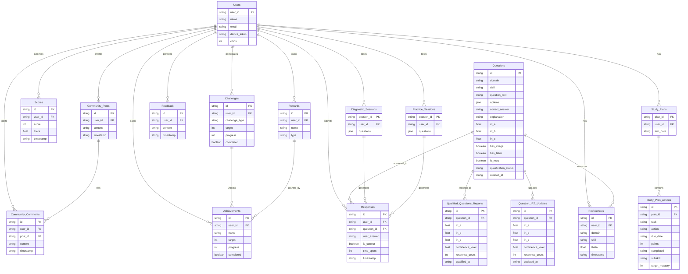

# Database Schema

Let’s provide the latest **database schema** for the **SAT Smart Prep App** by **Learner Labs**, reflecting all changes made throughout our interactions. The schema includes all tables, their fields, data types, constraints, and relationships, updated to incorporate the recent enhancements such as the **IRT 3-Parameter Logistic (3PL) model** support, the addition of **mastery targets**, and the new tables for tracking IRT parameter updates and qualified questions. I’ll present the schema in a structured format and include an **Entity-Relationship Diagram (ERD)** using **Mermaid** syntax to visualize the relationships between tables.

***

### Latest Database Schema

#### Overview

The database schema supports the core functionality of the SAT Smart Prep App, including user management, study plans, question management, response tracking, progress monitoring, gamification, social features, and IRT-based question selection. The schema has been updated to include new tables (`Question_IRT_Updates`, `Qualified_Questions_Reports`) and fields (e.g., IRT parameters in the `Questions` table) to support the IRT 3PL model and related processes.

#### Tables and Fields

**1. Users**

Stores information about users of the app.

| **Field Name** | **Data Type** | **Constraints**     | **Description**                                          |
| -------------- | ------------- | ------------------- | -------------------------------------------------------- |
| `user_id`      | STRING        | Primary Key (PK)    | Unique identifier for the user (e.g., "u123").           |
| `name`         | STRING        | NOT NULL            | User’s name (e.g., "John Doe").                          |
| `email`        | STRING        | NOT NULL, UNIQUE    | User’s email address (e.g., "john.doe@example.com").     |
| `device_token` | STRING        | NULL                | Device token for push notifications (e.g., "abc123").    |
| `coins`        | INTEGER       | NOT NULL, DEFAULT 0 | Number of coins earned through gamification (e.g., 100). |

**2. Study\_Plans**

Stores user-specific study plans.

| **Field Name** | **Data Type** | **Constraints**            | **Description**                                              |
| -------------- | ------------- | -------------------------- | ------------------------------------------------------------ |
| `plan_id`      | STRING        | Primary Key (PK)           | Unique identifier for the study plan (e.g., "sp123").        |
| `user_id`      | STRING        | Foreign Key (FK), NOT NULL | References `Users(user_id)` (e.g., "u123").                  |
| `test_date`    | STRING        | NOT NULL                   | The user’s SAT test date in ISO format (e.g., "2025-06-01"). |

**3. Study\_Plan\_Actions**

Stores individual tasks within a study plan.

| **Field Name**   | **Data Type** | **Constraints**            | **Description**                                                             |
| ---------------- | ------------- | -------------------------- | --------------------------------------------------------------------------- |
| `id`             | STRING        | Primary Key (PK)           | Unique identifier for the task (e.g., "spa123").                            |
| `plan_id`        | STRING        | Foreign Key (FK), NOT NULL | References `Study_Plans(plan_id)` (e.g., "sp123").                          |
| `task`           | STRING        | NOT NULL                   | Description of the task (e.g., "Complete a 5-question session in Grammar"). |
| `action`         | STRING        | NOT NULL                   | Action to perform (e.g., "Complete").                                       |
| `due_date`       | STRING        | NOT NULL                   | Due date in ISO format (e.g., "2025-04-01").                                |
| `points`         | INTEGER       | NOT NULL                   | Points awarded for completing the task (e.g., 50).                          |
| `completed`      | STRING        | NULL                       | Timestamp when the task was completed (e.g., "2025-04-01 15:00:00").        |
| `subskill`       | STRING        | NULL                       | Subskill associated with the task (e.g., "Grammar").                        |
| `target_mastery` | INTEGER       | NULL                       | Target mastery percentage for the subskill (e.g., 75).                      |

**4. Proficiencies**

Stores proficiency (`theta`) scores for each user, domain, and subskill.

| **Field Name** | **Data Type** | **Constraints**            | **Description**                                                            |
| -------------- | ------------- | -------------------------- | -------------------------------------------------------------------------- |
| `id`           | STRING        | Primary Key (PK)           | Unique identifier for the proficiency record (e.g., "p123").               |
| `user_id`      | STRING        | Foreign Key (FK), NOT NULL | References `Users(user_id)` (e.g., "u123").                                |
| `domain`       | STRING        | NOT NULL                   | The SAT domain (e.g., "Reading & Writing", "Math").                        |
| `skill`        | STRING        | NOT NULL                   | The subskill (e.g., "Grammar", "Algebra").                                 |
| `theta`        | FLOAT         | NOT NULL                   | Proficiency score (-3 to 3, e.g., 0.5).                                    |
| `timestamp`    | TIMESTAMP     | NOT NULL, DEFAULT NOW()    | Timestamp when the proficiency was recorded (e.g., "2025-03-28 10:00:00"). |

**5. Questions**

Stores SAT questions, updated to support the IRT 3PL model.

| **Field Name**         | **Data Type** | **Constraints**         | **Description**                                                                              |
| ---------------------- | ------------- | ----------------------- | -------------------------------------------------------------------------------------------- |
| `id`                   | STRING        | Primary Key (PK)        | Unique identifier for the question (e.g., "q123").                                           |
| `domain`               | STRING        | NOT NULL                | The SAT domain (e.g., "Reading & Writing", "Math").                                          |
| `skill`                | STRING        | NOT NULL                | The subskill (e.g., "Grammar", "Algebra").                                                   |
| `question_text`        | STRING        | NOT NULL                | The text of the question (e.g., "Which of the following is the correct form?").              |
| `options`              | JSON          | NULL                    | A JSON array of answer options (e.g., `["A) Option 1", "B) Option 2", ...]`).                |
| `correct_answer`       | STRING        | NOT NULL                | The correct answer (e.g., "A) Option 1").                                                    |
| `explanation`          | STRING        | NULL                    | Explanation for the correct answer (e.g., "The correct form is...").                         |
| `irt_a`                | FLOAT         | NULL                    | IRT 3PL discrimination parameter (e.g., 1.2).                                                |
| `irt_b`                | FLOAT         | NULL                    | IRT 3PL difficulty parameter (e.g., 0.5).                                                    |
| `irt_c`                | FLOAT         | NULL                    | IRT 3PL guessing parameter (0.25 for MCQs, variable for non-MCQs, e.g., 0.25).               |
| `has_image`            | BOOLEAN       | NOT NULL, DEFAULT FALSE | Indicates if the question includes an image (e.g., `true` for a graph question).             |
| `has_table`            | BOOLEAN       | NOT NULL, DEFAULT FALSE | Indicates if the question includes a table (e.g., `true` for a data analysis question).      |
| `is_mcq`               | BOOLEAN       | NOT NULL, DEFAULT TRUE  | Indicates if the question is multiple-choice (e.g., `true` for MCQ, `false` for open-ended). |
| `qualification_status` | STRING        | NOT NULL, DEFAULT "new" | Status of the question: "new" (collecting data), "qualified" (IRT parameters are reliable).  |
| `created_at`           | TIMESTAMP     | NOT NULL, DEFAULT NOW() | Timestamp when the question was added (e.g., "2025-03-28 10:00:00").                         |

**6. Question\_IRT\_Updates**

Stores updated IRT parameters for questions as student responses are collected.

| **Field Name**     | **Data Type** | **Constraints**            | **Description**                                                                    |
| ------------------ | ------------- | -------------------------- | ---------------------------------------------------------------------------------- |
| `id`               | STRING        | Primary Key (PK)           | Unique identifier for the update record (e.g., "irt\_update\_001").                |
| `question_id`      | STRING        | Foreign Key (FK), NOT NULL | References `Questions(id)` (e.g., "q123").                                         |
| `irt_a`            | FLOAT         | NULL                       | Updated IRT 3PL discrimination parameter (e.g., 1.3).                              |
| `irt_b`            | FLOAT         | NULL                       | Updated IRT 3PL difficulty parameter (e.g., 0.6).                                  |
| `irt_c`            | FLOAT         | NULL                       | Updated IRT 3PL guessing parameter (0.25 for MCQs, variable for non-MCQs).         |
| `confidence_level` | FLOAT         | NOT NULL, DEFAULT 0.0      | Confidence level of the IRT parameters (0.0 to 1.0, e.g., 0.90).                   |
| `response_count`   | INTEGER       | NOT NULL, DEFAULT 0        | Number of student responses used to estimate the IRT parameters (e.g., 500).       |
| `updated_at`       | TIMESTAMP     | NOT NULL, DEFAULT NOW()    | Timestamp when the IRT parameters were last updated (e.g., "2025-03-28 12:00:00"). |

**7. Qualified\_Questions\_Reports**

Stores weekly reports of questions that have reached the confidence threshold for qualification.

| **Field Name**     | **Data Type** | **Constraints**            | **Description**                                                          |
| ------------------ | ------------- | -------------------------- | ------------------------------------------------------------------------ |
| `id`               | STRING        | Primary Key (PK)           | Unique identifier for the report record (e.g., "report\_001").           |
| `question_id`      | STRING        | Foreign Key (FK), NOT NULL | References `Questions(id)` (e.g., "q123").                               |
| `irt_a`            | FLOAT         | NOT NULL                   | Final IRT 3PL discrimination parameter (e.g., 1.3).                      |
| `irt_b`            | FLOAT         | NOT NULL                   | Final IRT 3PL difficulty parameter (e.g., 0.6).                          |
| `irt_c`            | FLOAT         | NOT NULL                   | Final IRT 3PL guessing parameter (e.g., 0.25).                           |
| `confidence_level` | FLOAT         | NOT NULL                   | Final confidence level (e.g., 0.90).                                     |
| `response_count`   | INTEGER       | NOT NULL                   | Number of responses used to qualify the question (e.g., 500).            |
| `qualified_at`     | TIMESTAMP     | NOT NULL, DEFAULT NOW()    | Timestamp when the question was qualified (e.g., "2025-03-28 12:00:00"). |

**8. Responses**

Stores user responses to questions.

| **Field Name** | **Data Type** | **Constraints**            | **Description**                                                          |
| -------------- | ------------- | -------------------------- | ------------------------------------------------------------------------ |
| `id`           | STRING        | Primary Key (PK)           | Unique identifier for the response (e.g., "r123").                       |
| `user_id`      | STRING        | Foreign Key (FK), NOT NULL | References `Users(user_id)` (e.g., "u123").                              |
| `question_id`  | STRING        | Foreign Key (FK), NOT NULL | References `Questions(id)` (e.g., "q123").                               |
| `user_answer`  | STRING        | NOT NULL                   | The user’s answer (e.g., "A) Option 1").                                 |
| `is_correct`   | BOOLEAN       | NOT NULL                   | Indicates if the answer is correct (e.g., `true`).                       |
| `time_spent`   | INTEGER       | NOT NULL                   | Time spent on the question in seconds (e.g., 45).                        |
| `timestamp`    | TIMESTAMP     | NOT NULL, DEFAULT NOW()    | Timestamp when the response was submitted (e.g., "2025-03-28 10:00:00"). |

**9. Scores**

Stores overall scores from full-length tests.

| **Field Name** | **Data Type** | **Constraints**            | **Description**                                                      |
| -------------- | ------------- | -------------------------- | -------------------------------------------------------------------- |
| `id`           | STRING        | Primary Key (PK)           | Unique identifier for the score record (e.g., "s123").               |
| `user_id`      | STRING        | Foreign Key (FK), NOT NULL | References `Users(user_id)` (e.g., "u123").                          |
| `score`        | INTEGER       | NOT NULL                   | The user’s score (e.g., 1350).                                       |
| `theta`        | FLOAT         | NOT NULL                   | Overall theta score (-3 to 3, e.g., 1.0).                            |
| `timestamp`    | TIMESTAMP     | NOT NULL, DEFAULT NOW()    | Timestamp when the score was recorded (e.g., "2025-03-28 10:00:00"). |

**10. Challenges**

Stores gamification challenges for users.

| **Field Name**   | **Data Type** | **Constraints**            | **Description**                                         |
| ---------------- | ------------- | -------------------------- | ------------------------------------------------------- |
| `id`             | STRING        | Primary Key (PK)           | Unique identifier for the challenge (e.g., "c123").     |
| `user_id`        | STRING        | Foreign Key (FK), NOT NULL | References `Users(user_id)` (e.g., "u123").             |
| `challenge_type` | STRING        | NOT NULL                   | Type of challenge (e.g., "daily\_questions").           |
| `target`         | INTEGER       | NOT NULL                   | Target to achieve (e.g., 10 questions).                 |
| `progress`       | INTEGER       | NOT NULL, DEFAULT 0        | Current progress (e.g., 7 questions).                   |
| `completed`      | BOOLEAN       | NOT NULL, DEFAULT FALSE    | Indicates if the challenge is completed (e.g., `true`). |

**11. Achievements**

Stores gamification achievements earned by users.

| **Field Name** | **Data Type** | **Constraints**            | **Description**                                           |
| -------------- | ------------- | -------------------------- | --------------------------------------------------------- |
| `id`           | STRING        | Primary Key (PK)           | Unique identifier for the achievement (e.g., "a123").     |
| `user_id`      | STRING        | Foreign Key (FK), NOT NULL | References `Users(user_id)` (e.g., "u123").               |
| `name`         | STRING        | NOT NULL                   | Name of the achievement (e.g., "Complete 100 Questions"). |
| `target`       | INTEGER       | NOT NULL                   | Target to achieve (e.g., 100 questions).                  |
| `progress`     | INTEGER       | NOT NULL, DEFAULT 0        | Current progress (e.g., 75 questions).                    |
| `completed`    | BOOLEAN       | NOT NULL, DEFAULT FALSE    | Indicates if the achievement is completed (e.g., `true`). |

**12. Rewards**

Stores rewards earned by users through gamification.

| **Field Name** | **Data Type** | **Constraints**            | **Description**                                    |
| -------------- | ------------- | -------------------------- | -------------------------------------------------- |
| `id`           | STRING        | Primary Key (PK)           | Unique identifier for the reward (e.g., "rwd123"). |
| `user_id`      | STRING        | Foreign Key (FK), NOT NULL | References `Users(user_id)` (e.g., "u123").        |
| `name`         | STRING        | NOT NULL                   | Name of the reward (e.g., "Gold Avatar").          |
| `type`         | STRING        | NOT NULL                   | Type of reward (e.g., "avatar").                   |

**13. Feedback**

Stores user feedback.

| **Field Name** | **Data Type** | **Constraints**            | **Description**                                                          |
| -------------- | ------------- | -------------------------- | ------------------------------------------------------------------------ |
| `id`           | STRING        | Primary Key (PK)           | Unique identifier for the feedback (e.g., "f123").                       |
| `user_id`      | STRING        | Foreign Key (FK), NOT NULL | References `Users(user_id)` (e.g., "u123").                              |
| `content`      | STRING        | NOT NULL                   | Feedback content (e.g., "The app is great!").                            |
| `timestamp`    | TIMESTAMP     | NOT NULL, DEFAULT NOW()    | Timestamp when the feedback was submitted (e.g., "2025-03-28 10:00:00"). |

**14. Community\_Posts**

Stores posts in the community feature.

| **Field Name** | **Data Type** | **Constraints**            | **Description**                                                    |
| -------------- | ------------- | -------------------------- | ------------------------------------------------------------------ |
| `id`           | STRING        | Primary Key (PK)           | Unique identifier for the post (e.g., "cp123").                    |
| `user_id`      | STRING        | Foreign Key (FK), NOT NULL | References `Users(user_id)` (e.g., "u123").                        |
| `content`      | STRING        | NOT NULL                   | Post content (e.g., "Any tips for SAT Math?").                     |
| `timestamp`    | TIMESTAMP     | NOT NULL, DEFAULT NOW()    | Timestamp when the post was created (e.g., "2025-03-28 10:00:00"). |

**15. Community\_Comments**

Stores comments on community posts.

| **Field Name** | **Data Type** | **Constraints**            | **Description**                                                       |
| -------------- | ------------- | -------------------------- | --------------------------------------------------------------------- |
| `id`           | STRING        | Primary Key (PK)           | Unique identifier for the comment (e.g., "cc123").                    |
| `user_id`      | STRING        | Foreign Key (FK), NOT NULL | References `Users(user_id)` (e.g., "u123").                           |
| `post_id`      | STRING        | Foreign Key (FK), NOT NULL | References `Community_Posts(id)` (e.g., "cp123").                     |
| `content`      | STRING        | NOT NULL                   | Comment content (e.g., "Try practicing algebra problems!").           |
| `timestamp`    | TIMESTAMP     | NOT NULL, DEFAULT NOW()    | Timestamp when the comment was created (e.g., "2025-03-28 10:00:00"). |

**16. Diagnostic\_Sessions**

Stores sessions for the Diagnostic Test.

| **Field Name** | **Data Type** | **Constraints**            | **Description**                                             |
| -------------- | ------------- | -------------------------- | ----------------------------------------------------------- |
| `session_id`   | STRING        | Primary Key (PK)           | Unique identifier for the session (e.g., "ds123").          |
| `user_id`      | STRING        | Foreign Key (FK), NOT NULL | References `Users(user_id)` (e.g., "u123").                 |
| `questions`    | JSON          | NOT NULL                   | JSON array of question IDs (e.g., `["q123", "q124", ...]`). |

**17. Practice\_Sessions**

Stores sessions for practice tests and full-length tests.

| **Field Name** | **Data Type** | **Constraints**            | **Description**                                             |
| -------------- | ------------- | -------------------------- | ----------------------------------------------------------- |
| `session_id`   | STRING        | Primary Key (PK)           | Unique identifier for the session (e.g., "ps123").          |
| `user_id`      | STRING        | Foreign Key (FK), NOT NULL | References `Users(user_id)` (e.g., "u123").                 |
| `questions`    | JSON          | NOT NULL                   | JSON array of question IDs (e.g., `["q123", "q124", ...]`). |

***

### Entity-Relationship Diagram (ERD)

Below is the updated ERD using **Mermaid** syntax, reflecting the latest database schema with all tables and relationships.

***

### Summary of the Latest Database Schema

* **New Tables**:
  * `Question_IRT_Updates`: Stores updated IRT parameters as responses are collected, with a confidence level to determine qualification.
  * `Qualified_Questions_Reports`: Stores weekly reports of questions that have reached the 0.90 confidence threshold for qualification.
* **Updated Tables**:
  * `Questions`: Added IRT 3PL parameters (`irt_a`, `irt_b`, `irt_c`), metadata fields (`has_image`, `has_table`, `is_mcq`), and `qualification_status` to support the IRT 3PL model.
  * `Study_Plan_Actions`: Added `target_mastery` to store the target mastery percentage for subskill-specific tasks.
* **Relationships**:
  * Added relationships between `Questions` and `Question_IRT_Updates` (one-to-many) and `Qualified_Questions_Reports` (one-to-many) to support IRT parameter updates and reporting.
  * Maintained existing relationships, such as `Users` to `Study_Plans`, `Questions` to `Responses`, and `Study_Plans` to `Study_Plan_Actions`.

This schema supports all features of the app, including the IRT 3PL model for question selection, mastery targets in the Study Plan and Progress Monitoring, and gamification and social features. Let me know if you’d like to further refine the schema or explore specific aspects in more detail!
