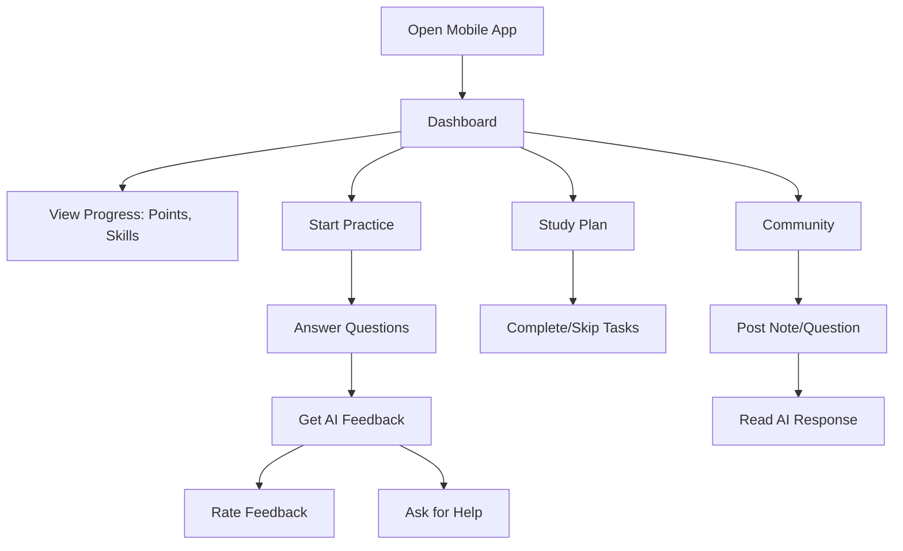
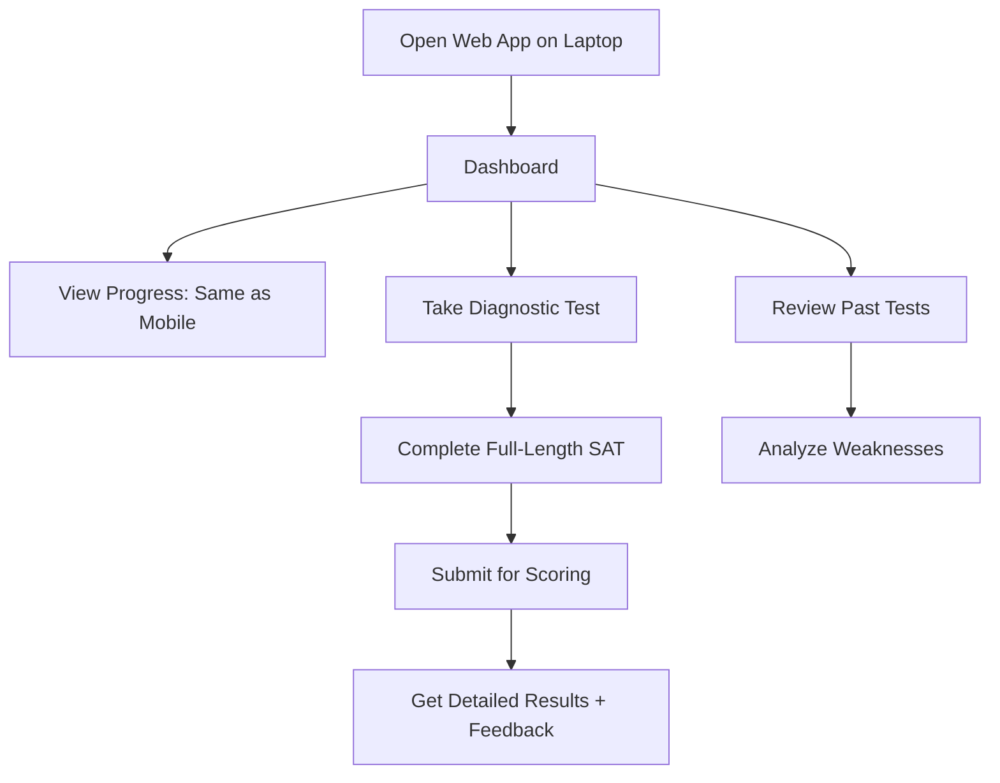
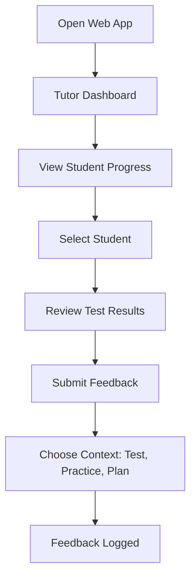
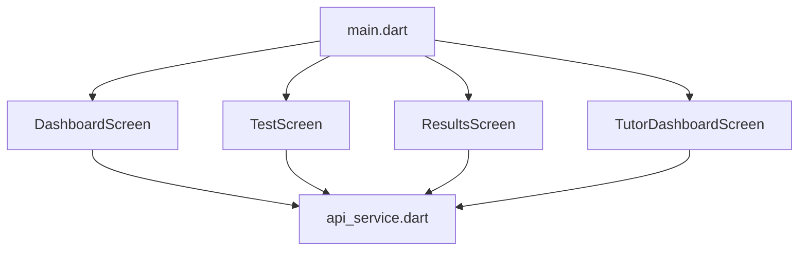
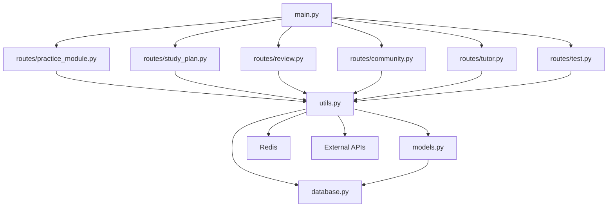
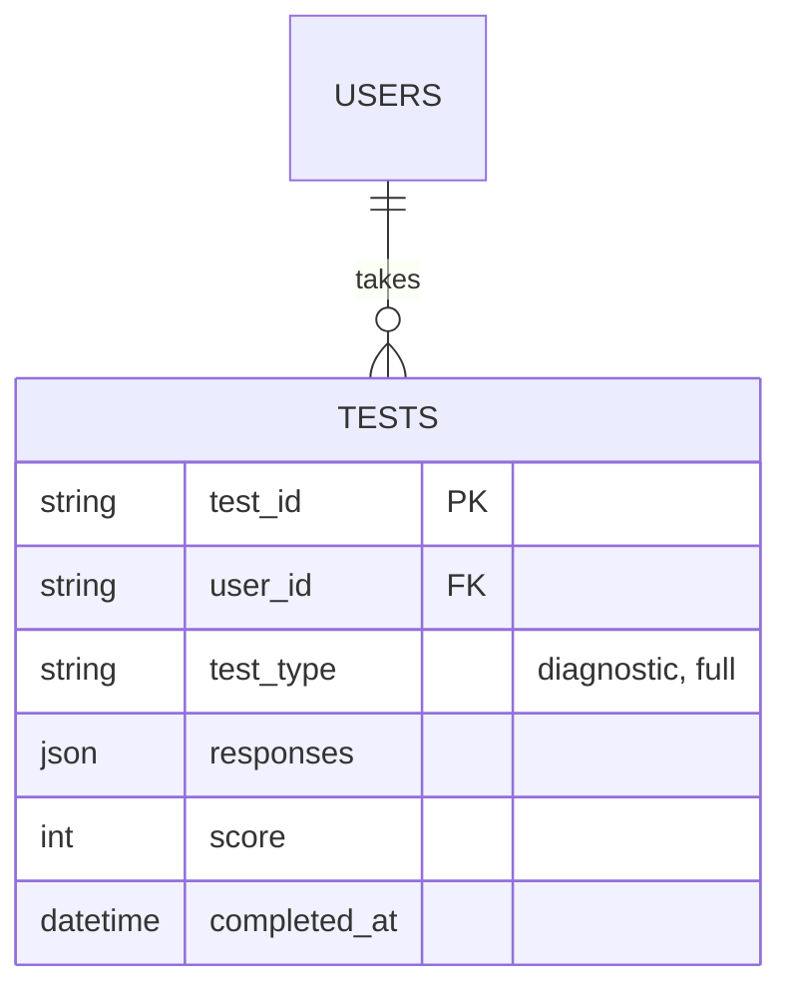
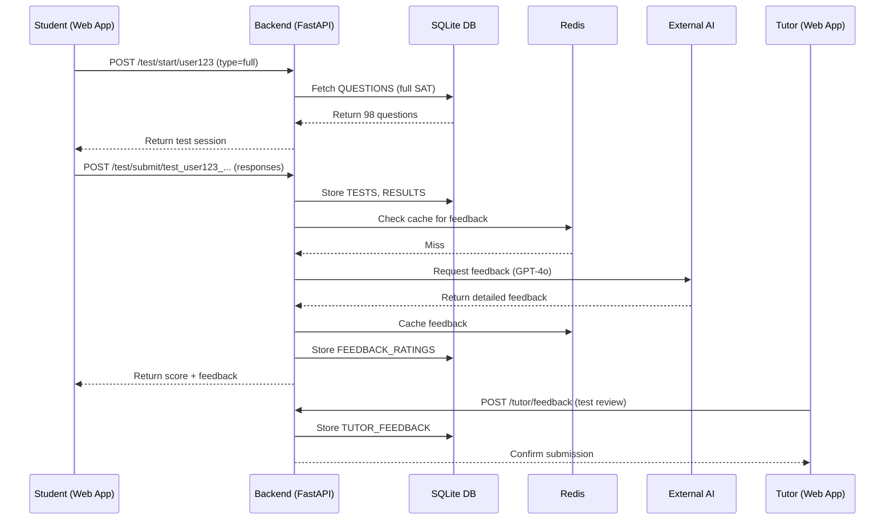

# Development Blueprint Docu

Thank you for the clarification! You’re absolutely right—while mobile devices (via the Flutter app) are ideal for practice, lessons, and on-the-go engagement, diagnostics and full-length SAT tests are better suited for laptops due to their length (3+ hours), complexity, and the need for a stable, focused environment. Based on this, the **SAT Prep Suite** will not be a mobile-only app but a **hybrid platform** with a **mobile app** (Flutter) for daily practice and a **web app** (accessible on laptops/desktops) for diagnostics and full tests. Below, I’ll revise the development blueprint to reflect this dual-platform approach, updating the user journey, app structure, key components, and interactions to accommodate both mobile and web experiences.

***

## SAT Prep Suite: Revised Development Blueprint (Mobile + Web)

### 1. User Journey

**Purpose**: Reflect dual usage—mobile for practice/engagement, web for diagnostics/tests.

#### 1.1 Student Journey (Mobile App)



* **Focus**: Quick, bite-sized prep (e.g., 5-10 questions, lessons).
* **Flow**: Same as before—optimized for mobile convenience.

#### 1.2 Student Journey (Web App)




* **Focus**: Long-form testing (diagnostics, full SATs—44 Reading, 54 Math questions).
* **Flow**:
  1. **Dashboard**: Unified progress view → Option to start diagnostic/full test.
  2. **Test**: Timed, multi-section SAT simulation → Submits answers.
  3. **Results**: Detailed breakdown (e.g., score, skill gaps) + AI feedback.
  4. **Review**: Past test analysis for improvement.

#### 1.3 Tutor Journey (Web App)



```mermaid
```

* **Focus**: Web-based for detailed analysis and feedback on tests.
* **Flow**: Similar to mobile but emphasizes test review.

#### 1.4 Parent Journey

* **Flow**: Web or mobile → Views child’s Dashboard (progress, test scores) → Push notifications.
* **Note**: Consistent across platforms, web preferred for test result deep dives.

***

### 2. App Structure Overview

**Purpose**: Updated architecture for mobile + web.

```mermaid
graph TD
    A[User Devices] -->|Mobile| B[Frontend: Flutter App]
    A -->|Laptop| C[Frontend: Flutter Web App]
    B -->|API Calls| D[Backend: FastAPI]
    C -->|API Calls| D
    D -->|SQL| E[SQLite DB]
    D -->|Cache| F[Redis]
    D -->|External APIs| G[AWS Polly, Google Speech]
    D -->|Future| H[Custom LLM]
    E -->|Data Export| I[real_sat_data.jsonl]
```

```mermaid
```

* **Components**:
  * **Flutter App (Mobile)**: iOS/Android for practice, lessons, community.
  * **Flutter Web App**: Browser-based for diagnostics, full tests, tutor tools.
  * **Backend**: FastAPI serves both platforms via unified APIs.
  * **Database**: SQLite stores all data (mobile practice + web tests).
  * **Cache/External APIs/LLM**: Same as before, shared across platforms.

***

### 3. Key Components and Interactions

**Purpose**: Detail mobile and web components, their roles, and interactions.

#### 3.1 Frontend (Flutter Mobile App)

* **Structure**:

```mermaid
graph TD
    A[main.dart] --> B[DashboardScreen]
    A --> C[PracticeScreen]
    A --> D[StudyPlanScreen]
    A --> E[CommunityScreen]
    B --> F[api_service.dart]
    C --> F
    D --> F
    E --> F
```

* **Key Files**:
  1. **`main.dart`**: Mobile entry, routes to practice-focused screens.
  2. **`screens/dashboard.dart`**: Progress, points, mobile navigation.
  3. **`screens/practice.dart`**: Short practice sessions (5-10 questions).
  4. **`screens/study_plan.dart`**: Task management.
  5. **`screens/community.dart`**: Note/question posting.
  6. **`services/api_service.dart`**: API client (shared with web).
* **Interactions**:
  * Calls `/practice/*`, `/study_plan/*`, `/community/*` endpoints.
  * Optimized for quick, touch-based interactions.

#### 3.2 Frontend (Flutter Web App)

* **Structure**:



* **Key Files**:
  1. **`main.dart`**: Web entry, routes to test-focused screens (separate build target).
  2. **`screens/dashboard.dart`**: Unified progress view (shared logic, web layout).
  3. **`screens/test.dart`**: Diagnostic/full test interface (timed, multi-section).
  4. **`screens/results.dart`**: Detailed test results + feedback.
  5. **`screens/tutor_dashboard.dart`**: Student progress, test review, feedback form.
  6. **`services/api_service.dart`**: Same as mobile, adjusted base URL if needed.
* **Interactions**:
  * Calls `/test/*`, `/review/*`, `/tutor/*` endpoints.
  * Designed for keyboard/mouse, large-screen UX.

#### 3.3 Backend (FastAPI)

* **Structure**:



* **Key Files**:
  * New: **`routes/test.py`**: Endpoints for diagnostics/full tests.
  * Others unchanged: Handle mobile practice, web tests, tutor features.
*   **New Endpoints** (`routes/test.py`):

    ```python
    from fastapi import APIRouter, Depends
    from sqlalchemy.orm import Session
    from api.database import get_db
    from api.utils import generate_feedback_with_custom_llm

    router = APIRouter(prefix="/test", tags=["test"])

    @router.post("/start/{user_id}")
    async def start_test(user_id: str, test_type: str, db: Session = Depends(get_db)):
        # Fetch full SAT or diagnostic (e.g., 44 Reading, 54 Math questions)
        questions = db.query(Question).filter(Question.test == test_type).all()
        return {"user_id": user_id, "test_id": f"test_{user_id}_{time.time()}", "questions": [q.content for q in questions]}

    @router.post("/submit/{test_id}")
    async def submit_test(test_id: str, responses: List[Dict], db: Session = Depends(get_db)):
        # Score test, store results
        score = calculate_score(responses)  # Hypothetical scoring logic
        feedback = generate_feedback_with_custom_llm({"responses": responses}, {"score": score})
        result = Result(user_id=test_id.split("_")[1], proficiencies={"total_score": score}, completed_at=datetime.utcnow())
        db.add(result)
        db.commit()
        return {"test_id": test_id, "score": score, "feedback": feedback}
    ```
* **Interactions**:
  * Serves mobile (`/practice/*`) and web (`/test/*`) requests.
  * Unified DB access for all data.

#### 3.4 Database (SQLite)

* **Updated Schema**:
  * Add `TESTS` table for full diagnostics:



* Existing tables (`RESPONSES`, `TUTOR_FEEDBACK`, etc.) unchanged.
* **Interactions**:
  * Mobile: Stores practice responses (`RESPONSES`).
  * Web: Stores test responses (`TESTS`), results (`RESULTS`).

#### 3.5 External Integrations & Custom LLM

* **Unchanged**: Redis, AWS Polly, Google Speech, initial AI (GPT-4o, etc.).
* **Custom LLM**: Trained on both mobile practice data and web test data, deployed to serve both platforms.

***

### 4. Data Flow Example (Web Test)



* **Scenario**: Student takes full SAT on web → Submits → Gets results → Tutor reviews.

***

### 5. Development Guidelines

* **Tech Stack**:
  * Mobile: Flutter (iOS/Android), Dart.
  * Web: Flutter Web (same codebase, separate build: `flutter build web`).
  * Backend: Python 3.9, FastAPI, SQLite, Redis.
  * Hosting: AWS EC2 (backend), Firebase Hosting (web), App Store/Google Play (mobile).
* **Coding**:
  * Shared Flutter logic (e.g., `api_service.dart`) → Platform-specific UI (mobile vs. web).
  * Responsive design: Mobile (touch), Web (mouse/keyboard, larger layouts).
* **Testing**:
  * Mobile: Practice flow, short sessions.
  * Web: Full test simulation (3-hour endurance), result accuracy.
* **Deployment**:
  * Mobile: `flutter run`, app stores.
  * Web: `flutter build web`, Firebase deploy.

***

### 6. Next Steps for Dev Team

1. **Setup**: Install Flutter, FastAPI, SQLite, Redis.
2. **Backend**: Add `/test/*` endpoints, update DB schema.
3. **Frontend**:
   * Mobile: Build practice-focused screens.
   * Web: Build test-focused screens (`test.dart`, `results.dart`).
4. **Integration**: Test mobile practice + web test flows → Verify data collection.
5. **LLM Prep**: Include test responses in `real_sat_data.jsonl`.

***

#### Conclusion

The **SAT Prep Suite** is now a hybrid app:

* **Mobile (Flutter)**: Practice, lessons, community—quick, on-the-go prep.
* **Web (Flutter Web)**: Diagnostics, full tests, tutor tools—deep, focused prep.
  \
  The backend unifies both experiences, collecting data from mobile practice and web tests to train our LLM. Start with backend updates and split Flutter development into mobile/web tracks—any adjustments needed?
