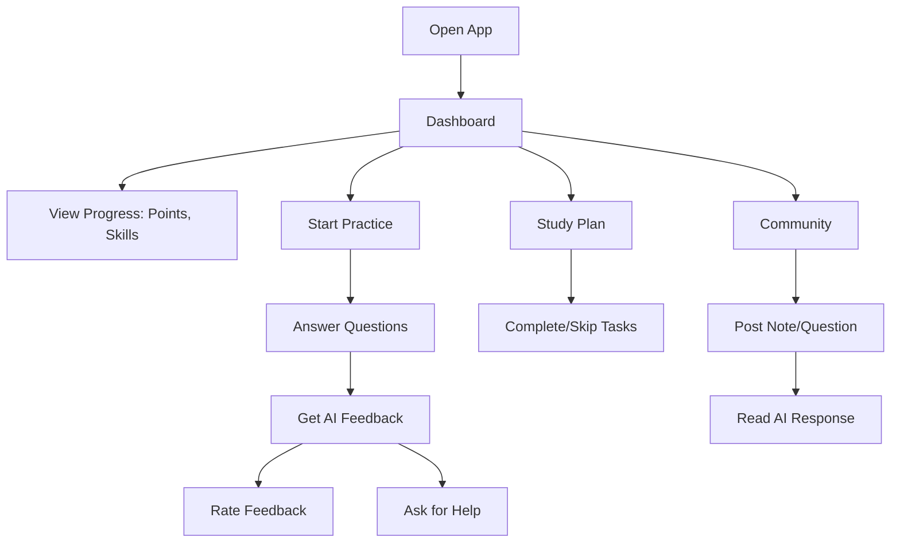
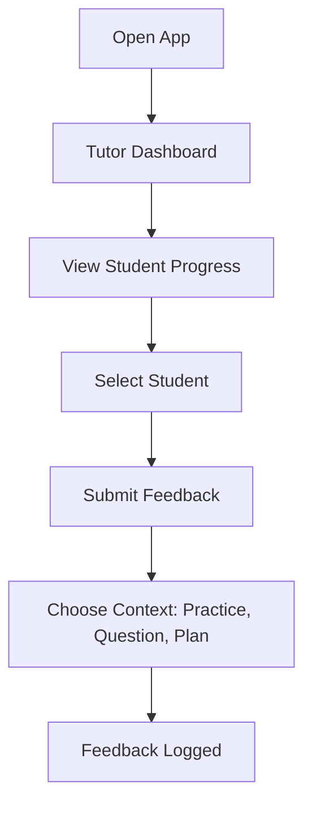
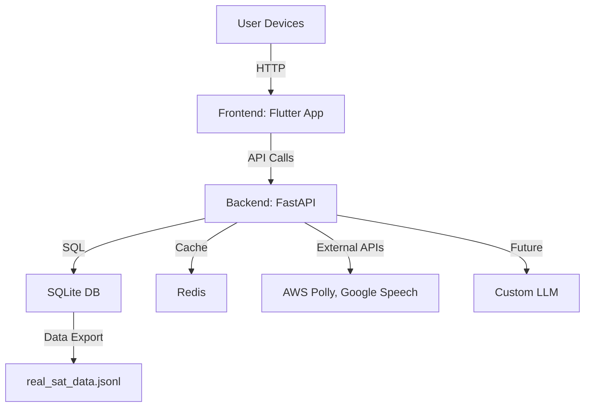
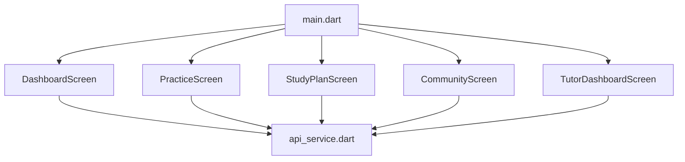
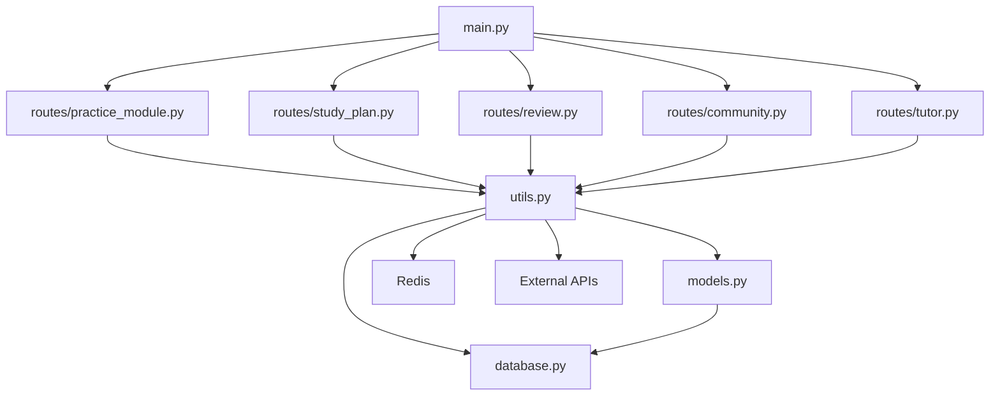
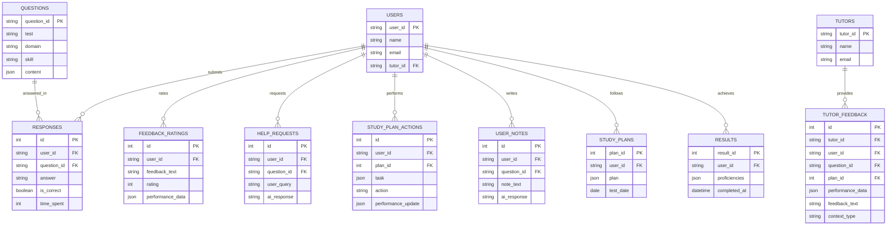
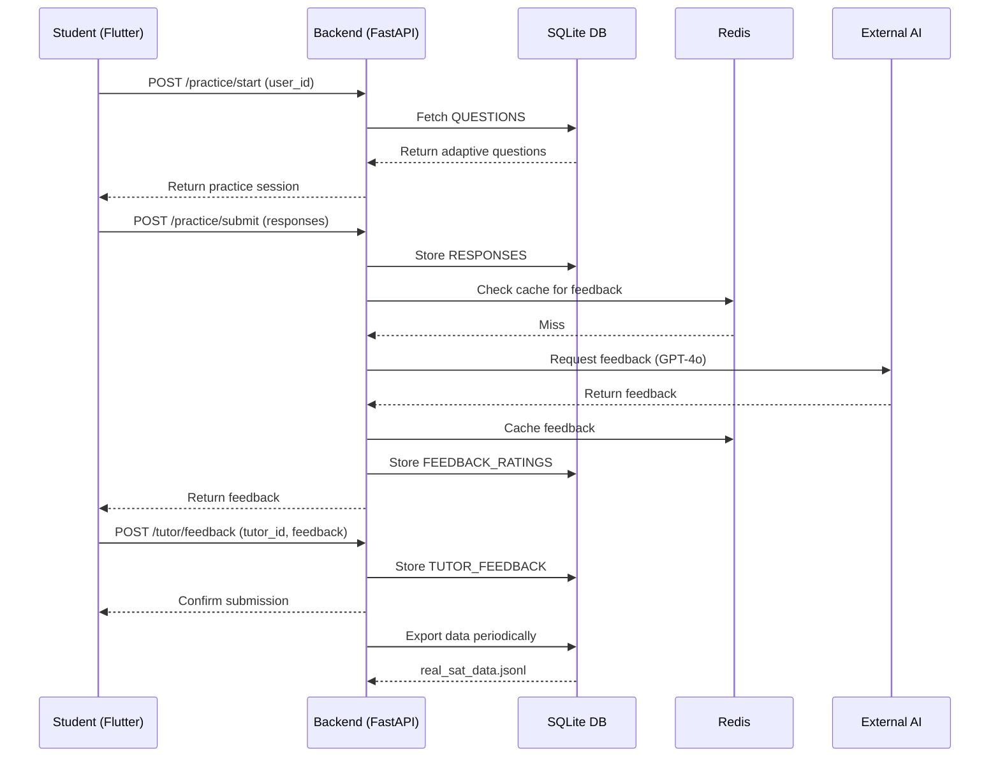

# Development Blueprint Documen

Below is a **Development Blueprint Document** for the **SAT Prep Suite**, designed to guide your development team by explaining the app’s structure visually and textually. It starts with the **User Journey** to contextualize how users (students, tutors, parents) interact with the app, followed by detailed sections on architecture, key components, and their interactions. I’ll incorporate visual elements using Mermaid diagrams (text-based, renderable in tools like GitHub or Mermaid Live Editor) for clarity. This document assumes the app is built from the MRD/PRD and prior discussions as of March 26, 2025.

***

## SAT Prep Suite: Development Blueprint

### 1. User Journey

**Purpose**: Outline how users experience the app to align development with user needs.

#### 1.1 Student Journey

* **Flow**:
  1. **Dashboard**: Student sees points, streak, skill proficiencies → Chooses Practice, Plan, or Community.
  2. **Practice**: Answers adaptive questions → Receives AI feedback → Rates it or asks for help.
  3. **Study Plan**: Views tasks → Marks completed/skipped → Gets updated plan.
  4. **Community**: Posts a note/question → Reads AI or peer responses.

#### 1.2 Tutor Journey

* **Flow**:
  1. **Tutor Dashboard**: Tutor sees assigned students’ progress → Selects a student.
  2. **Feedback**: Writes feedback → Specifies context (e.g., “practice”) → Submits.

#### 1.3 Parent Journey (Simplified)

* **Flow**: Logs in → Views child’s Dashboard (progress, points) → Receives push notifications (e.g., “Streak: 5 days!”).
* **Note**: Parent features are minimal; reuse student Dashboard with restricted access.

***

### 2. App Structure Overview

**Purpose**: Provide a high-level view of the app’s architecture.

* **Components**:
  * **Frontend**: Flutter app (iOS, Android) for students, tutors, parents.
  * **Backend**: FastAPI server handling logic, API endpoints.
  * **Database**: SQLite for user data, responses, feedback.
  * **Cache**: Redis for fast AI response retrieval.
  * **External APIs**: Polly (audio), Speech-to-Text (voice input).
  * **Custom LLM**: Future in-house AI trained on exported data.

***

### 3. Key Components and Interactions

**Purpose**: Detail each component’s role and how they connect.

#### 3.1 Frontend (Flutter App)

* **Structure**:   &#x20;

* **Key Files**:
  1. **`main.dart`**: Entry point, defines routes (`/dashboard`, `/practice`, etc.).
  2. **`screens/dashboard.dart`**: Progress, points, navigation hub.
  3. **`screens/practice.dart`**: Question display, feedback, help requests.
  4. **`screens/study_plan.dart`**: Task list, action buttons.
  5. **`screens/community.dart`**: Note/question input, responses.
  6. **`screens/tutor_dashboard.dart`**: Student list, feedback form.
  7. **`services/api_service.dart`**: HTTP client for API calls.
* **Interactions**:
  * Calls backend APIs (e.g., `GET /review/next`, `POST /tutor/feedback`) via `api_service.dart`.
  * Displays data (e.g., JSON responses rendered as widgets).

#### 3.2 Backend (FastAPI)

* **Structure**:

* **Key Files**:
  1. **`main.py`**: App entry, includes all routers.
  2. **`routes/practice_module.py`**: Endpoints for practice sessions, feedback, help.
  3. **`routes/study_plan.py`**: Study plan management, actions.
  4. **`routes/review.py`**: AI-driven insights (predictions, feedback).
  5. **`routes/community.py`**: Note/question handling.
  6. **`routes/tutor.py`**: Tutor progress, feedback submission.
  7. **`utils.py`**: Logic for AI, data logging, export.
  8. **`models.py`**: SQLAlchemy ORM models (e.g., `User`, `TutorFeedback`).
  9. **`database.py`**: DB connection setup.
* **Interactions**:
  * Receives HTTP requests from Flutter → Processes via routes → Queries DB or external APIs.
  * Stores data in SQLite → Caches frequent responses in Redis.
  * Exports training data to `.jsonl` file.

#### 3.3 Database (SQLite)

* **Schema**:

* **Interactions**:
  * Stores all user data, responses, feedback → Queried by `utils.py`.
  * Exports to `.jsonl` for LLM training via `export_llm_training_data`.

#### 3.4 External Integrations

* **Components**:
  1. **Redis**: Caches AI responses (e.g., feedback, predictions).
     * Interaction: `utils.py` sets/gets via `redis_client`.
  2. **AWS Polly**: Generates audio explanations.
     * Interaction: `/lessons/audio` endpoint calls Polly API.
  3. **Google Speech-to-Text**: Processes voice inputs.
     * Interaction: `/practice/speech-input` endpoint.
  4. **Initial AI (GPT-4o, Knewton, Watson)**:
     * Interaction: `utils.py` calls APIs for feedback, question selection, predictions.
* **Future**: Replace with custom LLM hosted locally.

#### 3.5 Custom LLM

* **Structure**: Trained offline → Deployed as a FastAPI endpoint.
* **Interactions**:
  * Trained on `sat_data.jsonl` (synthetic + real data).
  * `utils.py` loads model (`generate_feedback_with_custom_llm`) → Replaces external AI calls.

***

### 4. Data Flow Example

**Purpose**: Show how components interact in a typical scenario.

* **Scenario**: Student starts practice → Submits answers → Gets feedback → Tutor adds feedback → Data collected for LLM.

***

### 5. Development Guidelines

* **Tech Stack**:
  * Backend: Python 3.9, FastAPI, SQLAlchemy, SQLite, Redis.
  * Frontend: Flutter 3.0+, Dart.
  * Hosting: AWS EC2 (backend), Firebase (frontend).
* **Coding**:
  * Follow RESTful API conventions.
  * Use type hints in Python, async/await where applicable.
  * Modular Flutter screens with reusable widgets.
* **Testing**:
  * Unit tests: API endpoints (`pytest`), Flutter widgets (`flutter test`).
  * Integration: End-to-end flows (e.g., practice → feedback → tutor).
* **Deployment**:
  * Local: `uvicorn api.main:app`, `flutter run`.
  * Production: Nginx + EC2, Firebase Hosting.

***

### 6. Next Steps for Dev Team

1. **Setup**: Install dependencies, run DB migration, seed data.
2. **Backend**: Implement all routes, test endpoints with Postman.
3. **Frontend**: Build screens, connect to backend via `api_service.dart`.
4. **Integration**: Test data flow (practice → feedback → export).
5. **LLM Prep**: Generate synthetic data, plan initial training.

***

#### Conclusion

This blueprint structures the **SAT Prep Suite** around a user-centric journey, supported by a modular backend (FastAPI), interactive frontend (Flutter), and robust data collection for a custom LLM. Key components—Frontend, Backend, DB, External APIs, and LLM—interact seamlessly to deliver personalized SAT prep. Start with setup and backend implementation—any questions before diving in?
