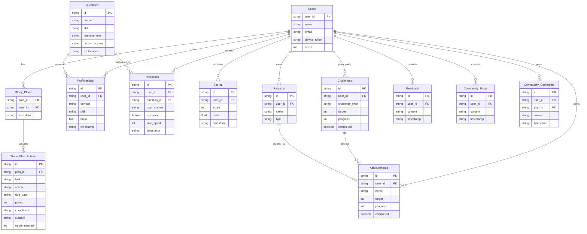
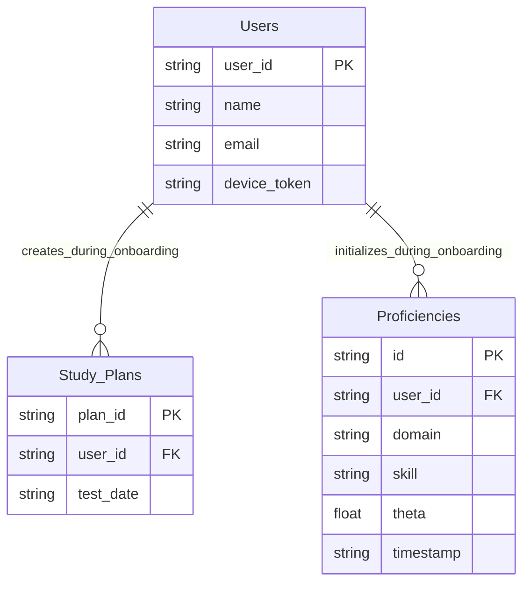
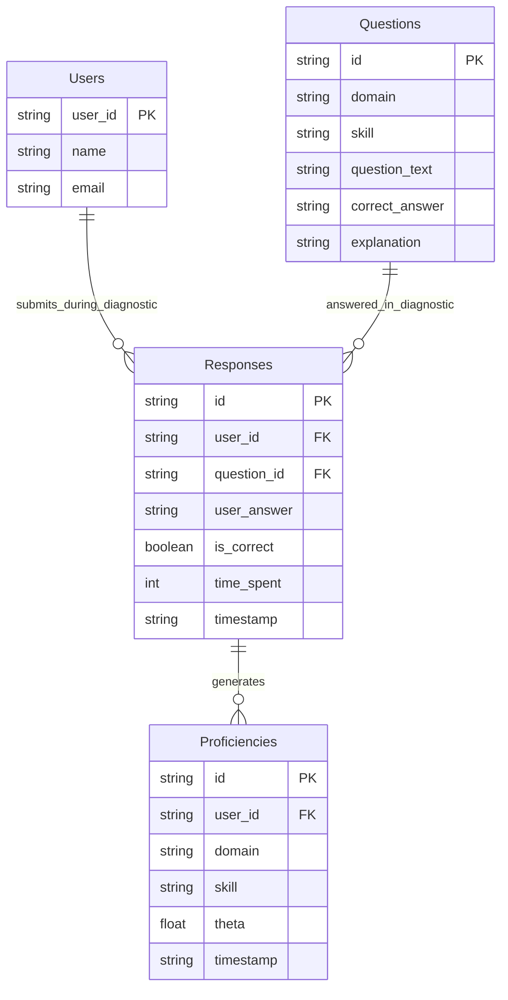
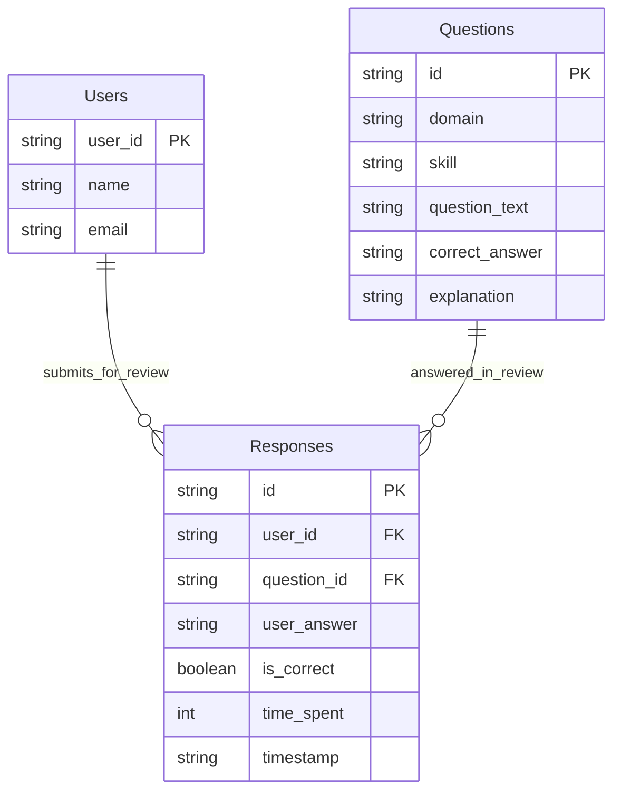
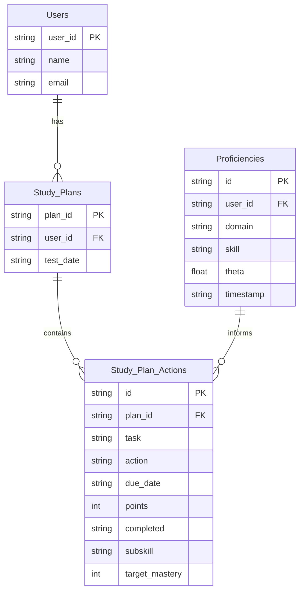
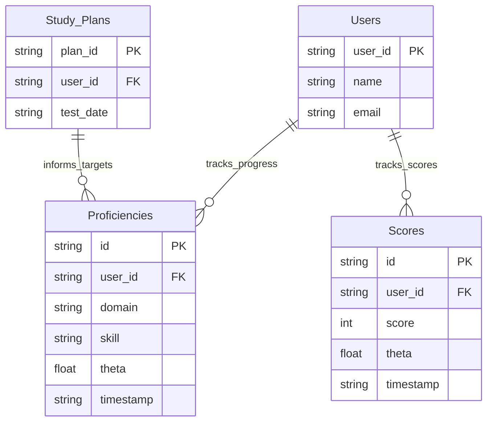

# ERD'

Let’s create **Entity-Relationship Diagrams (ERDs)** for the **SAT Smart Prep App** by **Learner Labs**, covering both the web app and mobile app, as well as specific ERDs for key features: **User Onboarding**, **Diagnostic Test**, **Review Process**, **Study Plan**, and **Progress Monitoring**. I’ll use **Mermaid** syntax to represent these diagrams, which can be rendered in tools that support Mermaid (e.g., Mermaid Live Editor, GitHub, or compatible IDEs). Each ERD will include the relevant entities, their attributes, and relationships, reflecting the app’s database structure and functionality.

***

### 1. Overall ERD for the SAT Smart Prep App (Web and Mobile)

The overall ERD represents the core entities and relationships for the entire app, encompassing both the web and mobile components. It includes entities for users, study plans, proficiencies, responses, questions, scores, gamification, and social features.

<figure><figcaption></figcaption></figure>

#### Explanation of the Overall ERD

* **Users**: The central entity, representing app users. Attributes include `user_id` (primary key), `name`, `email`, `device_token` (for notifications), and `coins` (for gamification).
* **Study\_Plans**: Stores user-specific study plans, linked to `Users` via `user_id`. Contains the `test_date` for scheduling.
* **Study\_Plan\_Actions**: Represents individual tasks in a Study Plan, including `task`, `due_date`, `points`, `completed` status, `subskill`, and `target_mastery` (added for mastery targets).
* **Proficiencies**: Stores `theta` scores for each domain and subskill per user, used for progress monitoring and Study Plan task allocation.
* **Questions**: Represents SAT questions, with attributes like `domain`, `skill`, and `correct_answer`.
* **Responses**: Stores user responses to questions, linked to `Users` and `Questions`, with `time_spent` for pacing analytics.
* **Scores**: Tracks user scores from full-length tests, used for progress monitoring and score improvement guarantee.
* **Challenges**, **Achievements**, **Rewards**: Support gamification features, linked to `Users`.
* **Feedback**, **Community\_Posts**, **Community\_Comments**: Support user feedback and social features.

***

### 2. ERD for User Onboarding

The User Onboarding feature collects user information and preferences to initialize their profile and Study Plan.

#### Explanation of the User Onboarding ERD

* **Users**: During onboarding, a new user record is created with `user_id`, `name`, `email`, and `device_token` (for notifications).
* **Study\_Plans**: Onboarding collects the `test_date` and other preferences (study hours, study days, mastery targets), which are used to create the initial Study Plan.
* **Proficiencies**: After the Diagnostic Test (part of onboarding), initial `theta` scores are stored for each domain and subskill, linked to the user.

***

### 3. ERD for Diagnostic Test

The Diagnostic Test feature assesses the user’s initial proficiency to initialize the Study Plan and Progress Monitoring.

#### Explanation of the Diagnostic Test ERD

* **Users**: The user takes the Diagnostic Test, submitting responses.
* **Questions**: The Diagnostic Test consists of 49 questions (27 Reading and Writing, 22 Math), stored in the `Questions` table.
* **Responses**: Captures the user’s answers to Diagnostic Test questions, including `user_answer`, `is_correct`, and `time_spent`.
* **Proficiencies**: The Diagnostic Test results generate initial `theta` scores for each domain and subskill, stored in the `Proficiencies` table.

***

### 4. ERD for Review Process

The Review Process allows users to review their performance on practice sessions and full-length tests.

#### Explanation of the Review Process ERD

* **Users**: The user submits responses during practice sessions or full-length tests, which are reviewed.
* **Questions**: The questions answered by the user, with details like `question_text`, `correct_answer`, and `explanation` for review.
* **Responses**: Stores the user’s answers, correctness, and time spent, which are displayed in the review UI for feedback and learning.

***

### 5. ERD for Study Plan

The Study Plan feature creates a personalized schedule of tasks, now including mastery targets.

#### Explanation of the Study Plan ERD

* **Users**: Each user has a Study Plan, linked via `user_id`.
* **Study\_Plans**: Stores the Study Plan metadata, including the `test_date` for scheduling.
* **Study\_Plan\_Actions**: Represents individual tasks in the Study Plan, with attributes like `task`, `due_date`, `points`, `completed`, `subskill`, and `target_mastery` (added to store the mastery target for each subskill task).
* **Proficiencies**: Provides current `theta` scores for domains and subskills, used to calculate mastery gaps and allocate tasks in the Study Plan.

***

### 6. ERD for Progress Monitoring

The Progress Monitoring feature tracks user progress, now including mastery targets and progress toward those targets.

#### Explanation of the Progress Monitoring ERD

* **Users**: The user’s progress is tracked through their proficiencies and scores.
* **Proficiencies**: Stores `theta` scores for each domain and subskill, used to calculate current mastery percentages for Progress Monitoring.
* **Scores**: Tracks overall scores from full-length tests, used to display score history and assess the score improvement guarantee.
* **Study\_Plans**: Provides the `target_mastery` data (e.g., 80% for domains, 75% for subskills), which Progress Monitoring uses to display mastery targets and track progress toward them.

***

### Summary of ERDs

* **Overall ERD**: Captures the entire app’s database structure, including entities for users, study plans, proficiencies, responses, questions, scores, gamification, and social features, with relationships reflecting their interactions.
* **User Onboarding ERD**: Focuses on user creation, Study Plan initialization, and initial proficiency data from the Diagnostic Test.
* **Diagnostic Test ERD**: Represents the process of taking the Diagnostic Test, submitting responses, and generating initial proficiencies.
* **Review Process ERD**: Shows how users review their responses to questions, focusing on feedback and learning.
* **Study Plan ERD**: Details the Study Plan structure, including tasks with mastery targets, informed by proficiency data.
* **Progress Monitoring ERD**: Illustrates how progress is tracked using proficiencies and scores, now including mastery targets from the Study Plan.

These ERDs provide a clear view of the app’s database schema and the relationships between entities for each key feature, ensuring a robust foundation for both the web and mobile apps. Let me know if you’d like to refine any of these diagrams further!
