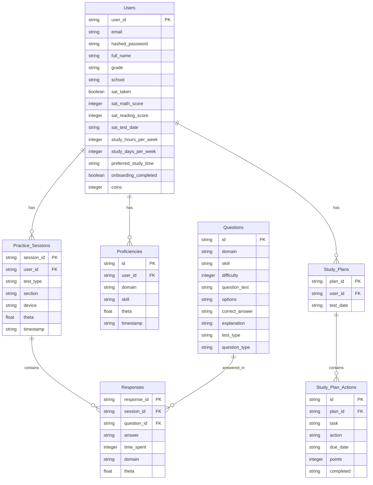

# User Onboading Process

Below is detailed documentation for the **new user onboarding process** of the **SAT Smart Prep App** by **Learner Labs**, covering both the web app (`frontend/`) and mobile app (`SATSmartPrepApp/`). The documentation includes the logic, flow, and an explanation of all relevant files involved in the process. I’ll also provide a simplified **Entity-Relationship Diagram (ERD)** specifically for the onboarding process, focusing on the entities and relationships directly involved.

***

### New User Onboarding Process Documentation

#### Overview

The onboarding process for new users in the SAT Smart Prep App is designed to collect essential user information, assess their current SAT proficiency, and create a personalized study plan. The process is identical for both the web app and mobile app, ensuring a consistent user experience across platforms. It consists of several steps: welcome, basic information collection, SAT experience, study preferences, diagnostic test, study plan creation, and dashboard introduction. Upon completion, users are awarded gamification rewards to encourage engagement.

***

### Onboarding Flow and Logic

#### Flow Overview

1. **Welcome Step**: Introduces the user to the app and prompts them to start onboarding.
2. **Basic Information Step**: Collects the user’s full name, grade level, and school (optional).
3. **SAT Experience Step**: Asks if the user has taken the SAT before. If yes, proceeds to collect previous scores; if no, skips to study preferences.
4. **SAT Score Step** (if applicable): Collects the user’s previous SAT Math and Reading & Writing scores.
5. **Study Preferences Step**: Gathers the user’s SAT test date, weekly study hours, study days per week, and preferred study time.
6. **Diagnostic Test Step**: Prompts the user to take a short diagnostic test to assess their current SAT proficiency.
7. **Study Plan Step**: Generates a personalized study plan based on diagnostic results and user preferences.
8. **Dashboard Step**: Introduces the user to their dashboard, showing diagnostic results and study plan, and completes onboarding.
9. **Post-Onboarding Rewards**: Awards the user with coins, an avatar, and a challenge to encourage further engagement.

#### Detailed Logic

* **User Authentication**:
  * Before onboarding, the user must sign up or log in (`/auth/signup` or `/auth/login` endpoints). Upon successful authentication, the `user_id` is stored in `localStorage` (web) or `AsyncStorage` (mobile).
  * File: `frontend/pages/login.js` (web), `SATSmartPrepApp/src/screens/LoginScreen.js` (mobile).
* **Step Navigation**:
  * The onboarding process uses a step-based navigation system, controlled by a `step` state variable (1 to 9).
  * Each step renders a specific component (e.g., `WelcomeStep`, `BasicInfoStep`), and the user progresses by clicking "Next" or "Back" buttons.
  * File: `frontend/pages/onboarding.js` (web), `SATSmartPrepApp/src/screens/OnboardingScreen.js` (mobile).
* **Data Collection**:
  * User data is stored in a `userData` state object, updated as the user progresses through steps.
  * Example fields: `full_name`, `grade`, `sat_taken`, `sat_math_score`, `study_hours_per_week`.
  * File: `frontend/pages/onboarding.js` (web), `SATSmartPrepApp/src/screens/OnboardingScreen.js` (mobile).
* **SAT Experience Logic**:
  * If `sat_taken` is `true`, the user is prompted to enter their previous SAT scores (`sat_math_score`, `sat_reading_score`).
  * If `sat_taken` is `false`, the app skips the SAT Score Step and proceeds to Study Preferences.
  * File: `frontend/pages/onboarding.js` (web), `SATSmartPrepApp/src/screens/OnboardingScreen.js` (mobile).
* **Diagnostic Test**:
  * The user takes a short diagnostic test (22 questions) to assess their SAT proficiency.
  * The test starts by calling the `/diagnostic/start/{user_id}` endpoint, which creates a `Practice_Sessions` record and returns questions.
  * Responses are submitted to `/diagnostic/submit/{session_id}`, which calculates a `theta` score and updates `Proficiencies`.
  * File: `frontend/pages/diagnostic.js` (web), `SATSmartPrepApp/src/screens/DiagnosticScreen.js` (mobile).
* **Study Plan Creation**:
  * After the diagnostic test, a study plan is created by calling `/study_plan/create/{user_id}` with the user’s test date, study hours, and days.
  * The backend uses diagnostic results (`Proficiencies`) to identify focus areas (e.g., skills with `theta < 0.5`) and generates tasks (`Study_Plan_Actions`).
  * File: `frontend/pages/study-plan.js` (web), `SATSmartPrepApp/src/screens/StudyPlanScreen.js` (mobile).
* **Dashboard Introduction**:
  * The dashboard displays diagnostic results and the study plan, giving the user a starting point for their SAT prep.
  * File: `frontend/pages/dashboard.js` (web), `SATSmartPrepApp/src/screens/DashboardScreen.js` (mobile).
* **Post-Onboarding Rewards**:
  * Upon completion, the app:
    * Updates the user’s profile (`/auth/update-profile/{user_id}`) with `onboarding_completed: true`.
    * Awards 50 coins (`/gamification/coins/earn`).
    * Unlocks a "Learner Star Avatar" reward (`/gamification/rewards/unlock`).
    * Creates a "First Study Session" challenge (`/gamification/challenges`).
  * File: `frontend/pages/onboarding.js` (web), `SATSmartPrepApp/src/screens/OnboardingScreen.js` (mobile).

***

### ERD for User Onboarding

The onboarding process involves a subset of the app’s database schema, focusing on user data, diagnostic tests, and study plans. Below is the ERD specific to onboarding.

#### Entities and Attributes

1. **Users**
   * `user_id` (VARCHAR(36), Primary Key): Unique identifier for the user.
   * `email` (VARCHAR(255), Unique, Not Null): User’s email.
   * `hashed_password` (VARCHAR(255), Not Null): Hashed password.
   * `full_name` (VARCHAR(255)): Collected in Basic Info Step.
   * `grade` (VARCHAR(50)): Collected in Basic Info Step.
   * `school` (VARCHAR(255)): Collected in Basic Info Step (optional).
   * `sat_taken` (BOOLEAN): Collected in SAT Experience Step.
   * `sat_math_score` (INTEGER): Collected in SAT Score Step.
   * `sat_reading_score` (INTEGER): Collected in SAT Score Step.
   * `sat_test_date` (VARCHAR(50)): Collected in Study Preferences Step.
   * `study_hours_per_week` (INTEGER): Collected in Study Preferences Step.
   * `study_days_per_week` (INTEGER): Collected in Study Preferences Step.
   * `preferred_study_time` (VARCHAR(50)): Collected in Study Preferences Step.
   * `onboarding_completed` (BOOLEAN, Default: FALSE): Set to `TRUE` upon completion.
   * `coins` (INTEGER, Default: 0): Updated with 50 coins post-onboarding.
2. **Practice\_Sessions**
   * `session_id` (VARCHAR(36), Primary Key): Unique identifier for the diagnostic session.
   * `user_id` (VARCHAR(36), Foreign Key → Users(user\_id)): Links to the user.
   * `test_type` (VARCHAR(50)): Set to 'SAT' for diagnostic tests.
   * `section` (VARCHAR(50)): Not used in onboarding (NULL).
   * `device` (VARCHAR(50)): 'web' or 'mobile', depending on the platform.
   * `theta` (FLOAT): Calculated after the diagnostic test.
   * `timestamp` (TIMESTAMP, Default: CURRENT\_TIMESTAMP): Session start time.
3. **Responses**
   * `response_id` (VARCHAR(36), Primary Key): Unique identifier for each response.
   * `session_id` (VARCHAR(36), Foreign Key → Practice\_Sessions(session\_id)): Links to the diagnostic session.
   * `question_id` (VARCHAR(36), Foreign Key → Questions(id)): Links to the question.
   * `answer` (VARCHAR(255)): User’s answer.
   * `time_spent` (INTEGER): Time spent on the question.
   * `domain` (VARCHAR(50)): Domain of the question (e.g., Math).
   * `theta` (FLOAT): Theta value for the response.
4. **Questions**
   * `id` (VARCHAR(36), Primary Key): Unique identifier for the question.
   * `domain` (VARCHAR(50)): Domain (e.g., Math, Reading & Writing).
   * `skill` (VARCHAR(50)): Specific skill (e.g., Algebra).
   * `difficulty` (INTEGER): Difficulty level.
   * `question_text` (TEXT): Question text.
   * `options` (JSONB): Answer options.
   * `correct_answer` (VARCHAR(255)): Correct answer.
   * `explanation` (TEXT): Explanation.
   * `test_type` (VARCHAR(50), Default: 'SAT'): Type of test.
   * `question_type` (VARCHAR(50)): Type of question.
5. **Proficiencies**
   * `id` (VARCHAR(36), Primary Key): Unique identifier for the proficiency record.
   * `user_id` (VARCHAR(36), Foreign Key → Users(user\_id)): Links to the user.
   * `domain` (VARCHAR(50)): Domain (e.g., Math).
   * `skill` (VARCHAR(50)): Specific skill (e.g., Algebra).
   * `theta` (FLOAT): Proficiency score from the diagnostic test.
   * `timestamp` (TIMESTAMP, Default: CURRENT\_TIMESTAMP): When recorded.
6. **Study\_Plans**
   * `plan_id` (VARCHAR(36), Primary Key): Unique identifier for the study plan.
   * `user_id` (VARCHAR(36), Foreign Key → Users(user\_id)): Links to the user.
   * `test_date` (VARCHAR(50)): Target SAT test date.
7. **Study\_Plan\_Actions**
   * `id` (VARCHAR(36), Primary Key): Unique identifier for the action.
   * `plan_id` (VARCHAR(36), Foreign Key → Study\_Plans(plan\_id)): Links to the study plan.
   * `task` (VARCHAR(255)): Task description (e.g., "Complete 5 Algebra sessions").
   * `action` (VARCHAR(50)): Action type (e.g., "Complete").
   * `due_date` (VARCHAR(50)): Due date for the task.
   * `points` (INTEGER): Points awarded for completion.
   * `completed` (TIMESTAMP): When the task was completed (NULL if not completed).

#### Relationships

* **Users ↔ Practice\_Sessions**: One-to-Many (a user can have multiple diagnostic sessions).
* **Practice\_Sessions ↔ Responses**: One-to-Many (a session contains multiple responses).
* **Questions ↔ Responses**: One-to-Many (a question can have multiple responses).
* **Users ↔ Proficiencies**: One-to-Many (a user has multiple proficiency records from the diagnostic test).
* **Users ↔ Study\_Plans**: One-to-Many (a user can have multiple study plans).
* **Study\_Plans ↔ Study\_Plan\_Actions**: One-to-Many (a study plan contains multiple tasks).

#### Mermaid Diagram for Onboarding ERD

***

### Files Involved in Onboarding

#### Web App (`frontend/`)

1. **frontend/pages/login.js**
   * **Purpose**: Handles user authentication before onboarding.
   * **Role in Onboarding**:
     * Users sign up (`/auth/signup`) or log in (`/auth/login`).
     * Upon success, the `user_id` is stored in `localStorage`, and the user is redirected to `/onboarding`.
   * **Key Logic**:
     * Calls `api.post('/auth/login')` to authenticate.
     * Redirects to `/onboarding` using `router.push('/onboarding')`.
2. **frontend/pages/onboarding.js**
   * **Purpose**: Main file for the web app’s onboarding process.
   * **Role in Onboarding**:
     * Manages the step-based navigation (steps 1-9).
     * Collects user data (`userData` state) and updates the backend (`/auth/update-profile/{user_id}`).
     * Integrates with diagnostic, study plan, and dashboard components.
   * **Key Logic**:
     * Uses `useState` for `step` and `userData`.
     * Defines sub-components for each step (e.g., `WelcomeStep`, `BasicInfoStep`).
     * Calls `completeOnboarding` to finalize onboarding, award rewards, and redirect to `/dashboard`.
3. **frontend/pages/diagnostic.js**
   * **Purpose**: Handles the diagnostic test step.
   * **Role in Onboarding**:
     * Renders the diagnostic test interface (22 questions).
     * Starts the test by calling `/diagnostic/start/{user_id}`.
     * Submits responses to `/diagnostic/submit/{session_id}`.
     * Stores results in `diagnosticResults` state, passed to the dashboard.
   * **Key Logic**:
     * Uses `api.post('/diagnostic/start/{user_id}')` to start the test.
     * Renders questions using components like `ReadingWritingTest` and `MathBasicTest`.
     * Submits responses and updates `Proficiencies`.
4. **frontend/pages/study-plan.js**
   * **Purpose**: Generates and displays the user’s study plan.
   * **Role in Onboarding**:
     * Creates a study plan by calling `/study_plan/create/{user_id}`.
     * Displays the plan, including tasks (`Study_Plan_Actions`).
   * **Key Logic**:
     * Fetches or creates a study plan using `api.get('/study_plan/{user_id}')` or `api.post('/study_plan/create/{user_id}')`.
     * Displays tasks with due dates and points.
5. **frontend/pages/dashboard.js**
   * **Purpose**: Introduces the user to their dashboard.
   * **Role in Onboarding**:
     * Displays diagnostic results and the study plan.
     * Provides a starting point for the user’s SAT prep journey.
   * **Key Logic**:
     * Receives `diagnosticResults` as a prop and displays estimated SAT scores.
     * Shows the study plan and progress metrics.
6. **frontend/utils/api.js**
   * **Purpose**: API client for making backend requests.
   * **Role in Onboarding**:
     * Handles all API calls during onboarding (e.g., `/auth/update-profile`, `/diagnostic/start`, `/gamification/coins/earn`).
   * **Key Logic**:
     * Uses `axios` to make HTTP requests to the FastAPI backend.

#### Mobile App (`SATSmartPrepApp/`)

1. **SATSmartPrepApp/src/screens/LoginScreen.js**
   * **Purpose**: Handles user authentication before onboarding.
   * **Role in Onboarding**:
     * Users sign up or log in, storing the `user_id` in `AsyncStorage`.
     * Redirects to the `Onboarding` screen.
   * **Key Logic**:
     * Calls `api.post('/auth/login')` to authenticate.
     * Uses `navigation.navigate('Onboarding')` to redirect.
2. **SATSmartPrepApp/src/screens/OnboardingScreen.js**
   * **Purpose**: Main file for the mobile app’s onboarding process.
   * **Role in Onboarding**:
     * Manages the step-based navigation (steps 1-9).
     * Collects user data and updates the backend.
     * Integrates with diagnostic, study plan, and dashboard screens.
   * **Key Logic**:
     * Similar to `frontend/pages/onboarding.js`, but uses React Native components (e.g., `Picker` instead of `select`).
     * Uses `navigation.navigate('Main')` to redirect after completion.
3. **SATSmartPrepApp/src/screens/DiagnosticScreen.js**
   * **Purpose**: Handles the diagnostic test step.
   * **Role in Onboarding**:
     * Renders the diagnostic test interface.
     * Starts and submits the test, storing results.
   * **Key Logic**:
     * Same as `frontend/pages/diagnostic.js`, adapted for React Native.
4. **SATSmartPrepApp/src/screens/StudyPlanScreen.js**
   * **Purpose**: Generates and displays the study plan.
   * **Role in Onboarding**:
     * Creates and displays the study plan.
   * **Key Logic**:
     * Same as `frontend/pages/study-plan.js`, adapted for React Native.
5. **SATSmartPrepApp/src/screens/DashboardScreen.js**
   * **Purpose**: Introduces the user to their dashboard.
   * **Role in Onboarding**:
     * Displays diagnostic results and study plan.
   * **Key Logic**:
     * Same as `frontend/pages/dashboard.js`, adapted for React Native.
6. **SATSmartPrepApp/src/utils/api.js**
   * **Purpose**: API client for backend requests.
   * **Role in Onboarding**:
     * Handles all API calls, similar to the web app.

#### Backend (`frontend/backend/`)

1. **frontend/backend/src/auth.py**
   * **Purpose**: Handles authentication and profile updates.
   * **Role in Onboarding**:
     * Provides `/auth/signup`, `/auth/login`, and `/auth/update-profile/{user_id}` endpoints.
   * **Key Logic**:
     * `signup`: Creates a new user in the `Users` table.
     * `login`: Authenticates the user and returns `user_id`.
     * `update_profile`: Updates user data (e.g., `full_name`, `onboarding_completed`).
2. **frontend/backend/src/diagnostic.py**
   * **Purpose**: Manages the diagnostic test.
   * **Role in Onboarding**:
     * Provides `/diagnostic/start/{user_id}` and `/diagnostic/submit/{session_id}` endpoints.
   * **Key Logic**:
     * `start_diagnostic`: Creates a `Practice_Sessions` record, selects 22 random questions, and returns them.
     * `submit_diagnostic`: Processes responses, calculates `theta`, updates `Practice_Sessions`, and creates `Proficiencies`.
3. **frontend/backend/src/study\_plan.py**
   * **Purpose**: Creates and retrieves study plans.
   * **Role in Onboarding**:
     * Provides `/study_plan/create/{user_id}` and `/study_plan/{user_id}` endpoints.
   * **Key Logic**:
     * `create_study_plan`: Uses `Proficiencies` to identify focus areas, calculates sessions per skill, and creates `Study_Plans` and `Study_Plan_Actions`.
     * `get_study_plan`: Retrieves the latest study plan for the user.
4. **frontend/backend/src/gamification.py**
   * **Purpose**: Manages gamification features.
   * **Role in Onboarding**:
     * Provides `/gamification/coins/earn`, `/gamification/rewards/unlock`, and `/gamification/challenges` endpoints.
   * **Key Logic**:
     * `earn_coins`: Awards 50 coins to the user.
     * `unlock_reward`: Unlocks the "Learner Star Avatar" reward.
     * `create_challenge`: Creates a "First Study Session" challenge.

***

### Summary

The onboarding process is a critical part of the SAT Smart Prep App, ensuring users are set up for success with a personalized study plan. It involves collecting user data, assessing proficiency through a diagnostic test, and generating a study plan, all while integrating gamification to boost engagement. The process is supported by a robust backend and a consistent frontend implementation across web and mobile platforms. The ERD highlights the key entities (`Users`, `Practice_Sessions`, `Responses`, `Questions`, `Proficiencies`, `Study_Plans`, `Study_Plan_Actions`) and their relationships, providing a clear view of the data flow during onboarding.

Let me know if you’d like to dive deeper into any specific part of the process or files!
