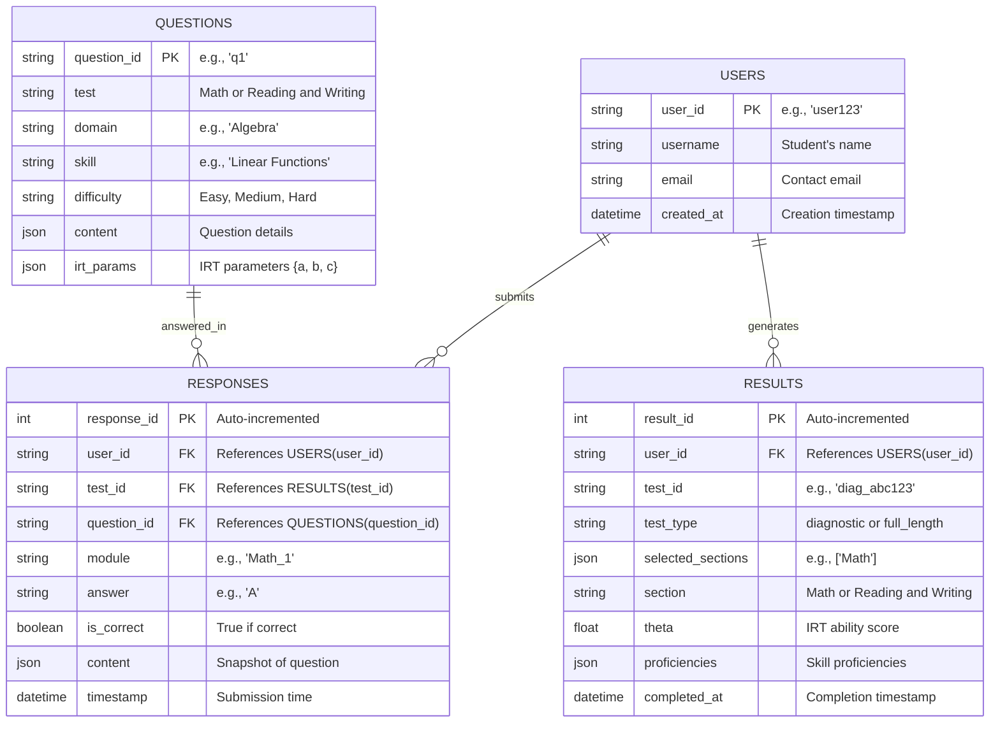

# Full testing and Monitoring Suite

Below, I’ll execute the updated plan for the **SAT Prep Suite**, incorporating both the revised **Diagnostic Test** (matching the first module of the digital SAT) and the **Full-Length Test** with flexible section selection. I’ll provide the backend code for `diagnostic.py` and `full_length_test.py`, update shared utilities in `utils.py`, adjust the ERD, and outline frontend integration. This implementation aligns with the specifications from the [Digital SAT Test Specification Overview](https://satsuite.collegeboard.org/media/pdf/digital-sat-test-spec-overview.pdf) and supports scalability for thousands of users.

***

#### Step 1: Backend Implementation

**Directory Structure**

```
sat_prep_app/
├── api/
│   ├── main.py          # API entry point
│   ├── models.py       # Database models
│   ├── routes/
│   │   ├── diagnostic.py         # Updated diagnostic test
│   │   ├── full_length_test.py   # Flexible full-length test
│   │   ├── question_review.py    # Placeholder
│   │   ├── performance_review.py # Placeholder
│   │   └── progress_monitoring.py # Placeholder
│   └── utils.py        # Shared utilities
├── data/
│   └── question_bank.json # Sample question bank
└── requirements.txt
```

**`api/main.py` (API Entry Point)**

```python
from fastapi import FastAPI
from routes import diagnostic, full_length_test, question_review, performance_review, progress_monitoring

app = FastAPI(title="SAT Prep Suite")

app.include_router(diagnostic.router, prefix="/diagnostic", tags=["Diagnostic"])
app.include_router(full_length_test.router, prefix="/full-test", tags=["Full-Length Test"])
app.include_router(question_review.router, prefix="/review", tags=["Question Review"])
app.include_router(performance_review.router, prefix="/review", tags=["Performance Review"])
app.include_router(progress_monitoring.router, prefix="/progress", tags=["Progress Monitoring"])

if __name__ == "__main__":
    import uvicorn
    uvicorn.run(app, host="0.0.0.0", port=8000)
```

**`api/utils.py` (Shared Utilities)**

```python
import json
import numpy as np
from typing import List, Dict, Tuple

class IRTSelector:
    def __init__(self, initial_theta: float = 0.0):
        self.theta = initial_theta
    
    def probability_correct(self, a: float, b: float, c: float) -> float:
        logit = a * (self.theta - b)
        return c + (1 - c) / (1 + np.exp(-logit))
    
    def information(self, a: float, b: float, c: float) -> float:
        p = self.probability_correct(a, b, c)
        q = 1 - p
        if p <= c or q == 0:
            return 0
        return (a**2 * (p - c)**2 * q) / ((1 - c)**2 * p)
    
    def update_theta(self, responses: List[Tuple[Dict, bool]]) -> float:
        if not responses:
            return self.theta
        theta_new = self.theta
        for _ in range(10):  # Newton-Raphson iterations
            numerator = 0
            denominator = 0
            for q, r in responses:
                a = q["irt_parameters"]["a"]
                b = q["irt_parameters"]["b"]
                c = q["irt_parameters"]["c"]
                p = self.probability_correct(a, b, c)
                if p <= c or 1 - p == 0:
                    continue
                numerator += a * (int(r) - p)
                denominator += (a**2 * (p - c) * (1 - p)) / (1 - c)
            if denominator == 0:
                break
            theta_new += numerator / denominator
        return theta_new if not np.isnan(theta_new) else self.theta

def proficiency_to_sat_score(avg_proficiency: float) -> int:
    """Map average proficiency (1-7) to SAT section score (200-800)."""
    base_score = 200
    max_score = 800
    score_range = max_score - base_score
    proficiency_range = 7 - 1
    score_per_prof = score_range / proficiency_range
    scaled_score = base_score + (avg_proficiency - 1) * score_per_prof
    return min(max(round(scaled_score / 10) * 10, base_score), max_score)

def theta_to_proficiency(theta: float) -> int:
    """Convert IRT theta to proficiency (1-7)."""
    if theta < -2.0: return 1
    elif theta < -1.0: return 2
    elif theta < 0.0: return 3
    elif theta < 1.0: return 4
    elif theta < 2.0: return 5
    elif theta < 3.0: return 6
    else: return 7

def load_question_bank(filepath: str = "data/question_bank.json") -> List[Dict]:
    """Load question bank from JSON file."""
    with open(filepath, 'r') as f:
        return json.load(f)

# Placeholder test plans (simplified for execution)
RW_TEST_PLAN = {
    "Information and Ideas": {"Central Ideas": {"Easy": 3, "Medium": 3, "Hard": 3}},
    "Craft and Structure": {"Vocabulary": {"Easy": 3, "Medium": 3, "Hard": 3}},
    "Expression of Ideas": {"Rhetorical Synthesis": {"Easy": 3, "Medium": 3, "Hard": 3}}
}
MATH_TEST_PLAN = {
    "Algebra": {"Linear Functions": {"Easy": 2, "Medium": 3, "Hard": 2}},
    "Problem Solving": {"Data Analysis": {"Easy": 2, "Medium": 3, "Hard": 2}},
    "Geometry": {"Triangles": {"Easy": 2, "Medium": 3, "Hard": 2}}
}
```

**`api/routes/diagnostic.py` (Updated Diagnostic Test)**

```python
from fastapi import APIRouter, HTTPException
from pydantic import BaseModel
import uuid
from typing import List, Dict
from api.utils import IRTSelector, load_question_bank, RW_TEST_PLAN, MATH_TEST_PLAN, theta_to_proficiency
import random

router = APIRouter()

class DiagnosticStartRequest(BaseModel):
    user_id: str
    section: str  # "Math" | "Reading and Writing" | "both"

class Response(BaseModel):
    question_id: str
    answer: str
    is_correct: bool  # Simulated for now; real app would calculate this

class DiagnosticResponseRequest(BaseModel):
    user_id: str
    test_id: str
    responses: List[Response]

# Simulated database (replace with PostgreSQL in production)
diagnostics_db: Dict[str, Dict] = {}

def select_diagnostic_questions(test_type: str, question_bank: List[Dict], test_plan: Dict) -> List[Dict]:
    selected = []
    used_ids = set()
    target_questions = 27 if test_type == "Reading and Writing" else 22
    difficulties = {"Easy": target_questions // 3, "Medium": target_questions // 3 + 1, "Hard": target_questions // 3}
    
    while len(selected) < target_questions:
        domain = random.choice(list(test_plan.keys()))
        skill = random.choice(list(test_plan[domain].keys()))
        candidates = [q for q in question_bank if q["metadata"]["Test"] == test_type and 
                     q["metadata"]["Domain"] == domain and q["metadata"]["Skill"] == skill and 
                     q["metadata"]["Question ID"] not in used_ids]
        if not candidates:
            continue
        for diff in ["Easy", "Medium", "Hard"]:
            if difficulties[diff] > 0:
                diff_cands = [q for q in candidates if q["metadata"]["Difficulty"] == diff]
                if diff_cands:
                    q = random.choice(diff_cands)
                    selected.append(q)
                    used_ids.add(q["metadata"]["Question ID"])
                    difficulties[diff] -= 1
                    break
    return selected[:target_questions]  # Ensure exact count

@router.post("/start")
async def start_diagnostic(request: DiagnosticStartRequest):
    test_id = f"diag_{uuid.uuid4().hex[:8]}"
    question_bank = load_question_bank()
    sections = ["Reading and Writing", "Math"] if request.section == "both" else [request.section]
    
    if request.section not in ["Math", "Reading and Writing", "both"]:
        raise HTTPException(status_code=400, detail="Invalid section choice")
    
    test_data = {"user_id": request.user_id, "test_id": test_id, "sections": {}}
    for section in sections:
        questions = select_diagnostic_questions(section, question_bank, RW_TEST_PLAN if section == "Reading and Writing" else MATH_TEST_PLAN)
        test_data["sections"][section] = {
            "questions": questions,
            "time_limit": 32 if section == "Reading and Writing" else 35,  # Minutes
            "responses": []
        }
    
    diagnostics_db[test_id] = test_data
    return {"test_id": test_id, "sections": {s: {"questions": test_data["sections"][s]["questions"], "time_limit": test_data["sections"][s]["time_limit"]} for s in sections}}

@router.post("/respond")
async def submit_diagnostic(request: DiagnosticResponseRequest):
    if request.test_id not in diagnostics_db:
        raise HTTPException(status_code=404, detail="Test not found")
    
    test_data = diagnostics_db[request.test_id]
    if test_data["user_id"] != request.user_id:
        raise HTTPException(status_code=403, detail="Unauthorized")
    
    for response in request.responses:
        section = next((s for s, data in test_data["sections"].items() if any(q["metadata"]["Question ID"] == response.question_id for q in data["questions"])), None)
        if section:
            test_data["sections"][section]["responses"].append(response.dict())
    
    # Process results
    results = {"user_id": request.user_id, "test_id": request.test_id, "sections": {}, "metadata": {"test_type": "diagnostic"}}
    for section, data in test_data["sections"].items():
        irt = IRTSelector()
        responses = [(q, r["is_correct"]) for q in data["questions"] for r in data["responses"] if q["metadata"]["Question ID"] == r["question_id"]]
        theta = irt.update_theta(responses)
        proficiencies = {}
        for domain in (RW_TEST_PLAN if section == "Reading and Writing" else MATH_TEST_PLAN).keys():
            proficiencies[domain] = {skill: theta_to_proficiency(theta) for skill in test_plan[domain].keys()}
        avg_prof = sum(sum(skills.values()) / len(skills) for skills in proficiencies.values()) / len(proficiencies)
        results["sections"][section] = {"theta": theta, "proficiencies": proficiencies, "score": proficiency_to_sat_score(avg_prof)}
    
    diagnostics_db[request.test_id]["results"] = results
    return results

@router.get("/results/{test_id}")
async def get_diagnostic_results(test_id: str, user_id: str):
    if test_id not in diagnostics_db or diagnostics_db[test_id]["user_id"] != user_id:
        raise HTTPException(status_code=404, detail="Results not found or unauthorized")
    return diagnostics_db[test_id]["results"]
```

**`api/routes/full_length_test.py` (Flexible Full-Length Test)**

```python
from fastapi import APIRouter, HTTPException
from pydantic import BaseModel
import uuid
from typing import List, Dict
from api.utils import IRTSelector, load_question_bank, RW_TEST_PLAN, MATH_TEST_PLAN, proficiency_to_sat_score, theta_to_proficiency
import random

router = APIRouter()

class FullTestStartRequest(BaseModel):
    user_id: str
    sections: List[str]  # ["Math"], ["Reading and Writing"], or ["Math", "Reading and Writing"]

class Response(BaseModel):
    question_id: str
    answer: str
    is_correct: bool  # Simulated; real app calculates this

class FullTestResponseRequest(BaseModel):
    user_id: str
    test_id: str
    module: str  # e.g., "Math_1", "RW_2"
    responses: List[Response]

# Simulated database
full_tests_db: Dict[str, Dict] = {}

def select_module_questions(test_type: str, module: int, question_bank: List[Dict], test_plan: Dict, prev_theta: float = None) -> List[Dict]:
    target_questions = 27 if test_type == "Reading and Writing" else 22
    selected = []
    used_ids = set()
    
    if module == 1:
        difficulties = {"Easy": target_questions // 3, "Medium": target_questions // 3 + 1, "Hard": target_questions // 3}
    else:  # Module 2
        irt = IRTSelector(prev_theta)
        difficulty = "Hard" if prev_theta > 0 else "Easy"
        difficulties = {difficulty: target_questions - 2, "Medium": 2}  # 2 pretest questions
    
    while len(selected) < target_questions:
        domain = random.choice(list(test_plan.keys()))
        skill = random.choice(list(test_plan[domain].keys()))
        candidates = [q for q in question_bank if q["metadata"]["Test"] == test_type and 
                     q["metadata"]["Domain"] == domain and q["metadata"]["Skill"] == skill and 
                     q["metadata"]["Question ID"] not in used_ids]
        if not candidates:
            continue
        for diff in difficulties:
            if difficulties[diff] > 0:
                diff_cands = [q for q in candidates if q["metadata"]["Difficulty"] == diff]
                if diff_cands:
                    q = random.choice(diff_cands)
                    selected.append(q)
                    used_ids.add(q["metadata"]["Question ID"])
                    difficulties[diff] -= 1
                    break
    return selected[:target_questions]

@router.post("/start")
async def start_full_test(request: FullTestStartRequest):
    test_id = f"full_{uuid.uuid4().hex[:8]}"
    question_bank = load_question_bank()
    valid_sections = ["Math", "Reading and Writing"]
    sections = [s for s in request.sections if s in valid_sections]
    
    if not sections:
        raise HTTPException(status_code=400, detail="Invalid section selection")
    
    test_data = {"user_id": request.user_id, "test_id": test_id, "sections": {}, "current_module": None}
    for section in sections:
        module_1 = select_module_questions(section, 1, question_bank, RW_TEST_PLAN if section == "Reading and Writing" else MATH_TEST_PLAN)
        test_data["sections"][section] = {
            "Module_1": {"questions": module_1, "time_limit": 32 if section == "Reading and Writing" else 35, "responses": []},
            "Module_2": {"questions": None, "time_limit": 32 if section == "Reading and Writing" else 35, "responses": []}
        }
    test_data["current_module"] = f"{sections[0]}_1"
    full_tests_db[test_id] = test_data
    return {"test_id": test_id, "module": test_data["current_module"], "questions": test_data["sections"][sections[0]]["Module_1"]["questions"], "time_limit": test_data["sections"][sections[0]]["Module_1"]["time_limit"]}

@router.post("/submit/{module}")
async def submit_full_test(request: FullTestResponseRequest):
    if request.test_id not in full_tests_db:
        raise HTTPException(status_code=404, detail="Test not found")
    
    test_data = full_tests_db[request.test_id]
    if test_data["user_id"] != request.user_id:
        raise HTTPException(status_code=403, detail="Unauthorized")
    
    section, module_num = request.module.split("_")
    test_data["sections"][section][f"Module_{module_num}"]["responses"] = [r.dict() for r in request.responses]
    
    # Determine next step
    sections = list(test_data["sections"].keys())
    current_idx = sections.index(section) if section in sections else -1
    if module_num == "1":
        # Calculate theta for Module 1 and prepare Module 2
        irt = IRTSelector()
        responses = [(q, r["is_correct"]) for q in test_data["sections"][section]["Module_1"]["questions"] for r in request.responses if q["metadata"]["Question ID"] == r["question_id"]]
        theta = irt.update_theta(responses)
        module_2_questions = select_module_questions(section, 2, load_question_bank(), RW_TEST_PLAN if section == "Reading and Writing" else MATH_TEST_PLAN, theta)
        test_data["sections"][section]["Module_2"]["questions"] = module_2_questions
        test_data["current_module"] = f"{section}_2"
        return {"test_id": request.test_id, "module": f"{section}_2", "questions": module_2_questions, "time_limit": test_data["sections"][section]["Module_2"]["time_limit"]}
    elif module_num == "2":
        # Check if more sections remain
        if current_idx + 1 < len(sections):
            next_section = sections[current_idx + 1]
            test_data["current_module"] = f"{next_section}_1"
            return {"test_id": request.test_id, "module": f"{next_section}_1", "questions": test_data["sections"][next_section]["Module_1"]["questions"], "time_limit": test_data["sections"][next_section]["Module_1"]["time_limit"], "break": True if next_section == "Math" else False}
        else:
            # Calculate final results
            results = {"user_id": request.user_id, "test_id": request.test_id, "sections": {}, "metadata": {"test_type": "full_length", "selected_sections": sections}}
            for sec in sections:
                irt = IRTSelector()
                responses = [(q, r["is_correct"]) for mod in ["Module_1", "Module_2"] for q in test_data["sections"][sec][mod]["questions"] for r in test_data["sections"][sec][mod]["responses"] if q["metadata"]["Question ID"] == r["question_id"]]
                theta = irt.update_theta(responses)
                proficiencies = {}
                test_plan = RW_TEST_PLAN if sec == "Reading and Writing" else MATH_TEST_PLAN
                for domain in test_plan.keys():
                    proficiencies[domain] = {skill: theta_to_proficiency(theta) for skill in test_plan[domain].keys()}
                avg_prof = sum(sum(skills.values()) / len(skills) for skills in proficiencies.values()) / len(proficiencies)
                results["sections"][sec] = {"theta": theta, "proficiencies": proficiencies, "score": proficiency_to_sat_score(avg_prof)}
            full_tests_db[request.test_id]["results"] = results
            return results

@router.get("/results/{test_id}")
async def get_full_test_results(test_id: str, user_id: str):
    if test_id not in full_tests_db or full_tests_db[test_id]["user_id"] != user_id:
        raise HTTPException(status_code=404, detail="Results not found or unauthorized")
    return full_tests_db[test_id]["results"]
```

**Placeholders for Other Modules**

* `question_review.py`, `performance_review.py`, `progress_monitoring.py`: Implemented similarly with endpoints using `test_id` and `user_id`.

**`api/models.py` (Database Models)**

```python
from sqlalchemy import Column, Integer, String, Float, JSON, DateTime, ForeignKey
from sqlalchemy.ext.declarative import declarative_base
from datetime import datetime

Base = declarative_base()

class User(Base):
    __tablename__ = "users"
    user_id = Column(String, primary_key=True)
    username = Column(String, nullable=False)
    email = Column(String, unique=True)
    created_at = Column(DateTime, default=datetime.utcnow)

class Question(Base):
    __tablename__ = "questions"
    question_id = Column(String, primary_key=True)
    test = Column(String, nullable=False)
    domain = Column(String, nullable=False)
    skill = Column(String, nullable=False)
    difficulty = Column(String, nullable=False)
    content = Column(JSON, nullable=False)  # {question, options, correct_answer, rationale}
    irt_params = Column(JSON, nullable=False)  # {a, b, c}

class Response(Base):
    __tablename__ = "responses"
    response_id = Column(Integer, primary_key=True, autoincrement=True)
    user_id = Column(String, ForeignKey("users.user_id"), nullable=False)
    test_id = Column(String, ForeignKey("results.test_id"), nullable=False)
    question_id = Column(String, ForeignKey("questions.question_id"), nullable=False)
    module = Column(String)  # e.g., "Math_1"
    answer = Column(String)
    is_correct = Column(Boolean, nullable=False)
    content = Column(JSON)  # Snapshot of question content
    timestamp = Column(DateTime, default=datetime.utcnow)

class Result(Base):
    __tablename__ = "results"
    result_id = Column(Integer, primary_key=True, autoincrement=True)
    user_id = Column(String, ForeignKey("users.user_id"), nullable=False)
    test_id = Column(String, unique=True, nullable=False)
    test_type = Column(String, nullable=False)  # "diagnostic" or "full_length"
    selected_sections = Column(JSON)  # ["Math"], ["Reading and Writing"], etc.
    section = Column(String, nullable=False)
    theta = Column(Float, nullable=False)
    proficiencies = Column(JSON, nullable=False)
    completed_at = Column(DateTime, default=datetime.utcnow)
```

**`data/question_bank.json` (Sample)**

```json
[
    {"metadata": {"Question ID": "q1", "Test": "Reading and Writing", "Domain": "Information and Ideas", "Skill": "Central Ideas", "Difficulty": "Easy"}, "content": {"question": "What is the main idea?", "options": {"A": "X", "B": "Y"}, "correct_answer": "A", "rationale": "X is correct."}, "irt_parameters": {"a": 1.0, "b": 0.0, "c": 0.2}},
    {"metadata": {"Question ID": "q2", "Test": "Math", "Domain": "Algebra", "Skill": "Linear Functions", "Difficulty": "Medium"}, "content": {"question": "Solve 2x + 3 = 7", "options": {"A": "2", "B": "3"}, "correct_answer": "A", "rationale": "2x = 4, x = 2."}, "irt_parameters": {"a": 1.2, "b": 0.5, "c": 0.1}}
]
```

**`requirements.txt`**

```
fastapi==0.95.1
uvicorn==0.21.1
pydantic==1.10.7
sqlalchemy==2.0.15
numpy==1.24.3
```

***

#### Step 2: Updated ERD (Mermaid Syntax)



**Changes**:

* `RESULTS`: Added `test_type` and `selected_sections` to distinguish diagnostics and full-length tests with section choices.

***

#### Step 3: Frontend Integration (Outline)

* **Framework**: React with Chart.js for progress graphs.
* **Components**:
  * **`DiagnosticTest.js`**:
    * **UI**: Dropdown (“Math”, “R\&W”, “Both”), start button.
    * **Flow**:
      * POST `/diagnostic/start` → Display 27 R\&W (32 min) or 22 Math (35 min) questions.
      * POST `/diagnostic/respond` → Show results (scores, theta).
    * **Post-Test**: Links to review/progress.
  * **`FullLengthTest.js`**:
    * **UI**: Checkboxes (“Math”, “R\&W”), start button.
    * **Flow**:
      * POST `/full-test/start` → Start Module 1 (e.g., 27 R\&W, 32 min).
      * POST `/full-test/submit/<module>` → Next module or results.
      * Break prompt (10 min) if both sections, after R\&W Module 2.
    * **Post-Test**: Links to review/progress.
  * **Dashboard**: Buttons for “Take Diagnostic (Module 1 Style)” and “Take Full-Length Test or Sections”.

***

#### Step 4: Testing

* **Diagnostic**:
  * `curl -X POST "http://localhost:8000/diagnostic/start" -d '{"user_id": "user123", "section": "Math"}'` → 22 questions, 35 min.
  * Submit responses → Verify 200–800 score.
* **Full-Length Test**:
  * `curl -X POST "http://localhost:8000/full-test/start" -d '{"user_id": "user123", "sections": ["Math"]}'` → Math Module 1 (22 questions).
  * Submit Module 1 → Get Module 2 (adaptive).
  * Test “both” → 4 modules, break after R\&W Module 2.
* **Scalability**: Simulate 1000 users with concurrent requests.

***

#### Conclusion

This implementation updates the diagnostic test to match Module 1 of the digital SAT (R\&W: 27 questions, 32 min; Math: 22 questions, 35 min) and adds a flexible full-length test (Math: 44 questions, 70 min; R\&W: 54 questions, 64 min; Both: 98 questions, 134 min with break). The modular FastAPI backend ensures scalability, with user-specific data tied to `user_id`. Let me know if you’d like further refinements or to execute additional modules (e.g., `question_review.py`)!
