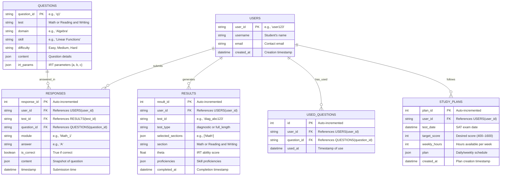

# Including Study Plan and Practice Sessions

Below is a detailed plan to enhance the **SAT Prep Suite** by making it smarter through adaptive question selection based on users' latest proficiency levels and creating a personalized study plan to maximize their SAT scores. This plan incorporates current performance, target score, test date, skill gaps, learning style, and time availability, structured in three phases (Foundation, Skill Building, Test Readiness). It also includes recommendations, a daily/weekly schedule, short practice modules using IRT, and scheduled practice/full-length tests for peak performance.

***

#### Step 1: Define Requirements

**Adaptive Question Selection**

* **Source**: Use latest proficiency levels from `RESULTS` table (`proficiencies` JSON per section/domain/skill).
* **Logic**: Select questions with difficulty matching or slightly above current proficiency (e.g., proficiency 3 → medium/hard questions).
* **IRT Integration**: Use IRT parameters (`a`, `b`, `c`) to fine-tune question selection based on theta and proficiency.

**Study Plan Inputs**

* **Current Performance**: Baseline scores from diagnostic test (200–800 per section).
* **Target Score**: User-provided desired SAT score (400–1600 total).
* **Test Date**: User-specified SAT exam date (e.g., June 7, 2025).
* **Skill Gaps**: Proficiency < 4 in any domain/skill (threshold for moderate competence).
* **Learning Style**: Infer from response patterns (e.g., faster on MCQs vs. SPR, accuracy by difficulty).
* **Time Availability**: User inputs weekly study hours (e.g., 10 hours/week).

**Study Plan Structure**

* **Foundation Phase (30%)**:
  * Focus: Weakest areas (proficiency ≤ 3).
  * Content: Basic lessons, easy/medium practice questions.
  * Goal: Reach proficiency ≥ 4 across all skills.
* **Skill Building Phase (40%)**:
  * Focus: Moderate to strong areas (proficiency 4–6).
  * Content: Intermediate/advanced lessons, targeted practice.
  * Goal: Proficiency ≥ 5–6 in most skills.
* **Test Readiness Phase (30%)**:
  * Focus: Test strategies, stamina.
  * Content: Full-length tests, advanced strategies.
  * Goal: Peak performance (target score ± 50 points).

**Additional Features**

* **Recommendations**: Identify priority skills/domains based on gaps and trends.
* **Daily/Weekly Plan**: Schedule lessons, practice modules, and tests.
* **Short Practice Modules**: 5–10 questions per skill, IRT-driven, proficiency-based.
* **Test Scheduling**: Space practice/full-length tests to optimize learning curve and peak on test date.

***

#### Step 2: Updated Plan for SAT Prep Suite

**Backend Enhancements**

* **New Module**: `study_plan.py`
* **Updated Modules**: `diagnostic.py`, `full_length_test.py`, `progress_monitoring.py`
* **New Table**: `STUDY_PLANS` for storing user plans.

**Updated ERD (Mermaid Syntax)**



**`api/models.py` (Updated)**

```python
# Add to existing models
class StudyPlan(Base):
    __tablename__ = "study_plans"
    plan_id = Column(Integer, primary_key=True, autoincrement=True)
    user_id = Column(String, ForeignKey("users.user_id"), nullable=False)
    test_date = Column(DateTime, nullable=False)
    target_score = Column(Integer, nullable=False)
    weekly_hours = Column(Integer, nullable=False)
    plan = Column(JSON, nullable=False)  # { "foundation": [...], "skill_building": [...], "test_readiness": [...] }
    created_at = Column(DateTime, default=datetime.utcnow)
```

**`api/utils.py` (Updated)**

```python
# Existing IRTSelector, proficiency_to_sat_score, etc., plus:

def get_latest_proficiencies(db: Session, user_id: str) -> Dict[str, Dict[str, Dict[str, int]]]:
    latest_results = db.query(Result).filter(Result.user_id == user_id).order_by(Result.completed_at.desc()).limit(2).all()
    proficiencies = {"Math": {}, "Reading and Writing": {}}
    for r in latest_results:
        proficiencies[r.section].update(r.proficiencies)
    return proficiencies

def select_proficiency_based_questions(test_type: str, question_bank: List[Dict], test_plan: Dict, used_ids: set, proficiencies: Dict, target_count: int) -> List[Dict]:
    selected = []
    difficulties = {"Easy": 1, "Medium": 2, "Hard": 3}  # Map to proficiency thresholds
    
    while len(selected) < target_count:
        domain = random.choice(list(test_plan.keys()))
        skill = random.choice(list(test_plan[domain].keys()))
        prof = proficiencies.get(domain, {}).get(skill, 3)  # Default to 3 if no data
        target_diff = "Easy" if prof <= 3 else "Medium" if prof <= 5 else "Hard"
        candidates = [q for q in question_bank if q["metadata"]["Test"] == test_type and 
                     q["metadata"]["Domain"] == domain and q["metadata"]["Skill"] == skill and 
                     q["metadata"]["Question ID"] not in used_ids and 
                     q["metadata"]["Difficulty"] in [target_diff, "Medium" if target_diff == "Hard" else "Hard"]]
        if candidates:
            irt = IRTSelector()
            candidates.sort(key=lambda q: irt.information(q["irt_parameters"]["a"], q["irt_parameters"]["b"], q["irt_parameters"]["c"]), reverse=True)
            q = candidates[0]
            selected.append(q)
            used_ids.add(q["metadata"]["Question ID"])
    if len(selected) < target_count:
        raise HTTPException(status_code=400, detail="Not enough unique questions available")
    return selected
```

**`api/routes/diagnostic.py` (Updated)**

```python
# Update select_diagnostic_questions to use proficiency-based selection
def select_diagnostic_questions(test_type: str, question_bank: List[Dict], test_plan: Dict, used_ids: set, proficiencies: Dict) -> List[Dict]:
    return select_proficiency_based_questions(test_type, question_bank, test_plan, used_ids, proficiencies.get(test_type, {}), 27 if test_type == "Reading and Writing" else 22)

@router.post("/start")
async def start_diagnostic(request: DiagnosticStartRequest, db: Session = Depends(get_db)):
    test_id = f"diag_{uuid.uuid4().hex[:8]}"
    question_bank = load_question_bank()
    sections = ["Reading and Writing", "Math"] if request.section == "both" else [request.section]
    used_ids = get_used_questions(db, request.user_id)
    proficiencies = get_latest_proficiencies(db, request.user_id)
    
    if request.section not in ["Math", "Reading and Writing", "both"]:
        raise HTTPException(status_code=400, detail="Invalid section choice")
    
    test_data = {"user_id": request.user_id, "test_id": test_id, "sections": {}}
    for section in sections:
        questions = select_diagnostic_questions(section, question_bank, RW_TEST_PLAN if section == "Reading and Writing" else MATH_TEST_PLAN, used_ids, proficiencies)
        test_data["sections"][section] = {
            "questions": questions,
            "time_limit": 32 if section == "Reading and Writing" else 35,
            "responses": []
        }
        mark_questions_used(db, request.user_id, [q["metadata"]["Question ID"] for q in questions])
    
    diagnostics_db[test_id] = test_data
    return {"test_id": test_id, "sections": {s: {"questions": test_data["sections"][s]["questions"], "time_limit": test_data["sections"][s]["time_limit"]} for s in sections}}
```

**`api/routes/full_length_test.py` (Updated)**

```python
# Update select_module_questions
def select_module_questions(test_type: str, module: int, question_bank: List[Dict], test_plan: Dict, used_ids: set, proficiencies: Dict, prev_theta: float = None) -> List[Dict]:
    target_questions = 27 if test_type == "Reading and Writing" else 22
    if module == 1:
        return select_proficiency_based_questions(test_type, question_bank, test_plan, used_ids, proficiencies.get(test_type, {}), target_questions)
    else:
        irt = IRTSelector(prev_theta)
        difficulty = "Hard" if prev_theta > 0 else "Easy"
        selected = select_proficiency_based_questions(test_type, question_bank, test_plan, used_ids, proficiencies.get(test_type, {}), target_questions - 2)
        medium_questions = [q for q in question_bank if q["metadata"]["Test"] == test_type and q["metadata"]["Difficulty"] == "Medium" and q["metadata"]["Question ID"] not in used_ids][:2]
        selected.extend(medium_questions)
        if len(selected) < target_questions:
            raise HTTPException(status_code=400, detail="Not enough unique questions")
        return selected

@router.post("/start")
async def start_full_test(request: FullTestStartRequest, db: Session = Depends(get_db)):
    test_id = f"full_{uuid.uuid4().hex[:8]}"
    question_bank = load_question_bank()
    valid_sections = ["Math", "Reading and Writing"]
    sections = [s for s in request.sections if s in valid_sections]
    used_ids = get_used_questions(db, request.user_id)
    proficiencies = get_latest_proficiencies(db, request.user_id)
    
    if not sections:
        raise HTTPException(status_code=400, detail="Invalid section selection")
    
    test_data = {"user_id": request.user_id, "test_id": test_id, "sections": {}, "current_module": None}
    for section in sections:
        module_1 = select_module_questions(section, 1, question_bank, RW_TEST_PLAN if section == "Reading and Writing" else MATH_TEST_PLAN, used_ids, proficiencies)
        test_data["sections"][section] = {
            "Module_1": {"questions": module_1, "time_limit": 32 if section == "Reading and Writing" else 35, "responses": []},
            "Module_2": {"questions": None, "time_limit": 32 if section == "Reading and Writing" else 35, "responses": []}
        }
        mark_questions_used(db, request.user_id, [q["metadata"]["Question ID"] for q in module_1])
    test_data["current_module"] = f"{sections[0]}_1"
    full_tests_db[test_id] = test_data
    return {"test_id": test_id, "module": test_data["current_module"], "questions": test_data["sections"][sections[0]]["Module_1"]["questions"], "time_limit": test_data["sections"][sections[0]]["Module_1"]["time_limit"]}
```

**`api/routes/study_plan.py` (New Module)**

```python
from fastapi import APIRouter, HTTPException, Depends
from pydantic import BaseModel
from sqlalchemy.orm import Session
from datetime import datetime, timedelta
from typing import Dict, List
from api.utils import get_latest_proficiencies, proficiency_to_sat_score, select_proficiency_based_questions
from api.models import StudyPlan, Result
from database import get_db

router = APIRouter()

class StudyPlanRequest(BaseModel):
    user_id: str
    test_date: str  # ISO format, e.g., "2025-06-07"
    target_score: int
    weekly_hours: int

def calculate_study_plan(user_id: str, test_date: datetime, target_score: int, weekly_hours: int, db: Session) -> Dict:
    today = datetime.now()
    days_remaining = (test_date - today).days
    if days_remaining < 14:
        raise HTTPException(status_code=400, detail="At least 2 weeks required for study plan")
    
    # Current performance
    proficiencies = get_latest_proficiencies(db, user_id)
    latest_results = db.query(Result).filter(Result.user_id == user_id).order_by(Result.completed_at.desc()).limit(2).all()
    current_scores = {r.section: proficiency_to_sat_score(sum(sum(p.values()) / len(p) for p in r.proficiencies.values()) / len(r.proficiencies)) for r in latest_results}
    current_total = sum(current_scores.values())
    
    # Skill gaps
    gaps = {"Math": [], "Reading and Writing": []}
    for section, domains in proficiencies.items():
        for domain, skills in domains.items():
            for skill, prof in skills.items():
                if prof < 4:
                    gaps[section].append({"domain": domain, "skill": skill, "proficiency": prof})
    
    # Learning style (simplified: based on accuracy by difficulty)
    responses = db.query(Response).filter(Response.user_id == user_id).all()
    learning_style = {"MCQ": sum(1 for r in responses if r.is_correct and "options" in r.content) / max(1, sum(1 for r in responses if "options" in r.content)),
                      "SPR": sum(1 for r in responses if r.is_correct and "options" not in r.content) / max(1, sum(1 for r in responses if "options" not in r.content))}
    
    # Time allocation
    total_hours = (days_remaining / 7) * weekly_hours
    phase_hours = {"foundation": total_hours * 0.3, "skill_building": total_hours * 0.4, "test_readiness": total_hours * 0.3}
    weeks = days_remaining // 7
    
    # Plan structure
    plan = {"foundation": [], "skill_building": [], "test_readiness": []}
    hours_per_week = weekly_hours / 7  # Daily average
    
    # Foundation Phase (30%)
    foundation_weeks = max(1, int(weeks * 0.3))
    for week in range(foundation_weeks):
        weekly_plan = []
        for section in gaps:
            for gap in gaps[section]:
                practice = {"type": "practice", "section": section, "domain": gap["domain"], "skill": gap["skill"], "questions": 5, "time": 15}  # 5 questions, 15 min
                weekly_plan.append({"day": (week * 7 + i % 7) + 1, "task": practice} for i in range(min(2, len(gaps[section]))))
        plan["foundation"].extend(weekly_plan)
    
    # Skill Building Phase (40%)
    skill_weeks = max(1, int(weeks * 0.4))
    for week in range(foundation_weeks, foundation_weeks + skill_weeks):
        weekly_plan = []
        for section in proficiencies:
            for domain, skills in proficiencies[section].items():
                for skill, prof in skills.items():
                    if 4 <= prof <= 6:
                        practice = {"type": "practice", "section": section, "domain": domain, "skill": skill, "questions": 10, "time": 20}
                        weekly_plan.append({"day": (week * 7 + i % 7) + 1, "task": practice} for i in range(1))
        plan["skill_building"].extend(weekly_plan)
    
    # Test Readiness Phase (30%)
    test_weeks = max(1, weeks - foundation_weeks - skill_weeks)
    practice_tests = min(test_weeks, 3)  # Max 3 full-length tests
    for week in range(foundation_weeks + skill_weeks, weeks):
        weekly_plan = []
        if practice_tests > 0:
            weekly_plan.append({"day": (week * 7 + 1), "task": {"type": "full_test", "sections": ["Math", "Reading and Writing"], "time": 134}})
            practice_tests -= 1
        else:
            weekly_plan.append({"day": (week * 7 + i % 7) + 1, "task": {"type": "strategy", "content": "Timing and review", "time": 60}} for i in range(2))
        plan["test_readiness"].extend(weekly_plan)
    
    # Recommendations
    recommendations = {"priority_skills": gaps, "learning_style": learning_style}
    
    return {"plan": plan, "recommendations": recommendations, "current_score": current_total, "target_score": target_score}

@router.post("/generate")
async def generate_study_plan(request: StudyPlanRequest, db: Session = Depends(get_db)):
    test_date = datetime.fromisoformat(request.test_date)
    if test_date < datetime.now():
        raise HTTPException(status_code=400, detail="Test date must be in the future")
    
    plan_data = calculate_study_plan(request.user_id, test_date, request.target_score, request.weekly_hours, db)
    db.add(StudyPlan(user_id=request.user_id, test_date=test_date, target_score=request.target_score, weekly_hours=request.weekly_hours, plan=plan_data["plan"]))
    db.commit()
    return plan_data

@router.get("/{user_id}")
async def get_study_plan(user_id: str, db: Session = Depends(get_db)):
    plan = db.query(StudyPlan).filter(StudyPlan.user_id == user_id).order_by(StudyPlan.created_at.desc()).first()
    if not plan:
        raise HTTPException(status_code=404, detail="No study plan found")
    return {"user_id": user_id, "test_date": plan.test_date.isoformat(), "target_score": plan.target_score, "weekly_hours": plan.weekly_hours, "plan": plan.plan}
```

**`api/routes/practice_module.py` (New Module for Short Practice)**

```python
from fastapi import APIRouter, HTTPException, Depends
from pydantic import BaseModel
from sqlalchemy.orm import Session
from api.utils import select_proficiency_based_questions, get_used_questions, mark_questions_used, IRTSelector
from database import get_db

router = APIRouter()

class PracticeRequest(BaseModel):
    user_id: str
    section: str
    domain: str
    skill: str
    questions: int = 5

class PracticeResponseRequest(BaseModel):
    user_id: str
    practice_id: str
    responses: List[ResponseModel]

practice_db: Dict[str, Dict] = {}

@router.post("/start")
async def start_practice(request: PracticeRequest, db: Session = Depends(get_db)):
    practice_id = f"prac_{uuid.uuid4().hex[:8]}"
    question_bank = load_question_bank()
    used_ids = get_used_questions(db, request.user_id)
    proficiencies = get_latest_proficiencies(db, request.user_id)
    
    questions = select_proficiency_based_questions(request.section, question_bank, {request.domain: {request.skill: {}}}, used_ids, proficiencies.get(request.section, {}), request.questions)
    practice_db[practice_id] = {"user_id": request.user_id, "questions": questions, "responses": []}
    mark_questions_used(db, request.user_id, [q["metadata"]["Question ID"] for q in questions])
    
    return {"practice_id": practice_id, "questions": questions, "time_limit": request.questions * 3}  # 3 min/question estimate

@router.post("/submit")
async def submit_practice(request: PracticeResponseRequest, db: Session = Depends(get_db)):
    if request.practice_id not in practice_db:
        raise HTTPException(status_code=404, detail="Practice session not found")
    
    session = practice_db[request.practice_id]
    if session["user_id"] != request.user_id:
        raise HTTPException(status_code=403, detail="Unauthorized")
    
    session["responses"] = [r.dict() for r in request.responses]
    irt = IRTSelector()
    responses = [(q, r["is_correct"]) for q in session["questions"] for r in session["responses"] if q["metadata"]["Question ID"] == r["question_id"]]
    theta = irt.update_theta(responses)
    
    return {"practice_id": request.practice_id, "theta": theta, "improvement": theta > 0}
```

**`api/routes/progress_monitoring.py` (Updated)**

```python
# Update to include study plan integration
@router.get("/{user_id}")
async def get_progress(user_id: str, db: Session = Depends(get_db)):
    results = db.query(Result).filter(Result.user_id == user_id).order_by(Result.completed_at).all()
    plan = db.query(StudyPlan).filter(StudyPlan.user_id == user_id).order_by(StudyPlan.created_at.desc()).first()
    if not results:
        raise HTTPException(status_code=404, detail="No test results found")
    
    progress = {"Math": {}, "Reading and Writing": {}}
    scores = []
    for r in results:
        test_id = r.test_id
        section = r.section
        avg_prof = sum(sum(p.values()) / len(p) for p in r.proficiencies.values()) / len(r.proficiencies)
        scores.append({"test_id": test_id, "section": section, "score": proficiency_to_sat_score(avg_prof)})
        for domain, skills in r.proficiencies.items():
            if domain not in progress[section]:
                progress[section][domain] = {}
            for skill, prof in skills.items():
                if skill not in progress[section][domain]:
                    progress[section][domain][skill] = []
                progress[section][domain][skill].append((test_id, prof))
    
    projected = {
        "Math": project([s["score"] for s in scores if s["section"] == "Math"], len([s for s in scores if s["section"] == "Math"])),
        "Reading and Writing": project([s["score"] for s in scores if s["section"] == "Reading and Writing"], len([s for s in scores if s["section"] == "Reading and Writing"])),
        "Total": project([m + r for m, r in zip([s["score"] for s in scores if s["section"] == "Math"], [s["score"] for s in scores if s["section"] == "Reading and Writing"])], len([s for s in scores if s["section"] == "Math"])) if len([s for s in scores if s["section"] == "Math"]) == len([s for s in scores if s["section"] == "Reading and Writing"]) else []
    }
    
    recommendations = {"Math": [], "Reading and Writing": []}
    for section, domains in progress.items():
        for domain, skills in domains.items():
            for skill, profs in skills.items():
                avg_prof = sum(p[1] for p in profs) / len(profs)
                trend = np.mean(np.diff([p[1] for p in profs])) if len(profs) > 1 else 0
                if avg_prof < 4 or (trend < 0.1 and len(profs) > 1):
                    recommendations[section].append({"domain": domain, "skill": skill, "avg_prof": avg_prof, "trend": trend})
    
    return {
        "historical_scores": scores,
        "projected_scores": projected,
        "skill_progress": progress,
        "recommendations": recommendations,
        "study_plan_progress": {"current_phase": "foundation" if plan and (datetime.now() - plan.created_at).days < (plan.test_date - plan.created_at).days * 0.3 else "skill_building" if plan and (datetime.now() - plan.created_at).days < (plan.test_date - plan.created_at).days * 0.7 else "test_readiness"} if plan else None
    }
```

***

#### Step 3: Frontend Integration (Outline)

* **`StudyPlan.js`**:
  * POST `/study-plan/generate` → Input form (test date, target score, weekly hours).
  * GET `/study-plan/<user_id>` → Display daily/weekly schedule.
* **`PracticeModule.js`**:
  * POST `/practice/start` → Select section/domain/skill → Get 5–10 questions.
  * POST `/practice/submit` → Show theta improvement.
* **Dashboard**: Add “Study Plan” and “Practice Modules” buttons.

***

#### Step 4: Testing

* **Adaptive Questions**: Verify diagnostic/full-length tests select questions matching latest proficiencies (e.g., proficiency 5 → hard questions).
* **Study Plan**: Generate plan for `user123` (test date: 2025-06-07, target: 1400, 10 hr/week) → Check 3-phase structure, daily tasks.
* **Practice Modules**: Start practice for Algebra → Confirm 5 unique, proficiency-based questions.
* **Scheduling**: Ensure full-length tests peak near test date (e.g., last 2 weeks).

***

#### Conclusion

This plan enhances the SAT Prep Suite with:

* **Smart Question Selection**: Proficiency-based, IRT-driven questions for diagnostics, full-length tests, and practice modules.
* **Personalized Study Plan**: Three-phase structure (Foundation, Skill Building, Test Readiness) tailored to current performance, target score, and time, with daily/weekly tasks and test scheduling.
* **Recommendations & Practice**: Targeted skill focus and short, adaptive practice sessions.

The system is now optimized for thousands of users, maximizing scores by test date (e.g., March 26, 2025 → June 7, 2025). If approved, I can implement this—let me know your thoughts!
