# ERD

Below is the complete **Entity-Relationship Diagram (ERD)** for the **SAT Prep Suite** database, represented using **Mermaid** syntax with full details. This ERD includes all 14 tables (`users`, `questions`, `responses`, `proficiencies`, `practice_sessions`, `study_plans`, `study_plan_actions`, `badges`, `notifications`, `tutor_interactions`, `tutor_actions`, `posts`, `comments`, `friends`) as defined in `backend/src/database.py`, with their attributes, data types, constraints (e.g., primary keys, foreign keys, unique constraints), and relationships. This reflects the fully enhanced database from Item 8 as of March 27, 2025. You can paste this code into a Mermaid-compatible tool (e.g., `mermaid.live`) to visualize it.

***

### Mermaid ERD Code with Complete Details

```mermaid
erDiagram
    USER ||--o{ RESPONSES : has
    USER ||--o{ PROFICIENCIES : has
    USER ||--o{ PRACTICE_SESSIONS : has
    USER ||--o{ STUDY_PLANS : has
    USER ||--o{ BADGES : has
    USER ||--o{ NOTIFICATIONS : has
    USER ||--o{ TUTOR_INTERACTIONS : has
    USER ||--o{ POSTS : has
    USER ||--o{ COMMENTS : has
    USER ||--o{ FRIENDS : sends
    USER ||--o{ FRIENDS : receives
    USER ||--o{ TUTOR_ACTIONS : performs
    USER ||--o{ TUTOR_ACTIONS : receives

    QUESTION ||--o{ RESPONSES : answered_in

    PRACTICE_SESSIONS ||--o{ RESPONSES : contains
    STUDY_PLANS ||--o{ PRACTICE_SESSIONS : schedules

    STUDY_PLANS ||--o{ STUDY_PLAN_ACTIONS : contains

    POSTS ||--o{ COMMENTS : has

    USER {
        string user_id PK "Unique identifier"
        string email UK "User's email, unique"
        string hashed_password "Hashed password"
        string role "Default: 'student' (student, tutor, parent)"
        integer study_hours "Weekly study hours"
        integer points "Gamification points, default: 0"
        integer streak "Daily streak, default: 0"
        string league "League (Bronze, Silver, Gold, Platinum), default: 'Bronze'"
        string linked_user_id FK "Nullable, links to users.user_id (tutor/parent)"
    }

    QUESTION {
        string question_id PK "Unique identifier"
        string domain "Category (e.g., Math, Reading & Writing)"
        string skill "Specific skill (e.g., Algebra)"
        string text "Question content"
        string options "Nullable, JSON string for MCQ options"
        string correct_answer "Correct answer"
        float a_param "IRT discrimination, default: 1.0"
        float b_param "IRT difficulty, default: 0.0"
        float c_param "IRT guessing, default: 0.25"
    }

    RESPONSES {
        integer id PK "Unique identifier"
        string session_id FK "Links to practice_sessions.session_id"
        string user_id FK "Links to users.user_id"
        string question_id FK "Links to questions.question_id"
        string answer "User's answer"
        integer time_spent "Time in seconds"
        datetime timestamp "When answered, default: now()"
        string review_text "Nullable, AI-generated feedback"
    }

    PROFICIENCIES {
        integer id PK "Unique identifier"
        string user_id FK "Links to users.user_id"
        string domain "Category"
        string skill "Specific skill"
        float theta "IRT proficiency score"
        datetime timestamp "When recorded, default: now()"
    }

    PRACTICE_SESSIONS {
        string session_id PK "Unique identifier"
        string user_id FK "Links to users.user_id"
        float theta "Session proficiency score, default: 0.0"
        string test_type "Type (diagnostic, full, practice)"
        string section "Nullable, sections (e.g., 'Math')"
        string plan_id FK "Nullable, links to study_plans.plan_id"
    }

    STUDY_PLANS {
        string plan_id PK "Unique identifier"
        string user_id FK "Links to users.user_id"
        datetime test_date "SAT test date"
    }

    STUDY_PLAN_ACTIONS {
        integer id PK "Unique identifier"
        string plan_id FK "Links to study_plans.plan_id"
        string task "Task name (e.g., 'Practice Algebra')"
        string action "Task description"
        datetime due_date "Due date"
        integer points "Points awarded"
        datetime completed "Nullable, completion timestamp"
    }

    BADGES {
        integer id PK "Unique identifier"
        string user_id FK "Links to users.user_id"
        string name "Badge name (e.g., 'Beginner')"
        datetime awarded_at "When awarded, default: now()"
    }

    NOTIFICATIONS {
        integer id PK "Unique identifier"
        string user_id FK "Links to users.user_id"
        string message "Notification text"
        datetime timestamp "When sent, default: now()"
        boolean read "Read status, default: false"
    }

    TUTOR_INTERACTIONS {
        integer id PK "Unique identifier"
        string user_id FK "Links to users.user_id"
        string query "User's question/input"
        string response "AI response"
        datetime timestamp "When occurred, default: now()"
        integer duration "Time in seconds"
    }

    TUTOR_ACTIONS {
        integer id PK "Unique identifier"
        string tutor_id FK "Links to users.user_id (tutor)"
        string student_id FK "Links to users.user_id (student)"
        string action "Action type (e.g., 'Viewed analytics')"
        string details "Nullable, additional info"
        datetime timestamp "When occurred, default: now()"
    }

    POSTS {
        integer id PK "Unique identifier"
        string user_id FK "Links to users.user_id"
        string content "Post text"
        datetime timestamp "When posted, default: now()"
    }

    COMMENTS {
        integer id PK "Unique identifier"
        integer post_id FK "Links to posts.id"
        string user_id FK "Links to users.user_id"
        string content "Comment text"
        datetime timestamp "When commented, default: now()"
    }

    FRIENDS {
        integer id PK "Unique identifier"
        string user_id FK "Links to users.user_id (requester)"
        string friend_id FK "Links to users.user_id (recipient)"
        string status "Status (pending, accepted), default: 'pending'"
        datetime timestamp "When requested, default: now()"
    }
```

<figure><figcaption>
ERD
</figcaption></figure>

***

### Explanation of ERD Details

#### Entities and Attributes

* **USER**: Central entity with user data and relationships to all user-generated content.
  * `user_id`: Primary key, unique identifier.
  * `email`: Unique constraint for login.
  * `linked_user_id`: Self-referencing foreign key for tutor/parent linking.
* **QUESTION**: Stores SAT questions with IRT parameters.
* **RESPONSES**: Links users, questions, and sessions for answers.
* **PROFICIENCIES**: Tracks user skill levels over time.
* **PRACTICE\_SESSIONS**: Manages test sessions (diagnostic, practice, full).
* **STUDY\_PLANS**: Defines user study schedules.
* **STUDY\_PLAN\_ACTIONS**: Individual tasks within plans.
* **BADGES**: Gamification rewards.
* **NOTIFICATIONS**: User alerts (e.g., streak reminders).
* **TUTOR\_INTERACTIONS**: Logs AI tutor chats.
* **TUTOR\_ACTIONS**: Tracks tutor actions on students.
* **POSTS**: Social media posts.
* **COMMENTS**: Comments on posts.
* **FRIENDS**: Manages friendships with status tracking.

#### Relationships

* **One-to-Many (||--o{)**:
  * `USER` to `RESPONSES`, `PROFICIENCIES`, `PRACTICE_SESSIONS`, etc.: One user has many records.
  * `QUESTION` to `RESPONSES`: One question answered many times.
  * `PRACTICE_SESSIONS` to `RESPONSES`: One session contains many responses.
  * `STUDY_PLANS` to `STUDY_PLAN_ACTIONS`, `PRACTICE_SESSIONS`: One plan has many actions/sessions.
  * `POSTS` to `COMMENTS`: One post has many comments.
* **Many-to-One (o{--||)**:
  * `RESPONSES` to `USER`, `QUESTION`, `PRACTICE_SESSIONS`: Each response links to one entity.
  * `STUDY_PLAN_ACTIONS` to `STUDY_PLANS`: Each action belongs to one plan.
* **Many-to-Many (o{--o{)**:
  * `USER` to `FRIENDS`: Self-referencing via `user_id` and `friend_id` for friendships.
  * `USER` to `TUTOR_ACTIONS`: Via `tutor_id` and `student_id`.

#### Constraints

* **PK**: Primary Key (e.g., `user_id`, `id`).
* **FK**: Foreign Key (e.g., `session_id` links to `practice_sessions.session_id`).
* **UK**: Unique Key (e.g., `email` in `USER`).
* **Nullable**: Fields like `options` in `QUESTION` or `completed` in `STUDY_PLAN_ACTIONS`.

***

### Visualization Instructions

1. **Copy the Code**: Copy the Mermaid code above.
2. **Paste into Mermaid Live Editor**: Go to `mermaid.live`, paste into the editor, and click "Render".
3. **View ERD**: Displays entities as boxes, attributes with details, and relationships as lines with cardinality.

***

### Verification

* **Completeness**: All 14 tables from `database.py` included with full attributes, types, and constraints.
* **Relationships**: Matches ORM relationships (e.g., `User.responses`, `Post.comments`).
* **Accuracy**: Reflects database schema supporting all features (auth, practice, AI, social, etc.).

This ERD is fully detailed—visualize it in `mermaid.live` and let me know if you need adjustments (e.g., additional notes)!
