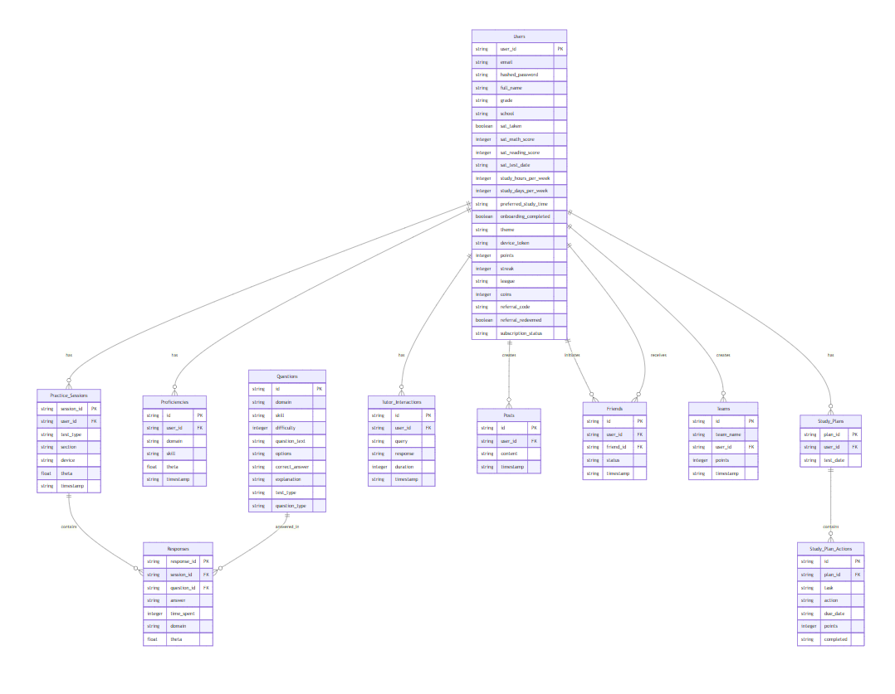
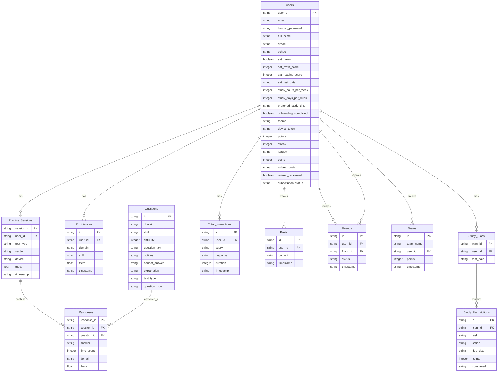

# ERD Mermaid

Below is a **Mermaid diagram** representing the **Entity-Relationship Diagram (ERD)** for the **SAT Smart Prep App** by **Learner Labs**, as described in the previous detailed ERD. Mermaid is a JavaScript-based diagramming tool that allows you to create diagrams using a simple text syntax, which can be rendered in tools like Mermaid Live Editor (https://mermaid.live/) or integrated into Markdown files in platforms like GitHub.

Since I cannot directly render the diagram, I’ll provide the Mermaid code that you can copy and paste into a Mermaid-compatible editor to visualize the ERD. The diagram includes all entities, their key attributes, and relationships as outlined in the previous ERD description.

***

### Mermaid Diagram for the SAT Smart Prep App ERD

<figure><figcaption></figcaption></figure>

***

### How to Use the Mermaid Diagram

1. **Copy the Code**: Copy the Mermaid code above (everything between the `mermaid and` markers).
2. **Paste into a Mermaid Editor**:
   * Go to the Mermaid Live Editor: https://mermaid.live/
   * Paste the code into the editor.
   * The diagram will render automatically, showing the entities, their attributes, and relationships.
3. **Customize (Optional)**:
   * You can adjust the layout or styling in the Mermaid Live Editor if needed.
   * For example, you can add labels to relationships by modifying the syntax (e.g., `Users ||--o{ Practice_Sessions : "has"` can be changed to include more details).
4. **Export or Embed**:
   * Export the diagram as a PNG, SVG, or other format from the Mermaid Live Editor.
   * Alternatively, embed the Mermaid code in a Markdown file (e.g., in your project’s `README.md`) if your documentation platform supports Mermaid rendering (e.g., GitHub, GitLab).

***

### Explanation of the Diagram

* **Entities**: Each box represents a table in the database (e.g., `Users`, `Questions`, `Practice_Sessions`).
* **Attributes**: Listed inside each entity box, with the primary key (PK), foreign keys (FK), and default values indicated.
* **Relationships**:
  * `||--o{` indicates a one-to-many relationship (e.g., one `User` can have many `Practice_Sessions`).
  * `||--o{` with two foreign keys in `Friends` indicates a many-to-many self-referential relationship (users can be friends with other users).
* **Labels**: Relationships are labeled with verbs (e.g., "has", "contains", "creates") to describe the nature of the connection.

***

### Notes for the Outsourcing Team

* **Database Setup**: The schema is implemented in PostgreSQL, as shown in `frontend/backend/migrations/init_db.py`. Ensure the database is initialized before testing.
* **Testing Focus**:
  * Verify that API endpoints (e.g., `/practice/start`, `/study_plan/create`) correctly interact with the database tables.
  * Test foreign key constraints (e.g., deleting a `User` should handle related `Practice_Sessions` appropriately, possibly via cascading deletes).
  * Ensure data integrity for relationships (e.g., a `Response` should always link to a valid `Question` and `Practice_Session`).
* **Scalability**: For large datasets, consider adding indexes on frequently queried fields (e.g., `user_id`, `session_id`) to improve performance.

You can use this Mermaid diagram to visualize the database structure and guide the testing and implementation process. Let me know if you’d like to adjust the diagram or add more details!
