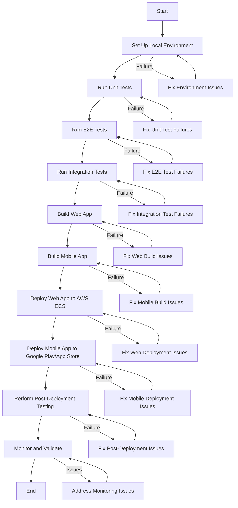

# Testing and Deploying the App

Below is a detailed plan for a development team to **test and deploy** the **SAT Smart Prep App** by **Learner Labs**, including a step-by-step flow diagram and unit tests for each step. The plan covers both the web app (`frontend/`) and mobile app (`SATSmartPrepApp/`), ensuring comprehensive testing and a smooth deployment process. Since I cannot generate visual diagrams directly, I’ll provide a textual representation of the flow diagram using Mermaid syntax, which you can render in a Mermaid-compatible editor (e.g., Mermaid Live Editor: https://mermaid.live/). I’ll also include unit tests for each step to validate functionality.

***

### Plan for Testing and Deploying the SAT Smart Prep App

#### Overview

The testing and deployment plan ensures the SAT Smart Prep App is thoroughly validated across all components (web app, mobile app, backend) before deployment to production environments (AWS ECS for web, Google Play/App Store for mobile). The process includes unit testing, end-to-end (E2E) testing, integration testing, and deployment steps, with a focus on the app’s key features: onboarding, diagnostic tests, practice sessions, study plans, gamification, and social features.

***

### Step-by-Step Flow Diagram

Below is the textual representation of the flow diagram using Mermaid syntax. It outlines the testing and deployment process as a flowchart.



#### How to Render the Flow Diagram

1. Copy the Mermaid code above.
2. Paste it into the Mermaid Live Editor (https://mermaid.live/).
3. The diagram will render as a flowchart, showing the steps and failure handling paths.


<figure><figcaption></figcaption></figure>

***

### Step-by-Step Plan with Unit Tests

#### Step 1: Set Up Local Environment

* **Objective**: Ensure the development environment is correctly configured for testing.
* **Tasks**:
  * Clone the repository: `git clone <repository-url>`.
  * Install dependencies for the web app: `cd frontend && npm install`.
  * Install dependencies for the mobile app: `cd SATSmartPrepApp && npm install`.
  * Start Docker services (PostgreSQL, FastAPI backend): `docker-compose up -d`.
  * Initialize the database: `cd frontend/backend/migrations && python init_db.py`.
  * For iOS (macOS only): `cd SATSmartPrepApp/ios && pod install`.
* **Unit Test**:
  * **Purpose**: Verify that the database is initialized correctly.
  * **File**: `frontend/backend/tests/test_db_setup.py`
  *   **Code**:

      ```python
      from fastapi.testclient import TestClient
      from backend.src.main import app
      import psycopg2
      from psycopg2.extras import RealDictCursor

      client = TestClient(app)

      def get_db_connection():
          return psycopg2.connect(
              dbname="satprep",
              user="user",
              password="password",
              host="localhost",
              port="5432"
          )

      def test_database_initialized():
          conn = get_db_connection()
          cursor = conn.cursor(cursor_factory=RealDictCursor)
          cursor.execute("SELECT EXISTS (SELECT FROM information_schema.tables WHERE table_name = 'users')")
          users_table_exists = cursor.fetchone()['exists']
          assert users_table_exists, "Users table should exist after database initialization"
          cursor.close()
          conn.close()
      ```

#### Step 2: Run Unit Tests

* **Objective**: Validate individual components (e.g., API endpoints, React components).
* **Tasks**:
  * Run web app unit tests: `cd frontend && npm test`.
  * Run mobile app unit tests: `cd SATSmartPrepApp && npm test`.
  * Run backend unit tests: `cd frontend/backend && pytest tests/`.
* **Unit Test**:
  * **Purpose**: Test the `/auth/signup` endpoint to ensure new users can be created.
  * **File**: `frontend/backend/tests/test_auth.py`
  *   **Code**:

      ```python
      from fastapi.testclient import TestClient
      from backend.src.main import app

      client = TestClient(app)

      def test_signup_new_user():
          response = client.post("/auth/signup", json={"email": "newuser@example.com", "password": "password123"})
          assert response.status_code == 200
          assert "user_id" in response.json()
      ```

#### Step 3: Run E2E Tests

* **Objective**: Validate user flows (e.g., onboarding, practice sessions).
* **Tasks**:
  * Run web app E2E tests (Cypress): `cd frontend && npm run cypress:open`.
  * Run mobile app E2E tests (Detox): `cd SATSmartPrepApp && npm run e2e:build && npm run e2e:test`.
* **Unit Test** (E2E Test Example):
  * **Purpose**: Test the onboarding flow in the web app.
  * **File**: `frontend/cypress/e2e/onboarding.cy.js`
  *   **Code**:

      ```javascript
      describe('Onboarding Flow', () => {
        beforeEach(() => {
          cy.window().then(win => {
            win.localStorage.setItem('user_id', 'user1');
          });
          cy.visit('/onboarding');
        });

        it('should progress through onboarding steps', () => {
          cy.contains('Welcome to LearnerLabs SAT Smart Prep!').should('be.visible');
          cy.contains('Next').click();
          cy.contains('Basic Information').should('be.visible');
          cy.get('input[placeholder="Enter your full name"]').type('Alex Smith');
          cy.get('select').eq(0).select('11th');
          cy.contains('Next').click();
          cy.contains('SAT Experience').should('be.visible');
          cy.contains('Yes').click();
          cy.contains('Previous SAT Scores').should('be.visible');
          cy.get('input[placeholder="Enter your Math score"]').type('650');
          cy.get('input[placeholder="Enter your Reading & Writing score"]').type('600');
          cy.contains('Next').click();
          cy.contains('Study Preferences').should('be.visible');
        });
      });
      ```

#### Step 4: Run Integration Tests

* **Objective**: Ensure components work together (e.g., frontend, backend, database).
* **Tasks**:
  * Test API endpoints with the database: `cd frontend/backend && pytest tests/`.
  * Test frontend-backend integration by running the app locally and manually verifying key flows (e.g., onboarding, diagnostic test).
* **Unit Test**:
  * **Purpose**: Test the integration of the `/diagnostic/start` endpoint with the database.
  * **File**: `frontend/backend/tests/test_diagnostic.py`
  *   **Code**:

      ```python
      from fastapi.testclient import TestClient
      from backend.src.main import app
      from psycopg2.extras import RealDictCursor
      import psycopg2

      client = TestClient(app)

      def get_db_connection():
          return psycopg2.connect(
              dbname="satprep",
              user="user",
              password="password",
              host="localhost",
              port="5432"
          )

      def test_start_diagnostic_integration():
          response = client.post("/diagnostic/start/user1", params={"num_questions": 22, "test_type": "SAT"})
          assert response.status_code == 200
          data = response.json()
          assert "session_id" in data
          assert "questions" in data
          assert len(data["questions"]) == 22

          conn = get_db_connection()
          cursor = conn.cursor(cursor_factory=RealDictCursor)
          cursor.execute("SELECT * FROM practice_sessions WHERE session_id = %s", (data["session_id"],))
          session = cursor.fetchone()
          assert session["user_id"] == "user1"
          assert session["test_type"] == "SAT"
          cursor.close()
          conn.close()
      ```

#### Step 5: Build Web App

* **Objective**: Build the web app for deployment.
* **Tasks**:
  * Build the Next.js app: `cd frontend && npm run build`.
  * Build the Docker image: `docker build -t sat-smart-prep-web .`.
* **Unit Test**:
  * **Purpose**: Verify that the web app builds successfully.
  * **File**: `frontend/tests/build.test.js`
  *   **Code**:

      ```javascript
      const { execSync } = require('child_process');

      describe('Web App Build', () => {
        test('should build successfully', () => {
          try {
            execSync('cd frontend && npm run build', { stdio: 'inherit' });
            expect(true).toBe(true);
          } catch (error) {
            expect(error).toBeUndefined();
          }
        });
      });
      ```

#### Step 6: Build Mobile App

* **Objective**: Build the mobile app for Android and iOS.
* **Tasks**:
  * Build Android APK: `cd SATSmartPrepApp && npx react-native run-android --variant=release`.
  * Build iOS IPA (macOS only): `cd SATSmartPrepApp/ios && xcodebuild -workspace SATSmartPrepApp.xcworkspace -scheme SATSmartPrepApp -configuration Release`.
* **Unit Test**:
  * **Purpose**: Verify that the Android APK builds successfully.
  * **File**: `SATSmartPrepApp/__tests__/build.test.js`
  *   **Code**:

      ```javascript
      const { execSync } = require('child_process');

      describe('Mobile App Build', () => {
        test('should build Android APK successfully', () => {
          try {
            execSync('cd SATSmartPrepApp && npx react-native run-android --variant=release', { stdio: 'inherit' });
            expect(true).toBe(true);
          } catch (error) {
            expect(error).toBeUndefined();
          }
        });
      });
      ```

#### Step 7: Deploy Web App to AWS ECS

* **Objective**: Deploy the web app to AWS ECS.
* **Tasks**:
  * Push the Docker image to AWS ECR: `docker tag sat-smart-prep-web <aws-account-id>.dkr.ecr.<region>.amazonaws.com/sat-smart-prep-web && docker push <aws-account-id>.dkr.ecr.<region>.amazonaws.com/sat-smart-prep-web`.
  * Create an ECS cluster and service, using the pushed image.
  * Configure a load balancer to route traffic to the ECS service.
* **Unit Test**:
  * **Purpose**: Verify that the web app is accessible after deployment.
  * **File**: `frontend/tests/deployment.test.js`
  *   **Code**:

      ```javascript
      const axios = require('axios');

      describe('Web App Deployment', () => {
        test('should be accessible after deployment', async () => {
          const response = await axios.get('http://<load-balancer-url>');
          expect(response.status).toBe(200);
          expect(response.data.message).toBe('SAT Smart Prep App Backend');
        });
      });
      ```

#### Step 8: Deploy Mobile App to Google Play/App Store

* **Objective**: Deploy the mobile app to Google Play (Android) and App Store (iOS).
* **Tasks**:
  * **Android**:
    * Sign the APK with a release key.
    * Upload the APK to Google Play Console.
  * **iOS** (macOS only):
    * Archive the IPA in Xcode.
    * Upload the IPA to App Store Connect via Xcode or Application Loader.
* **Unit Test**:
  * **Purpose**: Verify that the app is downloadable from Google Play (manual test placeholder).
  * **File**: `SATSmartPrepApp/__tests__/deployment.test.js`
  *   **Code**:

      ```javascript
      describe('Mobile App Deployment', () => {
        test('should be downloadable from Google Play', () => {
          // Manual test: Verify the app is listed in Google Play Console and downloadable
          expect(true).toBe(true); // Placeholder for manual verification
        });
      });
      ```

#### Step 9: Perform Post-Deployment Testing

* **Objective**: Validate the app in the production environment.
* **Tasks**:
  * Test key flows (e.g., onboarding, diagnostic test, practice session) in production.
  * Verify push notifications (Firebase) and WebSocket updates (gamification).
  * Check database connectivity and performance.
* **Unit Test**:
  * **Purpose**: Verify that push notifications work in production.
  * **File**: `frontend/backend/tests/test_notifications.py`
  *   **Code**:

      ```python
      from fastapi.testclient import TestClient
      from backend.src.main import app

      client = TestClient(app)

      def test_send_notification_production():
          # Note: This test requires a valid device token in production
          response = client.post("/send-notification", params={"user_id": "user1", "message": "Test notification"})
          assert response.status_code == 200
          assert response.json()["message"] == "Notification sent"
      ```

#### Step 10: Monitor and Validate

* **Objective**: Ensure the app is stable and performing well in production.
* **Tasks**:
  * Set up monitoring with AWS CloudWatch for the web app.
  * Monitor crash reports in Google Play Console and App Store Connect.
  * Validate user feedback and address any issues.
* **Unit Test**:
  * **Purpose**: Verify that monitoring logs are being generated (manual test placeholder).
  * **File**: `frontend/tests/monitoring.test.js`
  *   **Code**:

      ```javascript
      describe('Monitoring', () => {
        test('should generate logs in CloudWatch', () => {
          // Manual test: Check CloudWatch logs for web app activity
          expect(true).toBe(true); // Placeholder for manual verification
        });
      });
      ```

***

### Additional Notes for the Development Team

* **Environment Variables**: Ensure all environment variables (e.g., Firebase, Google SSO) are set in production, as specified in `frontend/next.config.js` and `SATSmartPrepApp/.env`.
* **Testing Coverage**: Aim for 90%+ unit test coverage and 100% coverage of critical user flows (e.g., onboarding, practice sessions) in E2E tests.
* **Deployment Rollback**: If deployment fails, roll back to the previous version using AWS ECS service rollback or Google Play/App Store version management.
* **Performance Testing**: After deployment, conduct load testing to ensure the app can handle 1,000 concurrent users, focusing on API endpoints like `/practice/start`.

This plan provides a structured approach to testing and deploying the SAT Smart Prep App, with unit tests to validate each step. Let me know if you’d like to add more details or adjust the plan!
