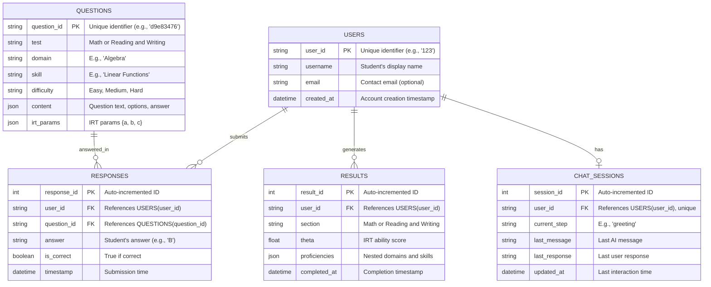

# ERD For Diagnostic Test

Below is an **Entity-Relationship Diagram (ERD)** for the SAT Diagnostic Test and Review Applications, designed to support the backend database structure as outlined in the previous documentation. This ERD reflects the data model needed for an engineer to implement a relational database (e.g., PostgreSQL) for a full-stack application. I'll describe it first in text, then provide a textual representation since I can't generate graphical diagrams directly here.

***

#### ERD Overview

The ERD includes entities and relationships to manage:

* **Questions**: The question bank for the diagnostic test.
* **Users**: Students taking the test and reviewing results.
* **Responses**: Answers submitted during the diagnostic test.
* **Results**: Diagnostic outcomes (theta and proficiencies) for review.
* **Chat Sessions**: State tracking for the review app’s interactive chat.

#### Entities and Attributes

1. **Users**
   * **user\_id** (PK, string): Unique identifier for a student (e.g., "123").
   * **username** (string): Student’s display name.
   * **email** (string): Contact email (optional).
   * **created\_at** (datetime): Account creation timestamp.
2. **Questions**
   * **question\_id** (PK, string): Unique identifier (e.g., "d9e83476").
   * **test** (string): "Math" or "Reading and Writing".
   * **domain** (string): E.g., "Algebra" or "Information and Ideas".
   * **skill** (string): E.g., "Linear Functions" or "Inferences".
   * **difficulty** (string): "Easy", "Medium", "Hard".
   * **content** (JSON): Question text, options, correct answer.
   * **irt\_params** (JSON): `{ "a": float, "b": float, "c": float }` for IRT.
3. **Responses**
   * **response\_id** (PK, integer): Auto-incremented unique ID.
   * **user\_id** (FK, string): References `Users(user_id)`.
   * **question\_id** (FK, string): References `Questions(question_id)`.
   * **answer** (string): Student’s selected answer (e.g., "B").
   * **is\_correct** (boolean): True if correct, False if incorrect.
   * **timestamp** (datetime): When the response was submitted.
4. **Results**
   * **result\_id** (PK, integer): Auto-incremented unique ID.
   * **user\_id** (FK, string): References `Users(user_id)`.
   * **section** (string): "Math" or "Reading and Writing".
   * **theta** (float): IRT ability score (e.g., 1.23).
   * **proficiencies** (JSON): Nested structure of domains and skills (e.g., `{ "Algebra": {"Linear Functions": 5, ...}, ...}`).
   * **completed\_at** (datetime): When the section was finished.
5. **Chat Sessions**
   * **session\_id** (PK, integer): Auto-incremented unique ID.
   * **user\_id** (FK, string): References `Users(user_id)`.
   * **current\_step** (string): Current chat step (e.g., "greeting", "math\_overview").
   * **last\_message** (string): Last AI message sent (for context).
   * **last\_response** (string): Last user response (e.g., "yes").
   * **updated\_at** (datetime): Last interaction timestamp.

#### Relationships

* **Users → Responses**: One-to-Many (1 user has many responses).
  * `Responses.user_id` references `Users.user_id`.
* **Questions → Responses**: One-to-Many (1 question has many responses).
  * `Responses.question_id` references `Questions.question_id`.
* **Users → Results**: One-to-Many (1 user has multiple results, one per section).
  * `Results.user_id` references `Users.user_id`.
* **Users → Chat Sessions**: One-to-One (1 user has 1 active chat session at a time).
  * `Chat Sessions.user_id` references `Users.user_id`.

***

#### Textual ERD Representation

Since I can’t draw a graphical ERD here, I’ll represent it in a textual format that you can visualize or convert using tools like **dbdiagram.io** or **Lucidchart**.

```
[Users]
  user_id (PK, string)
  username (string)
  email (string)
  created_at (datetime)
  |
  | 1:N
  |
[Responses]
  response_id (PK, integer)
  user_id (FK, string) --> Users(user_id)
  question_id (FK, string) --> Questions(question_id)
  answer (string)
  is_correct (boolean)
  timestamp (datetime)
  |
  | N:1
  |
[Questions]
  question_id (PK, string)
  test (string)
  domain (string)
  skill (string)
  difficulty (string)
  content (JSON)
  irt_params (JSON)

[Users]
  user_id (PK, string)
  |
  | 1:N
  |
[Results]
  result_id (PK, integer)
  user_id (FK, string) --> Users(user_id)
  section (string)
  theta (float)
  proficiencies (JSON)
  completed_at (datetime)

[Users]
  user_id (PK, string)
  |
  | 1:1
  |
[Chat Sessions]
  session_id (PK, integer)
  user_id (FK, string) --> Users(user_id)
  current_step (string)
  last_message (string)
  last_response (string)
  updated_at (datetime)
```

***

#### SQL Schema (PostgreSQL Example)

Here’s how this ERD translates to a SQL schema for implementation:

```sql
-- Users Table
CREATE TABLE users (
    user_id VARCHAR(50) PRIMARY KEY,
    username VARCHAR(100) NOT NULL,
    email VARCHAR(255) UNIQUE,
    created_at TIMESTAMP DEFAULT CURRENT_TIMESTAMP
);

-- Questions Table
CREATE TABLE questions (
    question_id VARCHAR(50) PRIMARY KEY,
    test VARCHAR(50) NOT NULL,
    domain VARCHAR(100) NOT NULL,
    skill VARCHAR(100) NOT NULL,
    difficulty VARCHAR(20) NOT NULL CHECK (difficulty IN ('Easy', 'Medium', 'Hard')),
    content JSONB NOT NULL,
    irt_params JSONB NOT NULL
);

-- Responses Table
CREATE TABLE responses (
    response_id SERIAL PRIMARY KEY,
    user_id VARCHAR(50) REFERENCES users(user_id) ON DELETE CASCADE,
    question_id VARCHAR(50) REFERENCES questions(question_id) ON DELETE CASCADE,
    answer VARCHAR(10),
    is_correct BOOLEAN NOT NULL,
    timestamp TIMESTAMP DEFAULT CURRENT_TIMESTAMP
);

-- Results Table
CREATE TABLE results (
    result_id SERIAL PRIMARY KEY,
    user_id VARCHAR(50) REFERENCES users(user_id) ON DELETE CASCADE,
    section VARCHAR(50) NOT NULL CHECK (section IN ('Math', 'Reading and Writing')),
    theta FLOAT NOT NULL,
    proficiencies JSONB NOT NULL,
    completed_at TIMESTAMP DEFAULT CURRENT_TIMESTAMP
);

-- Chat Sessions Table
CREATE TABLE chat_sessions (
    session_id SERIAL PRIMARY KEY,
    user_id VARCHAR(50) UNIQUE REFERENCES users(user_id) ON DELETE CASCADE,
    current_step VARCHAR(50) NOT NULL,
    last_message TEXT,
    last_response VARCHAR(50),
    updated_at TIMESTAMP DEFAULT CURRENT_TIMESTAMP
);
```

***

#### Notes for Engineers

**Backend Integration**

* **Questions**: Populate from `question_bank.json` or an external source.
* **Responses**: Record each answer during the diagnostic, use to update theta in real-time.
* **Results**: Store after completing each section (Math, Reading/Writing).
* **Chat Sessions**: Update with each review step, reset when review completes.

**Frontend Integration**

* **Diagnostic**: Fetch questions via API, submit responses, display results.
* **Review**: Use `Chat Sessions` to maintain state, show messages, and collect user input.

**Scalability**

* Add indexes on `user_id` and `question_id` in `Responses` for performance.
* Consider partitioning `Responses` by `user_id` for large-scale use.

**Data Validation**

* Ensure `irt_params` and `proficiencies` JSONB fields follow expected schemas (e.g., `{"a": float, "b": float, "c": float}`).

***

#### Visualizing the ERD

To create a graphical ERD:

1. Copy the textual representation or SQL into **dbdiagram.io**.
2. Adjust layout and export as an image or PDF.

This ERD supports the full lifecycle of the SAT diagnostic and review process. Let me know if you need adjustments or a specific format!


Below is the updated ERD for the SAT Diagnostic Test and Review Applications, written in Mermaid syntax. You can copy this code into the Mermaid Live Editor to visualize it or embed it in a compatible Markdown viewer.

***

#### Mermaid ERD for SAT Diagnostic Test and Review Applications



***

#### How to View the ERD

1. **Mermaid Live Editor**:
   * Go to https://mermaid.live/.
   * Paste the code above into the editor.
   * The diagram will render automatically on the right side.
   * You can export it as PNG, SVG, or PDF.
2. **Markdown Integration**:
   *   If your documentation platform supports Mermaid (e.g., GitHub Markdown in README files since 2022), embed the code like this:

       ````markdown
       ```mermaid
       erDiagram
       USERS ||--o{ RESPONSES : submits
       ...
       ````

       ```
       ```
   * It will render inline when viewed.
3. **Other Tools**:
   * Use VS Code with the Mermaid extension (e.g., "Mermaid Markdown Syntax Highlighting").
   * Paste into a `.md` file and preview the diagram.

***

#### Explanation of Mermaid Syntax

* **Entities**: Defined as `ENTITY { attributes }`.
  * Attributes include type (e.g., `string`), name, and optional description in quotes.
  * `PK` and `FK` denote primary and foreign keys.
* **Relationships**:
  * `||--o{`: One-to-Many (e.g., 1 User to many Responses).
  * `||--o|`: One-to-One (e.g., 1 User to 1 Chat Session).
  * `: relationship_name`: Describes the relationship (e.g., "submits").
* **Attributes**:
  * Match the SQL schema from the previous ERD.
  * JSON fields (`content`, `irt_params`, `proficiencies`) store structured data.

***

#### Visual Description (for Reference)

If rendered, the diagram would look like this:

* **USERS** box at the center, connected to:
  * **RESPONSES** (many) via `user_id`.
  * **RESULTS** (many) via `user_id`.
  * **CHAT\_SESSIONS** (one) via `user_id`.
* **QUESTIONS** box connected to **RESPONSES** (many) via `question_id`.
* Arrows indicate direction and cardinality (e.g., `||` for "one", `o{` for "many").

***

#### Updated Notes for Engineers

**Rendering in Frontend/Backend**

* **Backend**: Generate Mermaid code dynamically from the database schema if needed (e.g., for admin tools).
*   **Frontend**: Use Mermaid.js (https://mermaid-js.github.io/) to render the ERD in a web app:

    ```html
    <div class="mermaid">
      erDiagram
      USERS ||--o{ RESPONSES : submits
      ...
    </div>
    <script src="https://cdn.jsdelivr.net/npm/mermaid/dist/mermaid.min.js"></script>
    <script>mermaid.initialize({startOnLoad: true});</script>
    ```

**Database Implementation**

* The Mermaid ERD aligns with the SQL schema provided earlier. Use it to:
  * Create tables in PostgreSQL.
  * Define foreign key constraints for referential integrity.

**Adjustments**

* If you need more entities (e.g., "Tests" for multiple diagnostics), let me know, and I can extend the ERD.

***

#### Testing the ERD

* Copy the Mermaid code into https://mermaid.live/.
* Verify all entities, attributes, and relationships match the app requirements.
* Check that foreign keys (e.g., `user_id` in `Responses`) link correctly to primary keys.

This Mermaid-based ERD provides a clear, graphical representation for your documentation. Paste it into a compatible viewer to see it in action! Let me know if you’d like tweaks or another format!
