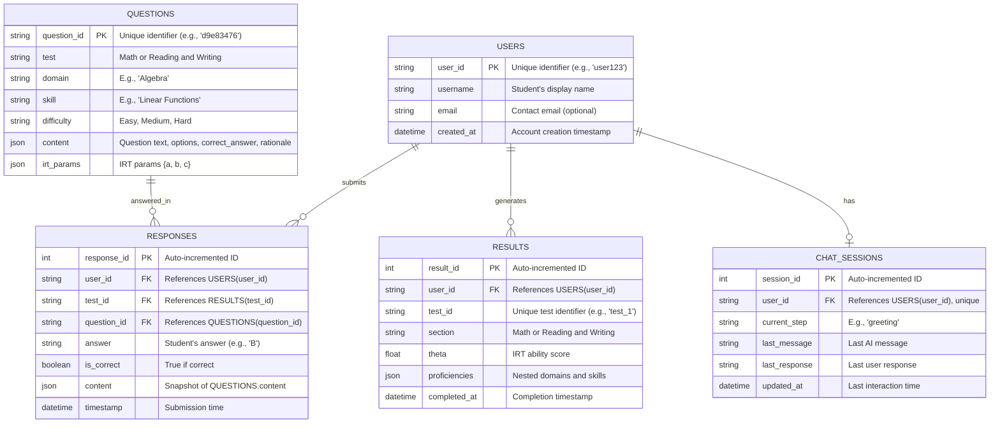

# Progress Monitoring App

#### SAT Progress Monitoring App

**Purpose**

The SAT Progress Monitoring App helps students:

* Track proficiency improvements in skills (e.g., "Linear Functions") and domains (e.g., "Algebra") across multiple tests.
* Visualize historical SAT scores, current performance, and projected scores for 6–10 tests.
* Receive tailored recommendations for skills/domains to improve based on trends (e.g., stagnant or declining areas).

**Functionality**

* **Input**: Multiple diagnostic\_results\_\<test\_id>.json files (e.g., diagnostic\_results\_1.json, diagnostic\_results\_2.json) or a database of results.
* **Features**:
  * **Progress Tracking**: Show proficiency changes per skill/domain over time.
  * **Score Visualization**: Historical, current, and projected SAT scores (Math, Reading/Writing, Total).
  * **Recommendations**: Highlight skills/domains with slow progress or low proficiency.
* **Output**: Console-based report (adaptable to frontend with graphs/tables).

**Assumptions**

* Students take 6–10 tests over time (e.g., 1 test/month).
* Progress is linear for projection (simplified model; could be enhanced with machine learning).

I’ll update the **SAT Progress Monitoring App** to include graphical output using `matplotlib` for visualizing progress and ensure user tracking by associating all test data with a specific user ID. This will:

* Add line graphs for historical and projected SAT scores (Math, Reading/Writing, Total).
* Include bar charts for skill/domain proficiency trends.
* Track user-specific data by requiring a `user_id` and storing/loading results tied to that user.

Below, I’ll:

1. Update the diagnostic test to include `user_id`.
2. Modify the progress monitoring app to filter by `user_id` and add graphical output.
3. Update the ERD to enforce user tracking.

***

#### Updated Diagnostic Test Code

Add `user_id` to track tests per user, saving results in a user-specific directory.

```python
import json
import random
import numpy as np
from typing import List, Dict, Tuple
from scipy.stats import norm
import uuid
import os

# Test plans unchanged (MATH_TEST_PLAN, RW_TEST_PLAN omitted for brevity)
# ...

class QuestionBank:
    def __init__(self, filepath: str):
        try:
            with open(filepath, 'r') as f:
                self.questions = json.load(f)
            if not self.questions:
                raise ValueError("Question bank is empty.")
        except FileNotFoundError:
            raise FileNotFoundError(f"Question bank file '{filepath}' not found.")
        except json.JSONDecodeError:
            raise ValueError(f"Invalid JSON in '{filepath}'.")

    def filter_questions(self, test: str, domain: str, skill: str, used_ids: set) -> List[Dict]:
        return [
            q for q in self.questions
            if q["metadata"]["Test"] == test
            and q["metadata"]["Domain"] == domain
            and q["metadata"]["Skill"] == skill
            and q["metadata"]["Question ID"] not in used_ids
        ]

class IRTSelector:
    def __init__(self, initial_theta: float = 0.0):
        self.theta = initial_theta
    
    def probability_correct(self, a: float, b: float, c: float) -> float:
        logit = a * (self.theta - b)
        return c + (1 - c) / (1 + np.exp(-logit))
    
    def information(self, a: float, b: float, c: float) -> float:
        p = self.probability_correct(a, b, c)
        q = 1 - p
        if p <= c or q == 0:
            return 0
        return (a**2 * (p - c)**2 * q) / ((1 - c)**2 * p)
    
    def update_theta(self, responses: List[Tuple[Dict, bool]]) -> float:
        if not responses:
            return self.theta
        theta_new = self.theta
        for _ in range(10):
            numerator = 0
            denominator = 0
            for q, r in responses:
                a = q["irt_parameters"]["a"]
                b = q["irt_parameters"]["b"]
                c = q["irt_parameters"]["c"]
                p = self.probability_correct(a, b, c)
                if p <= c or 1 - p == 0:
                    continue
                numerator += a * (int(r) - p)
                denominator += (a**2 * (p - c) * (1 - p)) / (1 - c)
            if denominator == 0:
                break
            theta_new = theta_new + numerator / denominator
        return theta_new if not np.isnan(theta_new) else self.theta

def theta_to_proficiency(theta: float) -> int:
    if theta < -2.0: return 1
    elif theta < -1.0: return 2
    elif theta < 0.0: return 3
    elif theta < 1.0: return 4
    elif theta < 2.0: return 5
    elif theta < 3.0: return 6
    else: return 7

def calculate_skill_proficiencies(responses: List[Tuple[Dict, bool]], test_plan: Dict) -> Dict[str, Dict[str, int]]:
    skill_responses = {domain: {skill: [] for skill in skills} for domain, skills in test_plan.items()}
    for q, r in responses:
        domain = q["metadata"]["Domain"]
        skill = q["metadata"]["Skill"]
        skill_responses[domain][skill].append((q, r))
    
    irt = IRTSelector(initial_theta=0.0)
    proficiencies = {}
    for domain, skills in skill_responses.items():
        proficiencies[domain] = {}
        for skill, resp in skills.items():
            theta = irt.update_theta(resp) if resp else 0.0
            proficiencies[domain][skill] = theta_to_proficiency(theta) if resp else 3
    return proficiencies

def select_adaptive_questions(question_bank: QuestionBank, test_plan: Dict, test_type: str, irt_selector: IRTSelector, test_id: str, user_id: str) -> Tuple[List[Dict], List[Dict]]:
    selected_questions = []
    responses = []
    used_ids = set()
    skill_counts = {domain: {skill: 0 for skill in skills} for domain, skills in test_plan.items()}
    difficulty_targets = {"Easy": 11, "Medium": 14, "Hard": 10}
    difficulty_counts = {"Easy": 0, "Medium": 0, "Hard": 0}

    while len(selected_questions) < 35:
        available_skills = [
            (domain, skill)
            for domain, skills in test_plan.items()
            for skill in skills
            if sum(test_plan[domain][skill].values()) > skill_counts[domain][skill]
        ]
        if not available_skills:
            raise ValueError(f"No available skills left to meet test plan for {test_type}")

        domain, skill = random.choice(available_skills)
        candidates = question_bank.filter_questions(test_type, domain, skill, used_ids)
        if not candidates:
            raise ValueError(f"No unused questions for {test_type} - {domain} - {skill}")

        valid_difficulties = [
            d for d in ["Easy", "Medium", "Hard"]
            if (test_plan[domain][skill][d] > 0 and
                difficulty_counts[d] < difficulty_targets[d] and
                skill_counts[domain][skill] < sum(test_plan[domain][skill].values()))
        ]
        if not valid_difficulties:
            continue
        candidates = [q for q in candidates if q["metadata"]["Difficulty"] in valid_difficulties]

        candidates.sort(key=lambda q: irt_selector.information(
            q["irt_parameters"]["a"], q["irt_parameters"]["b"], q["irt_parameters"]["c"]), reverse=True)
        question = candidates[0]
        
        selected_questions.append(question)
        used_ids.add(question["metadata"]["Question ID"])
        skill_counts[domain][skill] += 1
        difficulty_counts[question["metadata"]["Difficulty"]] += 1
        
        p_correct = irt_selector.probability_correct(
            question["irt_parameters"]["a"], question["irt_parameters"]["b"], question["irt_parameters"]["c"])
        response = random.random() < p_correct
        response_data = {
            "test_id": test_id,
            "user_id": user_id,
            "question_id": question["metadata"]["Question ID"],
            "answer": "A" if response else "B",
            "is_correct": response,
            "content": question["content"]
        }
        responses.append(response_data)
        
        irt_selector.theta = irt_selector.update_theta([(q, r["is_correct"]) for q, r in zip(selected_questions, responses)])
    
    return selected_questions, responses

def save_test(questions: List[Dict], output_file: str):
    os.makedirs(os.path.dirname(output_file), exist_ok=True)
    try:
        with open(output_file, 'w') as f:
            json.dump(questions, f, indent=4)
    except IOError as e:
        raise IOError(f"Failed to save test to '{output_file}': {e}")

def save_results(results: Dict, output_file: str):
    os.makedirs(os.path.dirname(output_file), exist_ok=True)
    try:
        with open(output_file, 'w') as f:
            json.dump(results, f, indent=4)
    except IOError as e:
        raise IOError(f"Failed to save results to '{output_file}': {e}")

def save_responses(responses: List[Dict], output_file: str):
    os.makedirs(os.path.dirname(output_file), exist_ok=True)
    try:
        with open(output_file, 'w') as f:
            json.dump(responses, f, indent=4)
    except IOError as e:
        raise IOError(f"Failed to save responses to '{output_file}': {e}")

def main(user_id: str = "user123"):
    question_bank_file = "question_bank.json"
    test_id = f"test_{uuid.uuid4().hex[:8]}"
    user_dir = f"data/{user_id}"
    
    try:
        qb = QuestionBank(question_bank_file)
        irt_selector_math = IRTSelector(initial_theta=0.0)
        irt_selector_rw = IRTSelector(initial_theta=0.0)
        
        # Math test
        math_questions, math_responses = select_adaptive_questions(qb, MATH_TEST_PLAN, "Math", irt_selector_math, test_id, user_id)
        math_proficiencies = calculate_skill_proficiencies([(q, r["is_correct"]) for q, r in zip(math_questions, math_responses)], MATH_TEST_PLAN)
        save_test(math_questions, f"{user_dir}/sat_math_diagnostic_{test_id}.json")
        
        # Reading and Writing test
        rw_questions, rw_responses = select_adaptive_questions(qb, RW_TEST_PLAN, "Reading and Writing", irt_selector_rw, test_id, user_id)
        rw_proficiencies = calculate_skill_proficiencies([(q, r["is_correct"]) for q, r in zip(rw_questions, rw_responses)], RW_TEST_PLAN)
        save_test(rw_questions, f"{user_dir}/sat_rw_diagnostic_{test_id}.json")
        
        # Compile results
        results = {
            "user_id": user_id,
            "sections": {
                "Math": {
                    "theta": float(irt_selector_math.theta),
                    "proficiencies": math_proficiencies
                },
                "Reading and Writing": {
                    "theta": float(irt_selector_rw.theta),
                    "proficiencies": rw_proficiencies
                }
            },
            "metadata": {
                "test_id": test_id,
                "date": "2025-03-26",
                "version": "1.0"
            }
        }
        save_results(results, f"{user_dir}/diagnostic_results_{test_id}.json")
        save_responses(math_responses + rw_responses, f"{user_dir}/responses_{test_id}.json")
        print(f"Diagnostic completed for {user_id}. Results saved to '{user_dir}/diagnostic_results_{test_id}.json'.")
    
    except (FileNotFoundError, ValueError, IOError) as e:
        print(f"Error: {e}")
    except Exception as e:
        print(f"Unexpected error: {e}")

if __name__ == "__main__":
    main("user123")  # Example user_id
```

**Changes**:

* **User ID**: Added `user_id` parameter, stored in results/responses.
* **Directory**: Files saved in `data/<user_id>/` (e.g., `data/user123/`).
* **Main**: Accepts `user_id` as an argument.

***

#### Updated Progress Monitoring App Code

Add `matplotlib` for graphical output and filter by `user_id`.

```python
import json
import os
import time
from typing import Dict, List
import numpy as np
import matplotlib.pyplot as plt

def load_user_results(user_id: str, directory: str = "./data") -> List[Dict]:
    """Load all diagnostic results for a specific user."""
    user_dir = os.path.join(directory, user_id)
    if not os.path.exists(user_dir):
        return []
    results_files = [f for f in os.listdir(user_dir) if f.startswith("diagnostic_results_") and f.endswith(".json")]
    all_results = []
    for file in sorted(results_files):
        try:
            with open(os.path.join(user_dir, file), 'r') as f:
                data = json.load(f)
                if data["user_id"] == user_id:
                    all_results.append(data)
        except (FileNotFoundError, json.JSONDecodeError) as e:
            print(f"Error loading {file}: {e}")
    return all_results

def proficiency_to_sat_score(avg_proficiency: float) -> int:
    """Map average proficiency (1-7) to SAT section score (200-800)."""
    base_score = 200
    max_score = 800
    score_range = max_score - base_score
    proficiency_range = 7 - 1
    score_per_prof = score_range / proficiency_range
    scaled_score = base_score + (avg_proficiency - 1) * score_per_prof
    return min(max(round(scaled_score / 10) * 10, base_score), max_score)

def calculate_progress(all_results: List[Dict]) -> Dict:
    """Calculate progress across tests for skills, domains, and sections."""
    progress = {"Math": {}, "Reading and Writing": {}}
    scores = []

    for result in all_results:
        test_id = result["metadata"]["test_id"]
        for section, data in result["sections"].items():
            section_prof = sum(sum(skills.values()) / len(skills) for skills in data["proficiencies"].values()) / len(data["proficiencies"])
            scores.append((test_id, section, proficiency_to_sat_score(section_prof)))
            for domain, skills in data["proficiencies"].items():
                if domain not in progress[section]:
                    progress[section][domain] = {}
                for skill, prof in skills.items():
                    if skill not in progress[section][domain]:
                        progress[section][domain][skill] = []
                    progress[section][domain][skill].append((test_id, prof))
    
    return progress, scores

def project_scores(scores: List[tuple], target_tests: int = 10) -> Dict:
    """Project future SAT scores based on historical trends."""
    if len(scores) < 2:
        return {"Math": [], "Reading and Writing": [], "Total": []}
    
    math_scores = [s[2] for s in scores if s[1] == "Math"]
    rw_scores = [s[2] for s in scores if s[1] == "Reading and Writing"]
    total_scores = [m + r for m, r in zip(math_scores, rw_scores)]
    
    def linear_projection(current_scores: List[int], current_n: int, target_n: int) -> List[int]:
        if current_n == 1:
            return current_scores * target_n
        x = np.arange(current_n)
        slope, intercept = np.polyfit(x, current_scores, 1)
        return [max(200, min(800, int(intercept + slope * i))) for i in range(target_n)]
    
    n_tests = len(math_scores)
    return {
        "Math": linear_projection(math_scores, n_tests, target_tests),
        "Reading and Writing": linear_projection(rw_scores, n_tests, target_tests),
        "Total": linear_projection(total_scores, n_tests, target_tests)
    }

def recommend_focus(progress: Dict) -> Dict:
    """Recommend skills/domains to focus on based on progress."""
    recommendations = {"Math": [], "Reading and Writing": []}
    for section, domains in progress.items():
        for domain, skills in domains.items():
            domain_avg = [sum(s[1] for s in skills[k]) / len(skills[k]) for k in skills]
            domain_trend = np.mean(np.diff([np.mean([s[1] for s in skills[k]]) for k in skills])) if len(all_results) > 1 else 0
            for skill, profs in skills.items():
                avg_prof = sum(p[1] for p in profs) / len(profs)
                trend = np.mean(np.diff([p[1] for p in profs])) if len(profs) > 1 else 0
                if avg_prof < 4 or (trend < 0.1 and len(profs) > 1):
                    recommendations[section].append((domain, skill, avg_prof, trend))
    return recommendations

def plot_scores(scores: List[tuple], projected_scores: Dict, user_id: str):
    """Plot historical and projected SAT scores."""
    math_scores = [s[2] for s in scores if s[1] == "Math"]
    rw_scores = [s[2] for s in scores if s[1] == "Reading and Writing"]
    total_scores = [m + r for m, r in zip(math_scores, rw_scores)]
    n_tests = len(math_scores)
    x_historical = range(1, n_tests + 1)
    x_projected = range(1, 11)

    plt.figure(figsize=(12, 6))
    plt.plot(x_historical, math_scores, 'b-o', label="Math (Historical)")
    plt.plot(x_projected, projected_scores["Math"], 'b--', label="Math (Projected)")
    plt.plot(x_historical, rw_scores, 'g-o', label="Reading/Writing (Historical)")
    plt.plot(x_projected, projected_scores["Reading and Writing"], 'g--', label="Reading/Writing (Projected)")
    plt.plot(x_historical, total_scores, 'r-o', label="Total (Historical)")
    plt.plot(x_projected, projected_scores["Total"], 'r--', label="Total (Projected)")
    plt.xlabel("Test Number")
    plt.ylabel("SAT Score")
    plt.title(f"SAT Score Progress for {user_id}")
    plt.legend()
    plt.grid(True)
    plt.show()

def plot_skill_progress(progress: Dict, section: str, user_id: str):
    """Plot proficiency trends for skills in a section."""
    domains = progress[section]
    for domain, skills in domains.items():
        plt.figure(figsize=(10, 5))
        for skill, profs in skills.items():
            x = range(1, len(profs) + 1)
            y = [p[1] for p in profs]
            plt.bar([i + 0.2 * list(skills.keys()).index(skill) for i in x], y, width=0.2, label=skill)
        plt.xlabel("Test Number")
        plt.ylabel("Proficiency (1-7)")
        plt.title(f"{section} - {domain} Skill Progress for {user_id}")
        plt.legend()
        plt.grid(True)
        plt.show()

def monitor_progress(all_results: List[Dict], user_id: str):
    """Display progress with graphical output."""
    if not all_results:
        print(f"No test results found for {user_id}. Take a diagnostic first!")
        return
    
    progress, scores = calculate_progress(all_results)
    projected_scores = project_scores(scores)
    
    print(f"\n=== SAT Progress Report for {user_id} ===")
    time.sleep(1)
    
    # Historical and Current Scores
    print("\nHistorical Scores:")
    for test_id, section, score in scores:
        print(f"Test {test_id} - {section}: {score}/800")
    current_math = scores[-2][2] if len(scores) >= 2 else scores[0][2]
    current_rw = scores[-1][2] if len(scores) >= 2 else scores[0][2]
    print(f"Current Total: {current_math + current_rw}/1600")
    time.sleep(1)
    
    # Plot Scores
    plot_scores(scores, projected_scores, user_id)
    
    # Skill/Domain Progress
    print("\nSkill Progress:")
    for section, domains in progress.items():
        print(f"\n{section}:")
        for domain, skills in domains.items():
            print(f"  {domain}:")
            for skill, profs in skills.items():
                trend = np.mean(np.diff([p[1] for p in profs])) if len(profs) > 1 else 0
                print(f"    {skill}: {', '.join(f'{p[1]} ({p[0]})' for p in profs)} | Trend: {trend:+.2f}")
        plot_skill_progress(progress, section, user_id)
    time.sleep(1)
    
    # Recommendations
    recommendations = recommend_focus(progress)
    print("\nRecommendations:")
    for section, recs in recommendations.items():
        if recs:
            print(f"\n{section}:")
            for domain, skill, avg_prof, trend in recs:
                print(f"  - {domain}: {skill} (Avg: {avg_prof:.1f}, Trend: {trend:+.2f})")
        else:
            print(f"\n{section}: Great job! Keep practicing all areas.")
    
    print("\nKeep up the hard work!")

def main(user_id: str = "user123"):
    try:
        all_results = load_user_results(user_id)
        monitor_progress(all_results, user_id)
    except Exception as e:
        print(f"Error: {e}")

if __name__ == "__main__":
    main("user123")  # Example user_id
```

**Changes**:

* **User Tracking**: `load_user_results` filters by `user_id`, reading from `data/<user_id>/`.
* **Graphical Output**:
  * `plot_scores`: Line graph for historical/projected scores (Math, R\&W, Total).
  * `plot_skill_progress`: Bar chart for skill proficiencies per domain.
* **Dependencies**: Added `matplotlib` (install via `pip install matplotlib`).

***

#### Updated ERD (Mermaid Syntax)

No structural changes needed beyond prior updates, but I’ll confirm `user_id` is central.



**Notes**: `user_id` ensures all data (responses, results) is tied to one user, supporting progress tracking.

***

#### Integration and Testing

**Running the Suite**

1.  **Diagnostic Test**: Run multiple times with the same `user_id`:

    ```bash
    python diagnostic_test.py user123
    ```

    * Creates `data/user123/diagnostic_results_<test_id>.json`.
2.  **Progress Monitoring**: Run with the same `user_id`:

    ```bash
    python progress_monitoring.py user123
    ```

    * Displays text report and graphs.

**Graphs**

* **Score Plot**: Line graph with solid lines for historical data, dashed for projections.
* **Skill Plot**: Bar chart per domain, showing proficiency per test.

**Testing**

* **User Tracking**: Run diagnostic 3 times for `user123`, ensure progress app only loads `user123` data.
* **Graphs**: Verify plots appear (requires `matplotlib`), check historical vs. projected alignment.
* **Edge Cases**: Test with 1 test (no trend), ensure graphs handle small datasets.

***

#### Pricing Update

* **Progress Bundle**: $79.99 → Include progress monitoring with graphs.
* **Monthly Standard**: $19.99/month → Add progress monitoring.
* **Add-On**: $19.99 standalone progress monitoring (with graphs).

**Rationale**: Graphical insights enhance value, justifying inclusion in mid/high tiers.

This update provides a visual, user-specific progress tracking tool! Let me know if you’d like further tweaks (e.g., interactive graphs, database integration)!
