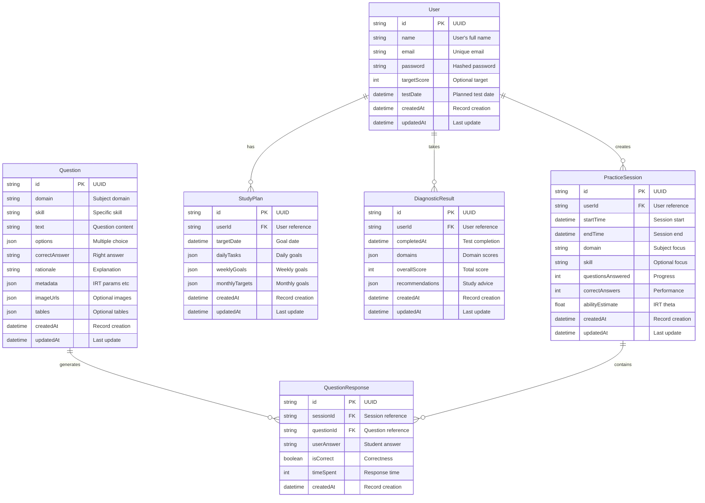
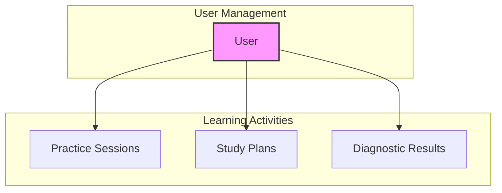
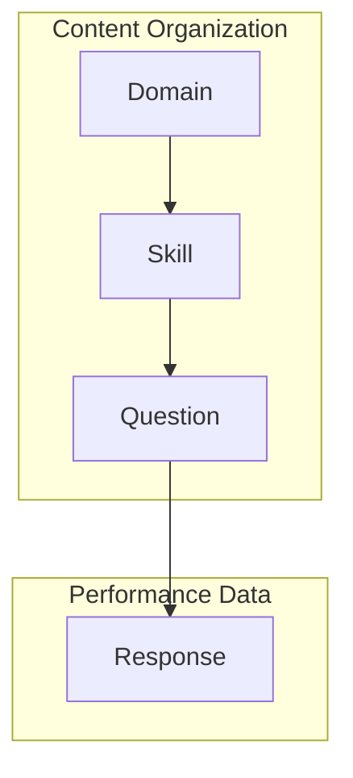
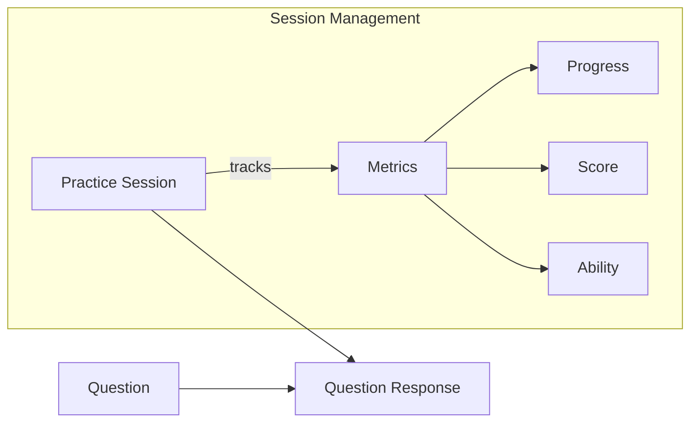
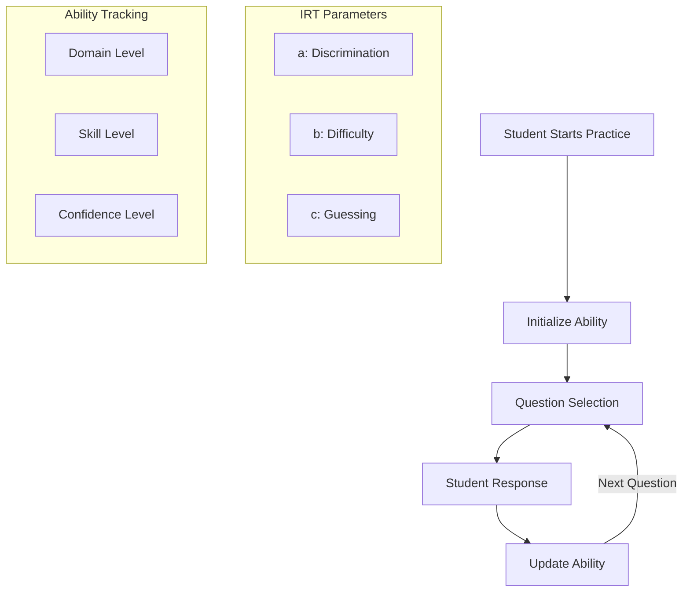
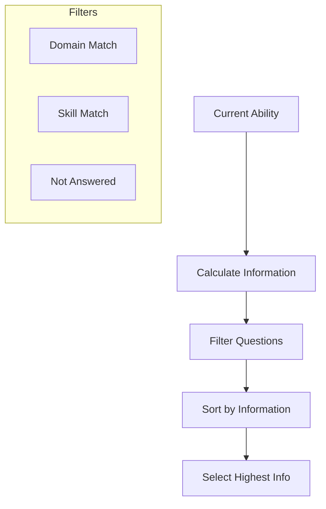
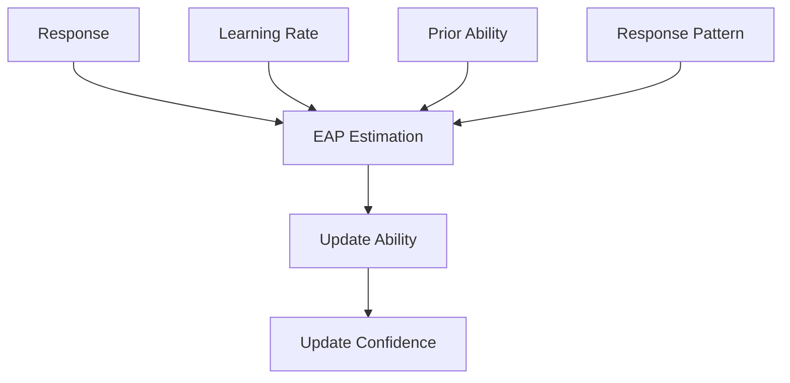
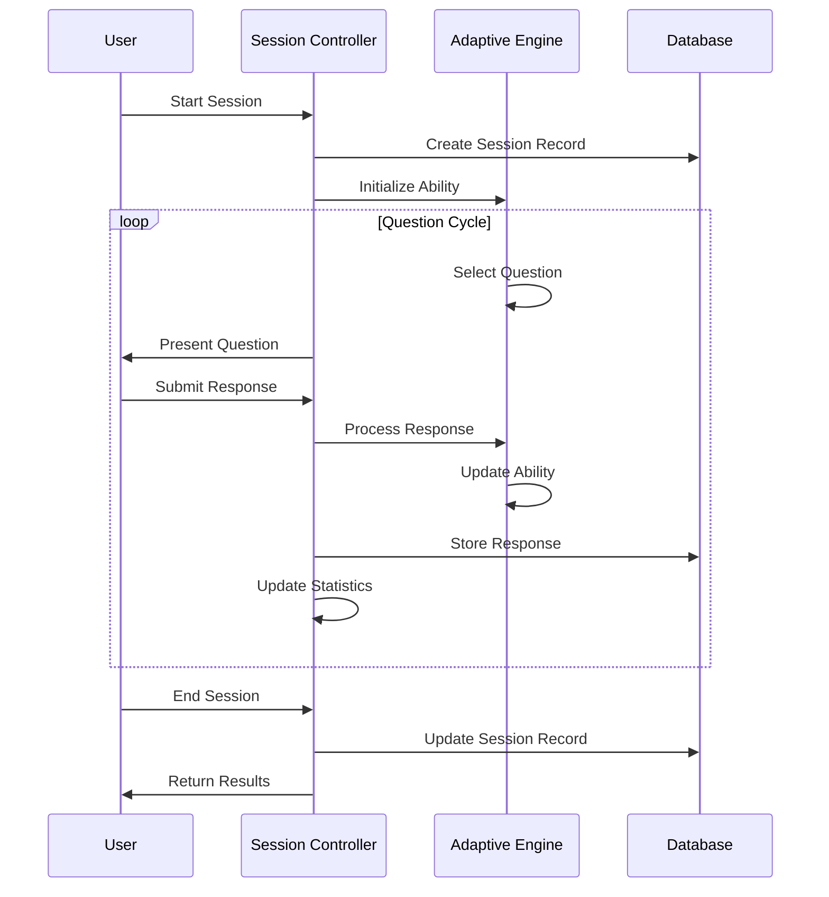
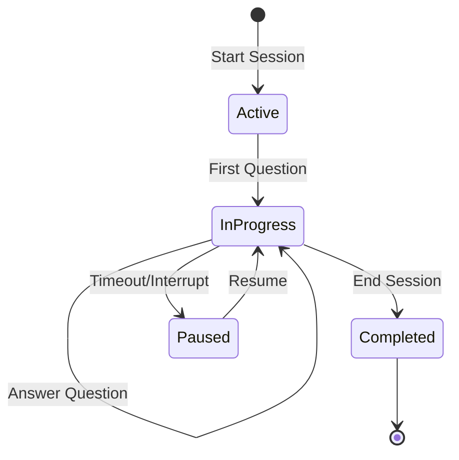
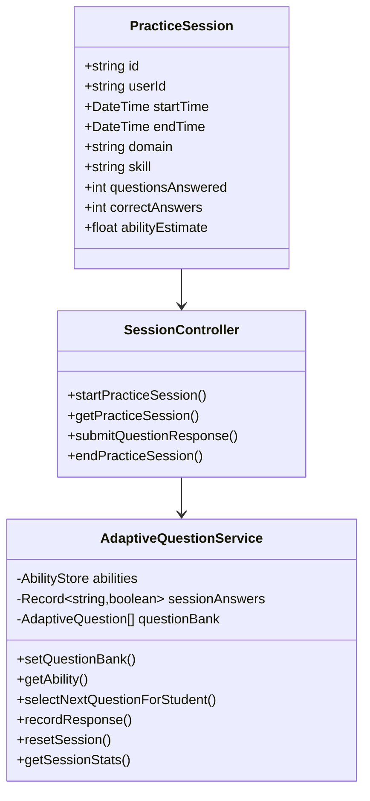

# Learner Lab Data Model Documentation

##

This document provides a comprehensive overview of the Learner Lab data model, including database schema, relationships, and implementation details.

### Database Schema Overview



### Key Components and Relationships

#### User Management

The User model is the central entity in the system, connecting to all learning activities:



#### Question Bank Structure

Questions are organized by domain and skill, with rich content support:



#### Practice Session Flow

Practice sessions track user interactions with questions:



### Adaptive Learning Implementation

The system uses Item Response Theory (IRT) with a sophisticated adaptive question selection mechanism.

#### Adaptive Learning Architecture



#### IRT Model Implementation

The system uses a 3-Parameter Logistic Model (3PL) for adaptive question selection:

```mermaid
graph LR
 A[3PL Model] --> B[P(θ) = c + (1-c)/(1 + e^(-Da(θ-b)))]
 B --> C[Probability]
 B --> D[Information]
 
 subgraph "Parameters"
     E[θ: Student Ability]
     F[a: Discrimination]
     G[b: Difficulty]
     H[c: Guessing]
 end
```

Key components:

* **Ability range**: -3 to 3 (standard IRT scale)
* **Discrimination (a)**: How well the question differentiates abilities
* **Difficulty (b)**: Ability level where P(correct) = 0.5
* **Guessing (c)**: Lower asymptote probability

#### Question Selection Algorithm



The algorithm:

1. Calculates information value for each question at current ability
2. Filters questions by domain/skill and previous answers
3. Selects the question with maximum information value

#### Ability Estimation



The process:

1. Uses Expected a Posteriori (EAP) estimation
2. Adjusts learning rate based on confidence
3. Updates ability based on response correctness
4. Increases confidence with each response

### Session Management Implementation

#### Session Lifecycle



#### Session State Management



### JSON Field Structures

#### Question Options

```json
{
  "A": "Option text for A",
  "B": "Option text for B",
  "C": "Option text for C",
  "D": "Option text for D"
}
```

#### Question Metadata

```json
{
  "irt_parameters": {
    "a": 1.2,
    "b": 0.5,
    "c": 0.25
  },
  "irt_difficulty": 0.65,
  "cognitive_level": "application",
  "tags": ["algebra", "equations", "linear"]
}
```

#### Diagnostic Domains

```json
{
  "math": {
    "score": 650,
    "subsections": {
      "algebra": 680,
      "geometry": 620,
      "statistics": 650
    }
  },
  "verbal": {
    "score": 700,
    "subsections": {
      "reading": 720,
      "writing": 680
    }
  }
}
```

#### Study Plan Tasks

```json
{
  "monday": [
    { "topic": "Linear equations", "duration": 30, "completed": false },
    { "topic": "Reading comprehension", "duration": 45, "completed": true }
  ],
  "tuesday": [
    { "topic": "Quadratic equations", "duration": 30, "completed": false },
    { "topic": "Vocabulary", "duration": 20, "completed": false }
  ]
}
```

### Database Design Considerations

#### Primary Keys & Indexes

* All tables use UUID primary keys for security and distribution
* Foreign keys are indexed for query performance
* Composite indexes on frequently queried combinations

#### Relationship Types

* User → Practice Session: One-to-Many
* Practice Session → Response: One-to-Many
* Question → Response: One-to-Many
* User → Study Plan: One-to-Many
* User → Diagnostic Result: One-to-Many

#### Data Access Patterns

* Session-based access for practice activities
* User-centric queries for personalized content
* Domain/skill filtering for targeted practice
* Temporal analysis for progress tracking

### Backend Service Architecture



This document provides a comprehensive overview of the Learner Lab data model and its implementation. The system is designed to deliver personalized, adaptive learning experiences through sophisticated algorithms and a well-structured database schema.
