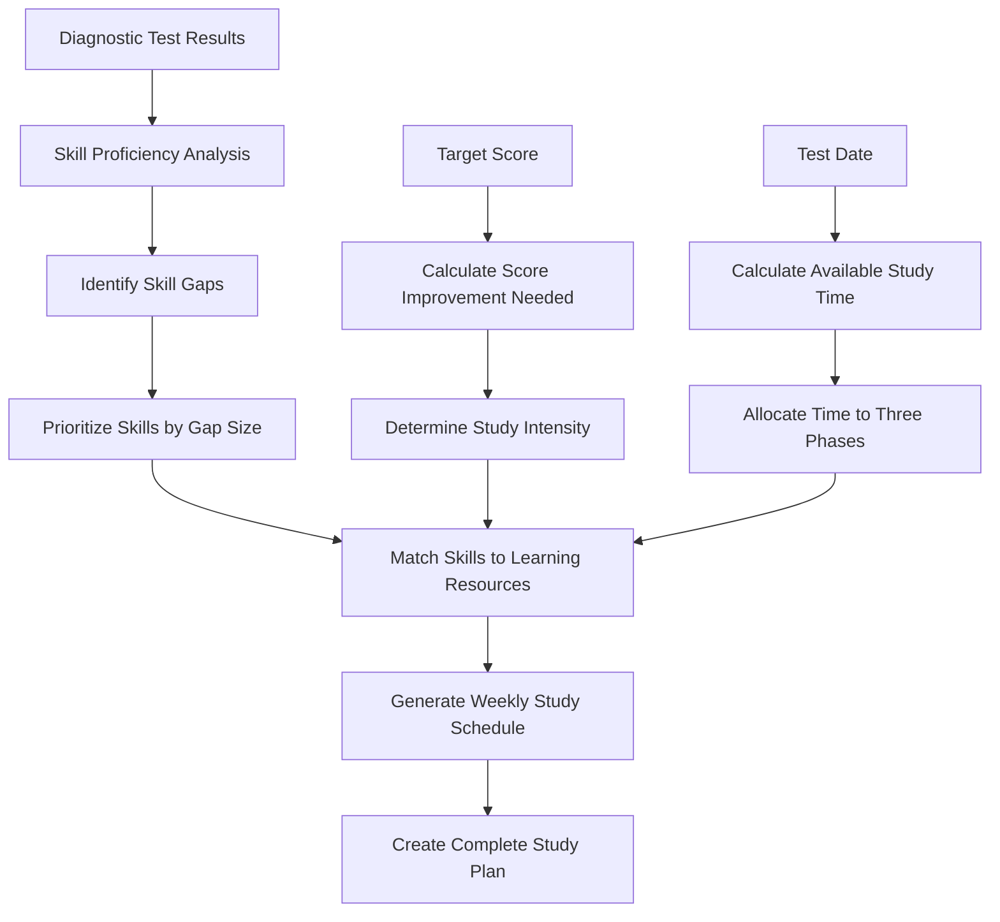
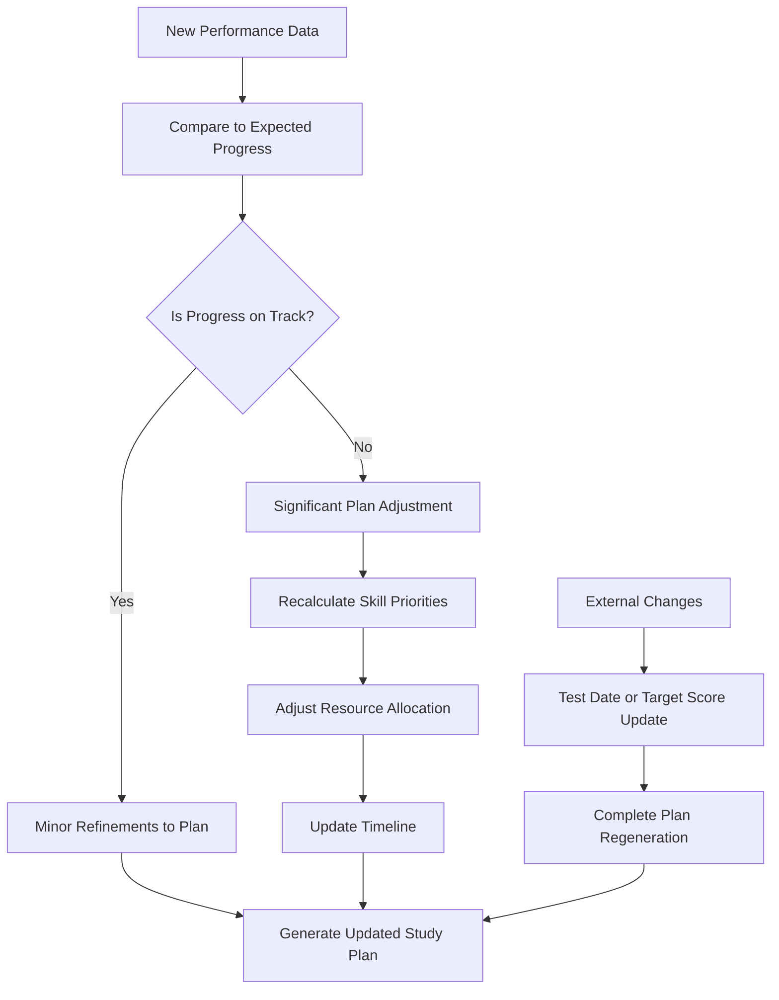

# LearnerLabs SAT Prep App: Personalized Study Plan Documentation


### Overview

The Personalized Study Plan is a core feature of the LearnerLabs SAT Prep App, providing students with a data-driven, adaptive learning path tailored to their specific needs. This document details how study plans are generated, monitored, and updated throughout a student's SAT preparation journey.

### Study Plan Generation

#### Initial Assessment

The personalized study plan generation begins with a comprehensive diagnostic assessment:

1. **Diagnostic Test**: Students complete a full-length SAT-style diagnostic test covering all content areas.
2. **Skill Mapping**: Each question in the diagnostic test is mapped to specific skills and knowledge domains.
3. **Performance Analysis**: The system analyzes correct and incorrect answers to identify:
4. Overall performance level
5. Section-specific strengths and weaknesses (Math vs. Reading & Writing)
6. Skill-specific proficiency levels
7. Question difficulty handling
8. Time management patterns

#### Personalization Factors

The study plan algorithm considers multiple factors to create a tailored learning path:

1. **Current Performance**: Baseline scores from the diagnostic test
2. **Target Score**: Student's desired SAT score
3. **Test Date**: Time remaining until the scheduled SAT exam
4. **Skill Gaps**: Areas where performance falls below proficiency thresholds
5. **Learning Style**: Patterns in how the student engages with different question types
6. **Time Availability**: Student's indicated weekly study time availability

#### Plan Structure

The generated study plan follows a three-phase structure:

1. **Foundation Phase** (30% of available time)
2. Focus: Building core concepts in weakest areas
3. Content: Fundamental lessons and basic practice
4. Goal: Establish minimum proficiency across all required skills
5. **Skill Building Phase** (40% of available time)
6. Focus: Deepening understanding and application
7. Content: Intermediate to advanced lessons and targeted practice
8. Goal: Develop moderate to strong proficiency in most skill areas
9. **Test Readiness Phase** (30% of available time)
10. Focus: Test strategies, timing, and full-length practice
11. Content: Full practice tests, advanced strategies, and review
12. Goal: Optimize test-taking skills and build stamina

#### Algorithm Details




```plaintext
Priority Score = (Gap Size × 0.5) + (Impact on Overall Score × 0.3) + (Prerequisite Importance × 0.2)
```


Where:

* **Gap Size**: Difference between current proficiency and target proficiency
* **Impact on Overall Score**: How much this skill typically affects SAT scores
* **Prerequisite Importance**: Whether this skill is foundational for other skils

### Progress Monitoring

#### Data Collection

The system continuously collects data on student performance and engagement:

1. **Practice Question Results**: Accuracy rates on topic-specific questions
2. **Quiz Scores**: Performance on skill-specific assessments
3. **Practice Test Results**: Scores on full-length practice tests
4. **Time Metrics**: Time spent on different question types
5. **Engagement Patterns**: Frequency and duration of study sessions
6. **Completion Rates**: Percentage of assigned materials completed

#### Progress Indicators

Student progress is tracked using several key metrics:

1. **Skill Proficiency Levels**: Numerical scores (1-5) for each skill area
2. **Overall Score Trajectory**: Projected SAT score based on current performance
3. **Phase Completion**: Progress through each study plan phase
4. **Study Consistency**: Streak days and weekly hour targets
5. **Milestone Achievement**: Completion of key learning objectives

#### Visualization

Progress is visualized for students through:

1. **Proficiency Heatmaps**: Color-coded skill matrices showing strengths and weaknesses
2. **Progress Bars**: Visual indicators of completion for each study phase
3. **Score Trend Charts**: Graphical representation of score improvements over time
4. **Timeline View**: Visual representation of the study plan with completed and upcoming activities

### Study Plan Updates

#### Update Triggers

The study plan is dynamically updated based on several triggers:

1. **Performance Thresholds**: When proficiency in a skill area crosses predefined thresholds
2. **Practice Test Results**: After completing full-length practice tests
3. **Weekly Reviews**: Automatic weekly assessment of progress and pace
4. **Manual Adjustments**: Student-initiated changes to target scores or test dates
5. **Engagement Patterns**: Significant changes in study frequency or duration

#### Update Algorithm



#### Adaptation Mechanisms

The system employs several mechanisms to adapt the study plan:

1. **Content Difficulty Adjustment**: Increasing or decreasing the difficulty of practice materials
2. **Time Reallocation**: Shifting study time between different skill areas
3. **Resource Substitution**: Replacing ineffective learning resources with alternatives
4. **Pace Modification**: Adjusting the speed of progression through the curriculum
5. **Strategy Recommendations**: Changing suggested study approaches based on performance patterns

### Implementation Details

#### Data Structures

The study plan is represented by several interconnected data structures:

1. **User Profile**

```typescript
type UserProfile = {
  currentScore: number;
  targetScore: number;
  testDate: string;
  weeklyAvailability: number; // hours
  skillLevels: Record<string, number>;
}
```

2. **Study Plan**

```typescript
type StudyPlan = {
  phases: StudyPhase[];
  startDate: string;
  endDate: string;
  lastUpdated: string;
  weeklySchedule: WeeklySchedule[];
}
```

3. **Study Phase**

```typescript
type StudyPhase = {
  name: "foundation" | "skillBuilding" | "testReadiness";
  startWeek: number;
  endWeek: number;
  focusAreas: SkillFocus[];
  milestones: Milestone[];
}
```

#### Progress Tracking Implementation

The progress tracking system uses a combination of:

1. **Event-Based Updates**: Real-time updates when students complete activities
2. **Periodic Calculations**: Scheduled recalculations of proficiency levels
3. **Predictive Modeling**: Projections of future performance based on current trends
4. **Comparative Analysis**: Benchmarking against expected progress rates

#### Technical Components

The study plan system consists of several key components:

1. **Plan Generator**: Creates initial study plans based on diagnostic results
2. **Progress Monitor**: Tracks and analyzes student performance data
3. **Plan Updater**: Modifies study plans based on new information
4. **Recommendation Engine**: Suggests specific learning resources and activities
5. **Notification System**: Alerts students to plan changes and recommendations

### User Interaction

#### Viewing the Study Plan

Students can interact with their study plan through several interfaces:

1. **Dashboard Overview**: High-level summary of current plan and progress
2. **Detailed Plan View**: Complete breakdown of all planned activities
3. **Weekly View**: Focused view of the current week's recommended activities
4. **Calendar Integration**: Study activities displayed in a calendar format

#### Manual Adjustments

Students can make several types of adjustments to their study plan:

1. **Update Test Date**: Change the target SAT test date
2. **Modify Target Score**: Adjust score goals up or down
3. **Weekly Availability**: Change available study hours
4. **Focus Preferences**: Request more or less focus on specific areas
5. **Skip Activities**: Mark certain activities as skipped
6. **Reset Areas**: Request a fresh start in specific skill areas

### Example Study Plan Generation

#### Sample Scenario

For a student with:

* Current diagnostic score: 1180 (580 Math, 600 Reading & Writing)
* Target score: 1400
* Test date: 90 days away
* Weakest areas: Data Analysis, Vocabulary in Context, Advanced Algebra

#### Generated Plan Highlights

**Foundation Phase (Weeks 1-4)**

* 60% focus on weakest areas
* 30% focus on moderate skills
* 10% focus on maintaining strengths
* Weekly mini-assessments
* Target milestone: Score \~1240 on practice assessment

**Skill Building Phase (Weeks 5-9)**

* 40% focus on previously weak areas
* 40% focus on moderate skills
* 20% focus on test strategies
* Section-specific practice tests
* Target milestone: Score \~1320 on practice assessment

**Test Readiness Phase (Weeks 10-13)**

* 30% focus on remaining weak areas
* 20% focus on content review
* 50% focus on full practice tests and review
* Full practice test every 1-2 weeks
* Target milestone: Score \~1400 on final practice test

### Conclusion

The Personalized Study Plan system is a sophisticated, adaptive learning tool that continuously evolves to meet each student's unique needs. By combining initial diagnostic data with ongoing performance metrics, the system creates and maintains an optimal learning path to help students achieve their target SAT scores efficiently and effectively.

***
