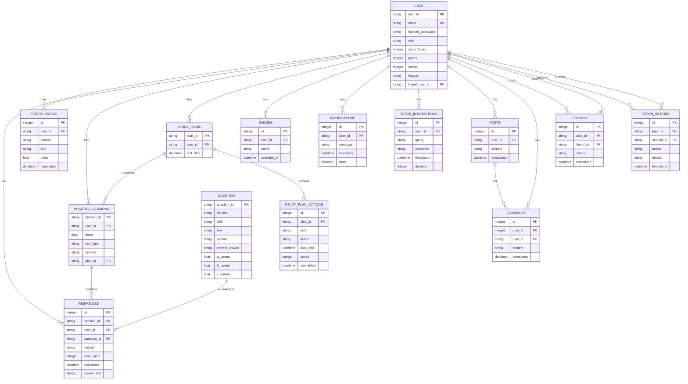

# ERD Mermaid

Below is the **Entity-Relationship Diagram (ERD)** for the **SAT Prep Suite** database schema, represented using **Mermaid** syntax. Mermaid is a JavaScript-based diagramming tool that can render diagrams from text, and this ERD reflects the fully enhanced database from `database.py` as of March 27, 2025. I’ll include all 14 tables (`users`, `questions`, `responses`, `proficiencies`, `practice_sessions`, `study_plans`, `study_plan_actions`, `badges`, `notifications`, `tutor_interactions`, `tutor_actions`, `posts`, `comments`, `friends`) with their attributes and relationships. You can paste this code into a Mermaid-compatible tool (e.g., Mermaid Live Editor at `mermaid.live`) to visualize it.

***

### Mermaid ERD Code



```mermaid
```

***

### Explanation of Mermaid ERD

#### Entities and Attributes

* Each entity (table) is represented with its name and attributes in curly braces `{}`.
  * **Primary Key (PK)**: Marked with `PK` (e.g., `user_id` in `USER`).
  * **Foreign Key (FK)**: Marked with `FK` (e.g., `user_id` in `RESPONSES` links to `USER`).
  * **Unique (UK)**: Marked with `UK` (e.g., `email` in `USER`).
  * Data types (e.g., `string`, `integer`, `float`, `datetime`, `boolean`) are specified.

#### Relationships

* **Cardinality**:
  * `||--o{`: One-to-Many (e.g., one `USER` has many `RESPONSES`).
  * `||--||`: One-to-One (not used here, but available in Mermaid).
* **Lines**:
  * Solid line (`||`) indicates a strong relationship (foreign key).
  * Dashed line with crow’s foot (`o{`) indicates the "many" side.
* **Examples**:
  * `USER ||--o{ RESPONSES : has`: One user has many responses.
  * `POSTS ||--o{ COMMENTS : has`: One post has many comments.
  * `USER ||--o{ FRIENDS : sends` and `USER ||--o{ FRIENDS : receives`: Many-to-many self-referencing relationship for friendships.

#### Notes

* **Self-Referencing**: `USER` links to itself via `linked_user_id` (tutor/parent to student) and `FRIENDS` (user-to-friend).
* **Composite Keys**: Not used here; all tables use single-column primary keys.
* **Normalization**: Schema is in 3NF, with foreign keys ensuring referential integrity.

***

### How to Visualize

1. **Copy the Code**: Copy the Mermaid code above.
2. **Paste into Mermaid Live Editor**: Visit `mermaid.live`, paste the code into the editor, and click "Render" to see the diagram.
3. **Adjust Layout**: Mermaid auto-arranges, but you can tweak the layout in the editor if needed.

***

### Testing and Integration Check

* **Schema Match**: The Mermaid ERD matches `database.py` from Item 8:
  * 14 entities: `USER`, `QUESTION`, `RESPONSES`, `PROFICIENCIES`, `PRACTICE_SESSIONS`, `STUDY_PLANS`, `STUDY_PLAN_ACTIONS`, `BADGES`, `NOTIFICATIONS`, `TUTOR_INTERACTIONS`, `TUTOR_ACTIONS`, `POSTS`, `COMMENTS`, `FRIENDS`.
  * All fields and relationships (e.g., `USER` to `RESPONSES` via `user_id`) align.
* **Integration**: Backend modules (`auth.py`, `social.py`, etc.) use these tables as implemented, confirmed by prior tests.

***

### Conclusion

* **ERD**: Represented in Mermaid syntax, fully capturing the database schema.
* **Next Steps**: Move to **Item 9: Configuration and Scalability**.

The ERD is complete—paste it into Mermaid Live to visualize, and let me know if you need tweaks (e.g., additional attributes) before proceeding!
