# Content Variety & Resources

Below, I’ll implement **Content Variety and Resources** into the **SAT Prep Suite**, addressing the need for conceptual understanding beyond just practice questions. This includes adding a lessons module, integrating it with the study plan, displaying existing rationales for questions, leveraging AI (Grok) for targeted help, and linking to external resources. This builds on the existing backend (with gamification, analytics, tutor/parent integration, and mobile app) and enhances the app’s utility for thousands of students as of March 26, 2025.

***

#### Step 1: Define Requirements

**Content Variety and Resources**

* **Missing**: Lack of lessons or explanatory content beyond practice questions.
* **Why Useful**: Students need foundational understanding, especially in weak areas, to improve SAT performance.
* **Features**:
  * **Lessons Module**: New `LESSONS` table with text/video content for conceptual learning.
  * **Study Plan Integration**: Add “lesson” tasks (e.g., “Watch Algebra Basics video, 20 min”) in Foundation/Skill Building phases.
  * **Explanations**: Display existing rationales in `QUESTIONS.content` post-response in practice/review.
  * **AI Help**: Use Grok to provide targeted explanations when users request help on specific questions.
  * **External Resources**: Curated links (e.g., Khan Academy, College Board) tied to skills/domains.

***

#### Step 2: Backend Implementation

**Updated ERD (Mermaid Syntax)**

```mermaid
erDiagram
    USERS ||--o{ RESPONSES : submits
    QUESTIONS ||--o{ RESPONSES : answered_in
    USERS ||--o{ RESULTS : generates
    USERS ||--o{ USED_QUESTIONS : has_used
    USERS ||--o{ STUDY_PLANS : follows
    USERS ||--o{ POINTS : earns
    USERS ||--o{ LESSONS_COMPLETED : completes
    LESSONS ||--o{ LESSONS_COMPLETED : completed_by

    USERS {
        string user_id PK "e.g., 'user123'"
        string username "Student's name"
        string email "Contact email"
        string fcm_token "Firebase Cloud Messaging token"
        datetime created_at "Creation timestamp"
    }

    QUESTIONS {
        string question_id PK "e.g., 'q1'"
        string test "Math or Reading and Writing"
        string domain "e.g., 'Algebra'"
        string skill "e.g., 'Linear Functions'"
        string difficulty "Easy, Medium, Hard"
        json content "Question details incl. rationale"
        json irt_params "IRT parameters {a, b, c}"
    }

    RESPONSES {
        int response_id PK "Auto-incremented"
        string user_id FK "References USERS(user_id)"
        string test_id FK "References RESULTS(test_id)"
        string question_id FK "References QUESTIONS(question_id)"
        string module "e.g., 'Math_1'"
        string answer "e.g., 'A'"
        boolean is_correct "True if correct"
        json content "Snapshot of question"
        float time_spent "Seconds taken to answer"
        datetime timestamp "Submission time"
    }

    RESULTS {
        int result_id PK "Auto-incremented"
        string user_id FK "References USERS(user_id)"
        string test_id "e.g., 'diag_abc123'"
        string test_type "diagnostic or full_length"
        json selected_sections "e.g., ['Math']"
        string section "Math or Reading and Writing"
        float theta "IRT ability score"
        json proficiencies "Skill proficiencies"
        datetime completed_at "Completion timestamp"
    }

    USED_QUESTIONS {
        int id PK "Auto-incremented"
        string user_id FK "References USERS(user_id)"
        string question_id FK "References QUESTIONS(question_id)"
        datetime used_at "Timestamp of use"
    }

    STUDY_PLANS {
        int plan_id PK "Auto-incremented"
        string user_id FK "References USERS(user_id)"
        datetime test_date "SAT exam date"
        int target_score "Desired score (400–1600)"
        int weekly_hours "Hours available per week"
        json plan "Daily/weekly schedule incl. lessons"
        datetime created_at "Plan creation timestamp"
    }

    POINTS {
        int id PK "Auto-incremented"
        string user_id FK "References USERS(user_id)"
        int points "Total points earned"
        json badges "List of earned badges"
        int streak "Consecutive days studied"
        datetime last_activity "Last study date"
    }

    LESSONS {
        int lesson_id PK "Auto-incremented"
        string section "Math or Reading and Writing"
        string domain "e.g., 'Algebra'"
        string skill "e.g., 'Linear Functions'"
        json content "Text, video URL, external links"
        int duration "Minutes"
    }

    LESSONS_COMPLETED {
        int id PK "Auto-incremented"
        string user_id FK "References USERS(user_id)"
        int lesson_id FK "References LESSONS(lesson_id)"
        datetime completed_at "Completion timestamp"
    }
```



**Changes**:

* Added `LESSONS` table for lesson content.
* Added `LESSONS_COMPLETED` to track user progress.
* Updated `STUDY_PLANS` to include lesson tasks in `plan`.

**`api/models.py` (Updated)**

```python
from sqlalchemy import Column, Integer, String, Float, JSON, DateTime, ForeignKey, Boolean
from sqlalchemy.ext.declarative import declarative_base
from datetime import datetime

Base = declarative_base()

# Existing models (User, Question, Response, Result, UsedQuestion, StudyPlan, Points, etc.) unchanged

class Lesson(Base):
    __tablename__ = "lessons"
    lesson_id = Column(Integer, primary_key=True, autoincrement=True)
    section = Column(String, nullable=False)  # "Math" or "Reading and Writing"
    domain = Column(String, nullable=False)  # e.g., "Algebra"
    skill = Column(String, nullable=False)  # e.g., "Linear Functions"
    content = Column(JSON, nullable=False)  # {"text": "...", "video_url": "...", "external_links": [{"title": "Khan Academy", "url": "..."}]}
    duration = Column(Integer, nullable=False)  # Minutes

class LessonCompleted(Base):
    __tablename__ = "lessons_completed"
    id = Column(Integer, primary_key=True, autoincrement=True)
    user_id = Column(String, ForeignKey("users.user_id"), nullable=False)
    lesson_id = Column(Integer, ForeignKey("lessons.lesson_id"), nullable=False)
    completed_at = Column(DateTime, default=datetime.utcnow)
```

**`api/utils.py` (Updated)**

```python
# Existing imports and functions unchanged

def get_latest_proficiencies(db: Session, user_id: str) -> Dict:
    results = db.query(Result).filter(Result.user_id == user_id).order_by(Result.completed_at.desc()).limit(2).all()
    proficiencies = {}
    for r in results:
        proficiencies[r.section] = r.proficiencies
    return proficiencies

def generate_study_plan(db: Session, user_id: str, test_date: datetime, target_score: int, weekly_hours: int) -> Dict:
    proficiencies = get_latest_proficiencies(db, user_id)
    days_until_test = (test_date - datetime.now()).days
    total_hours = weekly_hours * (days_until_test / 7)
    
    phases = {
        "foundation": [] if days_until_test < 30 else [],
        "skill_building": [],
        "test_readiness": []
    }
    
    lessons = db.query(Lesson).all()
    day = 0
    for phase in phases.keys():
        phase_days = days_until_test * (0.3 if phase == "foundation" else 0.4 if phase == "skill_building" else 0.3)
        hours_per_day = total_hours / days_until_test
        
        if phase in ["foundation", "skill_building"]:
            for lesson in lessons:
                if lesson.section not in proficiencies or lesson.domain not in proficiencies[lesson.section] or proficiencies[lesson.section][lesson.domain].get(lesson.skill, 7) < 4:
                    phases[phase].append({
                        "day": day,
                        "type": "lesson",
                        "lesson_id": lesson.lesson_id,
                        "section": lesson.section,
                        "domain": lesson.domain,
                        "skill": lesson.skill,
                        "duration": lesson.duration
                    })
                    day += 1 if day < phase_days else 0
        if phase == "skill_building":
            for section in ["Math", "Reading and Writing"]:
                for domain, skills in (MATH_TEST_PLAN if section == "Math" else RW_TEST_PLAN).items():
                    for skill in skills.keys():
                        if proficiencies.get(section, {}).get(domain, {}).get(skill, 7) < 5:
                            phases[phase].append({
                                "day": day,
                                "type": "practice",
                                "section": section,
                                "domain": domain,
                                "skill": skill,
                                "questions": 10
                            })
                            day += 1 if day < phase_days else 0
        if phase == "test_readiness":
            phases[phase].append({"day": day, "type": "full_test", "sections": ["Math", "Reading and Writing"]})
            day += 1
    
    return phases

def get_ai_help(question: Dict, user_answer: str, is_correct: bool) -> str:
    # Simulated Grok integration
    rationale = question["content"].get("rationale", "No rationale provided.")
    if is_correct:
        return f"Great job! Here's why: {rationale}"
    else:
        return f"Let's clarify this:\n- Your answer: {user_answer}\n- Correct answer: {question['content']['correct_answer']}\n- Explanation: {rationale}\nNeed more help? Try this: {question['content'].get('external_links', [{'title': 'Khan Academy', 'url': 'https://www.khanacademy.org'}])[0]['url']}"
```

**`api/routes/lessons.py` (New Module)**

```python
from fastapi import APIRouter, HTTPException, Depends
from pydantic import BaseModel
from sqlalchemy.orm import Session
from api.utils import award_points
from api.models import Lesson, LessonCompleted
from database import get_db

router = APIRouter()

class LessonRequest(BaseModel):
    section: str
    domain: str
    skill: str
    content: Dict  # {"text": "...", "video_url": "...", "external_links": [...]}
    duration: int

class CompleteLessonRequest(BaseModel):
    user_id: str
    lesson_id: int

@router.post("/create")
async def create_lesson(request: LessonRequest, db: Session = Depends(get_db)):
    lesson = Lesson(section=request.section, domain=request.domain, skill=request.skill, content=request.content, duration=request.duration)
    db.add(lesson)
    db.commit()
    return {"lesson_id": lesson.lesson_id, "section": request.section, "domain": request.domain, "skill": request.skill}

@router.get("/list")
async def list_lessons(db: Session = Depends(get_db)):
    lessons = db.query(Lesson).all()
    return [{"lesson_id": l.lesson_id, "section": l.section, "domain": l.domain, "skill": l.skill, "duration": l.duration} for l in lessons]

@router.post("/complete")
async def complete_lesson(request: CompleteLessonRequest, db: Session = Depends(get_db)):
    lesson = db.query(Lesson).filter(Lesson.lesson_id == request.lesson_id).first()
    if not lesson:
        raise HTTPException(status_code=404, detail="Lesson not found")
    completion = LessonCompleted(user_id=request.user_id, lesson_id=request.lesson_id)
    db.add(completion)
    gamification = award_points(db, request.user_id, "lesson_complete")
    db.commit()
    notify_users(db, [request.user_id], "Lesson Completed", f"You finished {lesson.skill}!")
    return {"user_id": request.user_id, "lesson_id": request.lesson_id, "gamification": gamification}
```

**`api/routes/study_plan.py` (Updated)**

```python
@router.post("/create")
async def create_study_plan(request: StudyPlanRequest, db: Session = Depends(get_db)):
    plan = generate_study_plan(db, request.user_id, datetime.fromisoformat(request.test_date), request.target_score, request.weekly_hours)
    study_plan = StudyPlan(user_id=request.user_id, test_date=datetime.fromisoformat(request.test_date), target_score=request.target_score, weekly_hours=request.weekly_hours, plan=plan)
    db.add(study_plan)
    db.commit()
    return {"plan_id": study_plan.plan_id, "plan": plan}

@router.post("/complete-task")
async def complete_task(user_id: str, day: int, task_index: int, db: Session = Depends(get_db)):
    plan = db.query(StudyPlan).filter(StudyPlan.user_id == user_id).order_by(StudyPlan.created_at.desc()).first()
    if not plan:
        raise HTTPException(status_code=404, detail="No study plan found")
    
    for phase, tasks in plan.plan.items():
        if task_index < len(tasks) and tasks[task_index]["day"] == day:
            task = tasks[task_index]
            if task["type"] == "lesson":
                completion = LessonCompleted(user_id=user_id, lesson_id=task["lesson_id"])
                db.add(completion)
                gamification = award_points(db, user_id, "lesson_complete")
            else:
                gamification = award_points(db, user_id, task["type"])
            db.commit()
            notify_users(db, [user_id], "Task Completed", f"You finished a {task['type']} task!")
            return {"user_id": user_id, "task": task, "gamification": gamification}
    raise HTTPException(status_code=404, detail="Task not found")
```

**`api/routes/practice_module.py` (Updated with Explanations)**

```python
@router.post("/submit")
async def submit_practice(request: PracticeResponseRequest, db: Session = Depends(get_db)):
    if request.practice_id not in practice_db:
        raise HTTPException(status_code=404, detail="Practice session not found")
    
    session = practice_db[request.practice_id]
    if session["user_id"] != request.user_id:
        raise HTTPException(status_code=403, detail="Unauthorized")
    
    session["responses"] = [r.dict() for r in request.responses]
    irt = IRTSelector()
    responses = [(q, r["is_correct"]) for q in session["questions"] for r in session["responses"] if q["metadata"]["Question ID"] == r["question_id"]]
    theta = irt.update_theta(responses)
    proficiencies = {request.section: {request.domain: {request.skill: theta_to_proficiency(theta)}}}
    gamification = award_points(db, request.user_id, "practice", proficiencies)
    
    # Add explanations and external resources
    feedback = []
    for r in request.responses:
        q = next(q for q in session["questions"] if q["metadata"]["Question ID"] == r.question_id)
        feedback.append({
            "question_id": r.question_id,
            "rationale": q["content"]["rationale"],
            "external_links": q["content"].get("external_links", []),
            "user_answer": r.answer,
            "is_correct": r.is_correct
        })
    
    db.commit()
    return {"practice_id": request.practice_id, "theta": theta, "improvement": theta > 0, "gamification": gamification, "feedback": feedback}

@router.post("/help/{practice_id}/{question_id}")
async def get_help(practice_id: str, question_id: str, user_id: str, user_answer: str, db: Session = Depends(get_db)):
    if practice_id not in practice_db:
        raise HTTPException(status_code=404, detail="Practice session not found")
    session = practice_db[practice_id]
    question = next((q for q in session["questions"] if q["metadata"]["Question ID"] == question_id), None)
    if not question:
        raise HTTPException(status_code=404, detail="Question not found")
    
    response = db.query(Response).filter(Response.user_id == user_id, Response.question_id == question_id, Response.test_id == practice_id).first()
    ai_help = get_ai_help(question, user_answer, response.is_correct if response else False)
    return {"question_id": question_id, "ai_help": ai_help}
```

**Sample `question_bank.json` Update**

```json
[
  {
    "metadata": {
      "Question ID": "q1",
      "Test": "Math",
      "Domain": "Algebra",
      "Skill": "Linear Functions",
      "Difficulty": "Medium"
    },
    "content": {
      "text": "Solve for x: 2x + 3 = 7",
      "options": ["1", "2", "3", "4"],
      "correct_answer": "2",
      "rationale": "Subtract 3 from both sides to get 2x = 4, then divide by 2 to find x = 2.",
      "external_links": [
        {"title": "Khan Academy - Linear Equations", "url": "https://www.khanacademy.org/math/algebra/x2f8bb11595b61c86:linear-equations"},
        {"title": "College Board - Algebra Tips", "url": "https://www.collegeboard.org/sat/algebra"}
      ]
    },
    "irt_params": {"a": 1.0, "b": 0.0, "c": 0.25}
  }
]
```

***

#### Step 3: Mobile App Updates (Flutter)

**`lib/models/lesson.dart`**

```dart
class Lesson {
  final int id;
  final String section;
  final String domain;
  final String skill;
  final Map<String, dynamic> content;
  final int duration;

  Lesson({required this.id, required this.section, required this.domain, required this.skill, required this.content, required this.duration});

  factory Lesson.fromJson(Map<String, dynamic> json) {
    return Lesson(
      id: json['lesson_id'],
      section: json['section'],
      domain: json['domain'],
      skill: json['skill'],
      content: json['content'],
      duration: json['duration'],
    );
  }
}
```

**`lib/services/api_service.dart` (Updated)**

```dart
Future<List<Lesson>> getLessons() async {
  final response = await http.get(Uri.parse('$baseUrl/lessons/list'));
  return (jsonDecode(response.body) as List).map((l) => Lesson.fromJson(l)).toList();
}

Future<void> completeLesson(String userId, int lessonId) async {
  await http.post(
    Uri.parse('$baseUrl/lessons/complete'),
    body: jsonEncode({'user_id': userId, 'lesson_id': lessonId}),
    headers: {'Content-Type': 'application/json'},
  );
}

Future<Map<String, dynamic>> getHelp(String practiceId, String questionId, String userId, String userAnswer) async {
  final response = await http.post(
    Uri.parse('$baseUrl/practice/help/$practiceId/$questionId'),
    body: jsonEncode({'user_id': userId, 'user_answer': userAnswer}),
    headers: {'Content-Type': 'application/json'},
  );
  return jsonDecode(response.body);
}
```

**`lib/screens/lessons.dart` (New Screen)**

```dart
import 'package:flutter/material.dart';
import '../services/api_service.dart';
import '../models/lesson.dart';

class LessonsScreen extends StatelessWidget {
  final ApiService api = ApiService();

  @override
  Widget build(BuildContext context) {
    return Scaffold(
      appBar: AppBar(title: Text('Lessons')),
      body: FutureBuilder(
        future: api.getLessons(),
        builder: (context, snapshot) {
          if (!snapshot.hasData) return Center(child: CircularProgressIndicator());
          var lessons = snapshot.data as List<Lesson>;
          return ListView.builder(
            itemCount: lessons.length,
            itemBuilder: (context, index) {
              var lesson = lessons[index];
              return ListTile(
                title: Text('${lesson.skill} (${lesson.duration} min)'),
                subtitle: Text(lesson.content['text'].substring(0, 50) + '...'),
                onTap: () {
                  showDialog(
                    context: context,
                    builder: (_) => AlertDialog(
                      title: Text(lesson.skill),
                      content: Column(
                        children: [
                          Text(lesson.content['text']),
                          if (lesson.content['video_url'] != null)
                            TextButton(
                              onPressed: () => launch(lesson.content['video_url']), // Use url_launcher
                              child: Text('Watch Video'),
                            ),
                          ...lesson.content['external_links'].map((link) => TextButton(
                                onPressed: () => launch(link['url']),
                                child: Text(link['title']),
                              )),
                        ],
                      ),
                      actions: [
                        TextButton(
                          onPressed: () async {
                            await api.completeLesson('user123', lesson.id);
                            Navigator.pop(context);
                          },
                          child: Text('Complete'),
                        ),
                      ],
                    ),
                  );
                },
              );
            },
          );
        },
      ),
    );
  }
}
```

**`lib/screens/practice.dart` (Updated)**

```dart
class _PracticeScreenState extends State<PracticeScreen> {
  // Existing code...

  void _showFeedback(Map<String, dynamic> feedback) {
    showDialog(
      context: context,
      builder: (_) => AlertDialog(
        title: Text('Feedback'),
        content: Column(
          children: [
            Text(feedback['rationale']),
            Text('Your answer: ${feedback['user_answer']}'),
            if (!feedback['is_correct'])
              ElevatedButton(
                onPressed: () async {
                  var help = await api.getHelp('prac_<id>', feedback['question_id'], 'user123', feedback['user_answer']);
                  Navigator.pop(context);
                  showDialog(
                    context: context,
                    builder: (_) => AlertDialog(
                      title: Text('AI Help'),
                      content: Text(help['ai_help']),
                      actions: [
                        TextButton(onPressed: () => Navigator.pop(context), child: Text('Close')),
                      ],
                    ),
                  );
                },
                child: Text('Get AI Help'),
              ),
            ...feedback['external_links'].map((link) => TextButton(
                  onPressed: () => launch(link['url']),
                  child: Text(link['title']),
                )),
          ],
        ),
        actions: [TextButton(onPressed: () => Navigator.pop(context), child: Text('Close'))],
      ),
    );
  }

  @override
  Widget build(BuildContext context) {
    return Scaffold(
      appBar: AppBar(title: Text('Practice')),
      body: questions.isEmpty
          ? Center(child: CircularProgressIndicator())
          : ListView.builder(
              itemCount: questions.length,
              itemBuilder: (context, index) => QuestionCard(
                question: questions[index],
                onSubmit: (qId, answer, isCorrect, time) async {
                  _submitResponse(qId, answer, isCorrect, time);
                  var result = await api.submitPractice('user123', 'prac_<id>', responses);
                  if (index == questions.length - 1) {
                    var feedback = result['feedback'];
                    _showFeedback(feedback.last);
                  }
                },
              ),
            ),
    );
  }
}
```

**`lib/screens/dashboard.dart` (Updated)**

```dart
class DashboardScreen extends StatelessWidget {
  // Existing code...

  @override
  Widget build(BuildContext context) {
    return Scaffold(
      appBar: AppBar(title: Text('SAT Prep')),
      body: FutureBuilder(
        future: api.getProgress('user123'),
        builder: (context, snapshot) {
          if (!snapshot.hasData) return Center(child: CircularProgressIndicator());
          var data = snapshot.data as Map<String, dynamic>;
          return ListView(
            children: [
              Text('Points: ${data['gamification']?['points'] ?? 0}', style: TextStyle(fontSize: 20)),
              Text('Streak: ${data['gamification']?['streak'] ?? 0} days'),
              ElevatedButton(
                onPressed: () => Navigator.push(context, MaterialPageRoute(builder: (_) => PracticeScreen())),
                child: Text('Start Practice'),
              ),
              ElevatedButton(
                onPressed: () => Navigator.push(context, MaterialPageRoute(builder: (_) => LessonsScreen())),
                child: Text('Lessons'),
              ),
              ElevatedButton(
                onPressed: () => Navigator.push(context, MaterialPageRoute(builder: (_) => CommunityScreen())),
                child: Text('Community'),
              ),
            ],
          );
        },
      ),
    );
  }
}
```

***

#### Step 4: Testing

* **Lessons Module**: Create lesson → List in `/lessons/list` → Complete → Verify points/notification.
* **Study Plan**: Generate plan → Check lesson tasks in Foundation/Skill Building → Complete → Confirm progress.
* **Explanations**: Submit practice → See rationale/links → Request AI help → Get Grok response.
* **External Resources**: Tap Khan Academy link → Verify URL opens.

***

#### Step 5: Sample Data

**`LESSONS` Table**

| lesson\_id | section | domain  | skill            | content                                                                                                                                                                   | duration |
| ---------- | ------- | ------- | ---------------- | ------------------------------------------------------------------------------------------------------------------------------------------------------------------------- | -------- |
| 1          | Math    | Algebra | Linear Functions | {"text": "Learn slope-intercept form...", "video\_url": "https://youtube.com/...", "external\_links": \[{"title": "Khan Academy", "url": "https://khanacademy.org/..."}]} | 20       |

**Study Plan Output**

```json
{
  "foundation": [
    {"day": 0, "type": "lesson", "lesson_id": 1, "section": "Math", "domain": "Algebra", "skill": "Linear Functions", "duration": 20}
  ],
  "skill_building": [
    {"day": 1, "type": "practice", "section": "Math", "domain": "Algebra", "skill": "Linear Functions", "questions": 10}
  ],
  "test_readiness": [
    {"day": 2, "type": "full_test", "sections": ["Math", "Reading and Writing"]}
  ]
}
```

**Practice Feedback**

```json
{
  "feedback": [
    {
      "question_id": "q1",
      "rationale": "Subtract 3 from both sides...",
      "external_links": [{"title": "Khan Academy", "url": "https://khanacademy.org/..."}],
      "user_answer": "2",
      "is_correct": true
    }
  ]
}
```

***

#### Conclusion

This implementation adds **Content Variety and Resources**:

* **Lessons Module**: Provides conceptual learning with text/videos.
* **Study Plan**: Integrates lessons for foundational/skill-building phases.
* **Explanations**: Shows rationales post-response with AI (Grok) help.
* **External Resources**: Links to Khan Academy/College Board for deeper study.

The suite now balances practice with understanding, leveraging existing rationales and AI for targeted support, making it more valuable for students as of March 26, 2025. Next steps could include advanced test simulation or UI refinement—let me know your priority!
