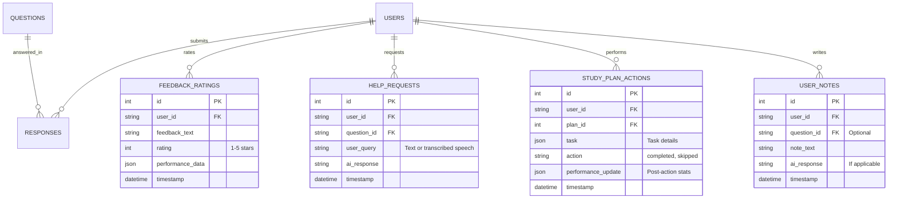

# Data Collection for our AI model

Let’s enhance the **SAT Prep Suite** by adding features to **collect data from users** specifically for training our own small Language Learning Model (LLM). This builds on the existing backend (with gamification, analytics, tutor/parent integration, mobile app, content variety, AI-driven insights, and external AI integrations) and the plan to use synthetic data initially, transitioning to real user data as the platform grows. The goal is to capture high-quality, SAT-specific data from user interactions to fine-tune our LLM, minimizing costs and improving personalization as of March 26, 2025. Below, I’ll outline the new features, their implementation, and how they feed into the LLM training pipeline.

***

#### Step 1: Data Collection Goals

**Objectives**

* Gather \~50K+ text pairs (input-output) for LLM training from user interactions.
* Focus on three key areas: **personalized feedback**, **question explanations**, and **study plan adjustments**.
* Ensure data is structured, SAT-specific, and scalable with user growth.

**Target Data Types**

1. **Response Patterns + Feedback**: User performance (accuracy, time) paired with generated feedback.
2. **Questions + Explanations**: User-answered questions paired with rationales or help requests.
3. **Study Plans + Adjustments**: User plans paired with performance-driven suggestions.

***

#### Step 2: New Features for Data Collection

**1. User Feedback Rating**

* **Purpose**: Collect user ratings on generated feedback to pair performance data with quality-assessed outputs.
* **Implementation**:
  * Add a “Rate this feedback” button (1-5 stars) after each feedback display.
  * Store ratings with response data for LLM training.
* **Data Generated**:
  * Input: Performance stats (e.g., `{"Math": {"Algebra": {"correct": 7, "total": 10}}}`).
  * Output: Feedback text + rating (e.g., “Great job! … \[4 stars]”).
* **Volume**: 1 rating per practice session → \~10K pairs at 10K users.

**2. Help Request Logging**

* **Purpose**: Capture user-initiated requests for explanations to pair questions with detailed responses.
* **Implementation**:
  * Enhance `/practice/help` endpoint to log user questions (text or speech) and AI responses.
  * Prompt users: “Need help? Ask a question!” with text/speech input.
* **Data Generated**:
  * Input: Question context + user query (e.g., “Why is x = 2?”).
  * Output: AI explanation (e.g., “Subtract 3, then divide…”).
* **Volume**: 1-2 requests per user → \~20K pairs at 10K users.

**3. Study Plan Feedback Loop**

* **Purpose**: Record user plan adherence and adjustments to pair plans with performance-based suggestions.
* **Implementation**:
  * Add “Mark as Completed” and “Skip” buttons for plan tasks.
  * Log task completion, skips, and subsequent performance changes.
* **Data Generated**:
  * Input: Plan + performance (e.g., `{"plan": {"day": 1, "skill": "Triangles"}}, {"correct": 3, "total": 10}}`).
  * Output: Adjustment (e.g., “Shift to Triangles practice!”).
* **Volume**: 1 adjustment per plan update → \~5K pairs at 10K users.

**4. User-Generated Content (UGC) Capture**

* **Purpose**: Collect user notes or questions via community or practice modules for additional context.
* **Implementation**:
  * Add a “Notes” field in practice/review screens and a “Post Question” feature in community.
  * Store with associated question/performance data.
* **Data Generated**:
  * Input: User note/question (e.g., “I don’t get quadratics”).
  * Output: AI response or community answer (e.g., “Try factoring…”).
* **Volume**: \~1 note/question per 5 users → \~2K pairs at 10K users.

***

#### Step 3: Backend Implementation

**Updated ERD**



**`api/models.py` (Updated)**

```python
from sqlalchemy import Column, Integer, String, JSON, DateTime, ForeignKey
from sqlalchemy.ext.declarative import declarative_base
from datetime import datetime

Base = declarative_base()

class FeedbackRating(Base):
    __tablename__ = "feedback_ratings"
    id = Column(Integer, primary_key=True, autoincrement=True)
    user_id = Column(String, ForeignKey("users.user_id"), nullable=False)
    feedback_text = Column(String, nullable=False)
    rating = Column(Integer, nullable=False)  # 1-5
    performance_data = Column(JSON, nullable=False)
    timestamp = Column(DateTime, default=datetime.utcnow)

class HelpRequest(Base):
    __tablename__ = "help_requests"
    id = Column(Integer, primary_key=True, autoincrement=True)
    user_id = Column(String, ForeignKey("users.user_id"), nullable=False)
    question_id = Column(String, ForeignKey("questions.question_id"), nullable=True)
    user_query = Column(String, nullable=False)
    ai_response = Column(String, nullable=False)
    timestamp = Column(DateTime, default=datetime.utcnow)

class StudyPlanAction(Base):
    __tablename__ = "study_plan_actions"
    id = Column(Integer, primary_key=True, autoincrement=True)
    user_id = Column(String, ForeignKey("users.user_id"), nullable=False)
    plan_id = Column(Integer, ForeignKey("study_plans.plan_id"), nullable=False)
    task = Column(JSON, nullable=False)
    action = Column(String, nullable=False)  # "completed", "skipped"
    performance_update = Column(JSON, nullable=True)
    timestamp = Column(DateTime, default=datetime.utcnow)

class UserNote(Base):
    __tablename__ = "user_notes"
    id = Column(Integer, primary_key=True, autoincrement=True)
    user_id = Column(String, ForeignKey("users.user_id"), nullable=False)
    question_id = Column(String, ForeignKey("questions.question_id"), nullable=True)
    note_text = Column(String, nullable=False)
    ai_response = Column(String, nullable=True)
    timestamp = Column(DateTime, default=datetime.utcnow)
```

**`api/utils.py` (Updated for Data Collection)**

```python
def log_feedback_rating(db: Session, user_id: str, feedback: str, rating: int, performance_data: Dict):
    rating_entry = FeedbackRating(user_id=user_id, feedback_text=feedback, rating=rating, performance_data=performance_data)
    db.add(rating_entry)
    db.commit()

def log_help_request(db: Session, user_id: str, question_id: str, user_query: str, ai_response: str):
    request = HelpRequest(user_id=user_id, question_id=question_id, user_query=user_query, ai_response=ai_response)
    db.add(request)
    db.commit()

def log_study_plan_action(db: Session, user_id: str, plan_id: int, task: Dict, action: str, performance_update: Dict = None):
    action_entry = StudyPlanAction(user_id=user_id, plan_id=plan_id, task=task, action=action, performance_update=performance_update)
    db.add(action_entry)
    db.commit()

def log_user_note(db: Session, user_id: str, question_id: str, note_text: str, ai_response: str = None):
    note = UserNote(user_id=user_id, question_id=question_id, note_text=note_text, ai_response=ai_response)
    db.add(note)
    db.commit()

def export_llm_training_data(db: Session, output_file: str):
    with open(output_file, "w") as f:
        # Feedback ratings
        for fr in db.query(FeedbackRating).all():
            f.write(json.dumps({"input": fr.performance_data, "output": fr.feedback_text}) + "\n")
        # Help requests
        for hr in db.query(HelpRequest).all():
            input_data = {"question_id": hr.question_id, "query": hr.user_query}
            f.write(json.dumps({"input": json.dumps(input_data), "output": hr.ai_response}) + "\n")
        # Study plan actions
        for spa in db.query(StudyPlanAction).all():
            if spa.performance_update:
                input_data = {"plan": spa.task, "performance": spa.performance_update}
                f.write(json.dumps({"input": json.dumps(input_data), "output": f"Adjust plan to focus on {spa.task['skill']}!"}) + "\n")
        # User notes
        for un in db.query(UserNote).all():
            if un.ai_response:
                f.write(json.dumps({"input": un.note_text, "output": un.ai_response}) + "\n")
```

**`api/routes/practice_module.py` (Updated)**

```python
@router.post("/submit")
async def submit_practice(request: PracticeResponseRequest, db: Session = Depends(get_db)):
    session = practice_db[request.practice_id]
    session["responses"] = [r.dict() for r in request.responses]
    # Existing theta, gamification logic...
    feedback = []
    for r in request.responses:
        q = next(q for q in session["questions"] if q["metadata"]["Question ID"] == r.question_id)
        fb = get_ai_help(q, r.answer, r.is_correct)  # Using custom LLM or GPT-4o initially
        feedback.append({"question_id": r.question_id, "feedback": fb})
        log_feedback_rating(db, request.user_id, fb, 0, {"question_id": r.question_id, "is_correct": r.is_correct, "time_spent": r.time_spent})  # Rating TBD
    db.commit()
    return {"practice_id": request.practice_id, "feedback": feedback}

@router.post("/help/{practice_id}/{question_id}")
async def get_help(practice_id: str, question_id: str, user_id: str, user_query: str, db: Session = Depends(get_db)):
    session = practice_db[practice_id]
    question = next((q for q in session["questions"] if q["metadata"]["Question ID"] == question_id), None)
    ai_response = generate_feedback_with_custom_llm({"question": question["content"]}, {})  # Placeholder
    log_help_request(db, user_id, question_id, user_query, ai_response)
    return {"question_id": question_id, "ai_response": ai_response}
```

**`api/routes/study_plan.py` (Updated)**

```python
@router.post("/action/{plan_id}")
async def log_plan_action(plan_id: int, user_id: str, task_index: int, action: str, db: Session = Depends(get_db)):
    plan = db.query(StudyPlan).filter(StudyPlan.plan_id == plan_id).first()
    task = plan.plan["skill_building"][task_index]  # Example phase
    performance_update = get_latest_proficiencies(db, user_id)  # Simplified
    log_study_plan_action(db, user_id, plan_id, task, action, performance_update)
    return {"user_id": user_id, "task": task, "action": action}
```

**`api/routes/community.py` (New)**

```python
@router.post("/note")
async def add_note(user_id: str, question_id: str, note_text: str, db: Session = Depends(get_db)):
    ai_response = generate_feedback_with_custom_llm({"note": note_text}, {})  # Placeholder
    log_user_note(db, user_id, question_id, note_text, ai_response)
    return {"user_id": user_id, "note_text": note_text, "ai_response": ai_response}
```

***

#### Step 4: Mobile App Updates (Flutter)

**`lib/services/api_service.dart` (Updated)**

```dart
Future<void> rateFeedback(String userId, String feedback, int rating, Map<String, dynamic> performance) async {
  await http.post(
    Uri.parse('$baseUrl/practice/rate-feedback'),
    body: jsonEncode({'user_id': userId, 'feedback': feedback, 'rating': rating, 'performance': performance}),
    headers: {'Content-Type': 'application/json'},
  );
}

Future<Map<String, dynamic>> submitHelpRequest(String userId, String practiceId, String questionId, String query) async {
  final response = await http.post(
    Uri.parse('$baseUrl/practice/help/$practiceId/$questionId'),
    body: jsonEncode({'user_id': userId, 'user_query': query}),
    headers: {'Content-Type': 'application/json'},
  );
  return jsonDecode(response.body);
}

Future<void> logPlanAction(String userId, int planId, int taskIndex, String action) async {
  await http.post(
    Uri.parse('$baseUrl/study_plan/action/$planId'),
    body: jsonEncode({'user_id': userId, 'task_index': taskIndex, 'action': action}),
    headers: {'Content-Type': 'application/json'},
  );
}

Future<Map<String, dynamic>> addNote(String userId, String? questionId, String noteText) async {
  final response = await http.post(
    Uri.parse('$baseUrl/community/note'),
    body: jsonEncode({'user_id': userId, 'question_id': questionId, 'note_text': noteText}),
    headers: {'Content-Type': 'application/json'},
  );
  return jsonDecode(response.body);
}
```

**`lib/screens/practice.dart` (Updated)**

```dart
class _PracticeScreenState extends State<PracticeScreen> {
  int? _selectedRating;

  void _showFeedbackAndRate(Map<String, dynamic> result) {
    var feedback = result['feedback'].last;
    showDialog(
      context: context,
      builder: (_) => AlertDialog(
        title: Text('Feedback'),
        content: Column(
          children: [
            Text(feedback['feedback']),
            Row(
              children: List.generate(5, (i) => IconButton(
                icon: Icon(i < (_selectedRating ?? 0) ? Icons.star : Icons.star_border),
                onPressed: () {
                  setState(() => _selectedRating = i + 1);
                  api.rateFeedback('user123', feedback['feedback'], i + 1, {'question_id': feedback['question_id']});
                },
              )),
            ),
            TextButton(
              onPressed: () async {
                var help = await api.submitHelpRequest('user123', 'prac_<id>', feedback['question_id'], 'Why is this wrong?');
                Navigator.pop(context);
                showDialog(context: context, builder: (_) => AlertDialog(title: Text('Help'), content: Text(help['ai_response'])));
              },
              child: Text('Ask for Help'),
            ),
          ],
        ),
      ),
    );
  }

  // Existing build method with _showFeedbackAndRate call
}
```

**`lib/screens/study_plan.dart` (New)**

```dart
class StudyPlanScreen extends StatelessWidget {
  final ApiService api = ApiService();

  @override
  Widget build(BuildContext context) {
    return Scaffold(
      appBar: AppBar(title: Text('Study Plan')),
      body: FutureBuilder(
        future: api.getStudyPlan('user123'),
        builder: (context, snapshot) {
          if (!snapshot.hasData) return Center(child: CircularProgressIndicator());
          var plan = snapshot.data!['plan']['skill_building'];
          return ListView.builder(
            itemCount: plan.length,
            itemBuilder: (context, index) => ListTile(
              title: Text(plan[index]['skill']),
              trailing: Row(
                mainAxisSize: MainAxisSize.min,
                children: [
                  IconButton(
                    icon: Icon(Icons.check),
                    onPressed: () => api.logPlanAction('user123', snapshot.data!['plan_id'], index, 'completed'),
                  ),
                  IconButton(
                    icon: Icon(Icons.skip_next),
                    onPressed: () => api.logPlanAction('user123', snapshot.data!['plan_id'], index, 'skipped'),
                  ),
                ],
              ),
            ),
          );
        },
      ),
    );
  }
}
```

**`lib/screens/community.dart` (Updated)**

```dart
class CommunityScreen extends StatelessWidget {
  final ApiService api = ApiService();
  final TextEditingController _noteController = TextEditingController();

  @override
  Widget build(BuildContext context) {
    return Scaffold(
      appBar: AppBar(title: Text('Community')),
      body: Column(
        children: [
          TextField(controller: _noteController, decoration: InputDecoration(labelText: 'Add a Note or Question')),
          ElevatedButton(
            onPressed: () async {
              var result = await api.addNote('user123', null, _noteController.text);
              ScaffoldMessenger.of(context).showSnackBar(SnackBar(content: Text(result['ai_response'] ?? 'Posted!')));
            },
            child: Text('Submit'),
          ),
        ],
      ),
    );
  }
}
```

***

#### Step 5: Data Pipeline for LLM Training

**Collection**

* **Storage**: New tables (`FEEDBACK_RATINGS`, `HELP_REQUESTS`, `STUDY_PLAN_ACTIONS`, `USER_NOTES`) capture interactions.
* **Frequency**: Real-time logging via API endpoints.

**Export**

* **Script**: `export_llm_training_data` runs weekly/monthly to dump data into `real_sat_data.jsonl`.
* **Format**: JSONL with `{"input": "...", "output": "..."}` pairs.

**Transition Plan**

* **Initial**: Train on 50K synthetic pairs (from previous plan).
* **1K Users**: Mix 5K real + 45K synthetic pairs.
* **10K Users**: 50K real pairs → Full transition, retrain quarterly.

***

#### Step 6: Testing and Volume Estimate

* **Test**: Submit practice → Rate feedback → Ask help → Mark plan task → Add note → Verify data in tables.
* **Volume at 10K Users**:
  * Feedback: 10K ratings.
  * Help: 20K requests.
  * Plans: 5K adjustments.
  * Notes: 2K pairs.
  * **Total**: \~37K pairs + synthetic = 50K+.

***

#### Conclusion

These features—**Feedback Rating**, **Help Request Logging**, **Study Plan Feedback Loop**, and **UGC Capture**—enable the SAT Prep Suite to collect rich, SAT-specific data from users. Starting with synthetic data, we’ll transition to real data as the platform scales, training a cost-effective LLM by mid-2025. Next step: Implement these backend and app changes—ready to proceed?
