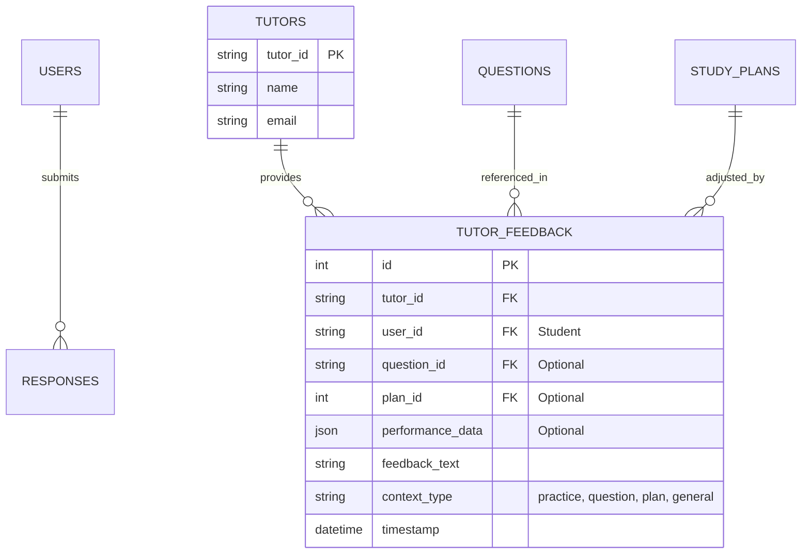

# Plan: Storing Tutor Feedback

Yes, capturing feedback from tutors is an excellent idea and could significantly enhance the quality and utility of the data we collect for training our small Language Learning Model (LLM) in the **SAT Prep Suite**. Tutor feedback offers expert-level insights, nuanced explanations, and personalized guidance that can enrich the dataset beyond what students alone provide. It’s a valuable addition to the data collection strategy, especially as we aim to transition from synthetic to real data and minimize costs while improving the LLM’s performance as of March 26, 2025. Below, I’ll explain why this is beneficial, what data to capture, and how to integrate it into the existing plan.

***

#### Step 1: Why Capture Tutor Feedback?

**Benefits**

1. **Expert Quality**: Tutors provide detailed, accurate, and pedagogically sound feedback, serving as a “gold standard” for the LLM to emulate.
   * Example: Student feedback might be “Good job!”, but a tutor might say, “You solved this quadratic efficiently, but check your signs next time—nice effort!”
2. **Diversity**: Adds a professional perspective to complement student-generated data (e.g., ratings, notes), improving model generalization.
3. **Rich Context**: Tutors can comment on specific skills, strategies, or patterns, offering deeper training examples.
   * Example: “This student struggles with Geometry proofs—focus on logical sequencing.”
4. **Scalability**: As the platform grows, tutor feedback can guide the LLM even with limited initial student data, bridging the gap until user volume increases.
5. **Cost Efficiency**: High-quality tutor data reduces reliance on external APIs (e.g., GPT-4o) by providing a robust initial dataset.

**Use Case**

* **Training**: Pair tutor feedback with student performance data to teach the LLM to generate tutor-like responses.
* **Validation**: Use tutor feedback as a benchmark to evaluate LLM outputs during development.

***

#### Step 2: What Tutor Feedback Data to Capture

**Data Types**

1. **Performance-Based Feedback**:
   * **Context**: Student responses or test results.
   * **Content**: Tutor’s written or spoken comments on accuracy, approach, or improvement areas.
   * **Example**: “You got 8/10 in Algebra, but your method for word problems is inefficient—try setting up equations faster.”
2. **Question-Specific Explanations**:
   * **Context**: Individual question attempts.
   * **Content**: Detailed rationale or correction from the tutor.
   * **Example**: “For 2x + 3 = 7, you chose 2, but subtract 3 first to get 2x = 4, then divide: x = 2.”
3. **Study Plan Recommendations**:
   * **Context**: Current plan + student progress.
   * **Content**: Suggestions for adjustments.
   * **Example**: “Shift next week to Geometry—Triangles need more practice based on your 40% accuracy.”
4. **General Observations**:
   * **Context**: Overall student trends or behavior.
   * **Content**: Broad insights or motivational comments.
   * **Example**: “You’re improving steadily but need to pace yourself better on timed sections.”

**Data Structure**

* **Input**: Student performance data (e.g., from `RESPONSES`, `RESULTS`), question details (from `QUESTIONS`), or plan (from `STUDY_PLANS`).
* **Output**: Tutor’s feedback text.
* **Metadata**: Tutor ID, timestamp, student ID, context type (e.g., “practice”, “plan”).

***

#### Step 3: Integration into the SAT Prep Suite

**Updated ERD**



**`api/models.py` (Updated)**

```python
from sqlalchemy import Column, Integer, String, JSON, DateTime, ForeignKey
from sqlalchemy.ext.declarative import declarative_base

Base = declarative_base()

class Tutor(Base):
    __tablename__ = "tutors"
    tutor_id = Column(String, primary_key=True)
    name = Column(String, nullable=False)
    email = Column(String, nullable=False)

class TutorFeedback(Base):
    __tablename__ = "tutor_feedback"
    id = Column(Integer, primary_key=True, autoincrement=True)
    tutor_id = Column(String, ForeignKey("tutors.tutor_id"), nullable=False)
    user_id = Column(String, ForeignKey("users.user_id"), nullable=False)
    question_id = Column(String, ForeignKey("questions.question_id"), nullable=True)
    plan_id = Column(Integer, ForeignKey("study_plans.plan_id"), nullable=True)
    performance_data = Column(JSON, nullable=True)
    feedback_text = Column(String, nullable=False)
    context_type = Column(String, nullable=False)  # "practice", "question", "plan", "general"
    timestamp = Column(DateTime, default=datetime.utcnow)
```

**`api/utils.py` (Updated)**

```python
def log_tutor_feedback(db: Session, tutor_id: str, user_id: str, feedback_text: str, context_type: str, question_id: str = None, plan_id: int = None, performance_data: Dict = None):
    feedback = TutorFeedback(
        tutor_id=tutor_id,
        user_id=user_id,
        question_id=question_id,
        plan_id=plan_id,
        performance_data=performance_data,
        feedback_text=feedback_text,
        context_type=context_type
    )
    db.add(feedback)
    db.commit()

def export_llm_training_data(db: Session, output_file: str):
    with open(output_file, "a") as f:  # Append mode for ongoing collection
        # Existing exports (FeedbackRating, HelpRequest, etc.)...
        
        # Tutor feedback
        for tf in db.query(TutorFeedback).all():
            if tf.context_type == "practice" and tf.performance_data:
                f.write(json.dumps({"input": tf.performance_data, "output": tf.feedback_text}) + "\n")
            elif tf.context_type == "question" and tf.question_id:
                q = db.query(Question).filter(Question.question_id == tf.question_id).first()
                input_data = {"question": q.content["text"], "options": q.content["options"]}
                f.write(json.dumps({"input": json.dumps(input_data), "output": tf.feedback_text}) + "\n")
            elif tf.context_type == "plan" and tf.plan_id:
                p = db.query(StudyPlan).filter(StudyPlan.plan_id == tf.plan_id).first()
                input_data = {"plan": p.plan, "performance": tf.performance_data}
                f.write(json.dumps({"input": json.dumps(input_data), "output": tf.feedback_text}) + "\n")
            elif tf.context_type == "general":
                f.write(json.dumps({"input": f"General observation for {tf.user_id}", "output": tf.feedback_text}) + "\n")
```

**`api/routes/tutor.py` (New)**

```python
from fastapi import APIRouter, Depends, HTTPException
from sqlalchemy.orm import Session
from api.models import TutorFeedback
from api.utils import log_tutor_feedback
from database import get_db

router = APIRouter()

@router.post("/feedback")
async def submit_tutor_feedback(
    tutor_id: str,
    user_id: str,
    feedback_text: str,
    context_type: str,
    question_id: str = None,
    plan_id: int = None,
    performance_data: Dict = None,
    db: Session = Depends(get_db)
):
    if context_type not in ["practice", "question", "plan", "general"]:
        raise HTTPException(status_code=400, detail="Invalid context_type")
    log_tutor_feedback(db, tutor_id, user_id, feedback_text, context_type, question_id, plan_id, performance_data)
    return {"user_id": user_id, "feedback_text": feedback_text, "context_type": context_type}
```

**`api/routes/practice_module.py` (Updated)**

```python
@router.post("/submit")
async def submit_practice(request: PracticeResponseRequest, db: Session = Depends(get_db)):
    session = practice_db[request.practice_id]
    session["responses"] = [r.dict() for r in request.responses]
    feedback = []
    for r in request.responses:
        q = next(q for q in session["questions"] if q["metadata"]["Question ID"] == r.question_id)
        fb = get_ai_help(q, r.answer, r.is_correct)
        feedback.append({"question_id": r.question_id, "feedback": fb})
        perf_data = {"question_id": r.question_id, "is_correct": r.is_correct, "time_spent": r.time_spent}
        log_feedback_rating(db, request.user_id, fb, 0, perf_data)
        # Allow tutor feedback if tutor is involved
        if "tutor_id" in session:  # Hypothetical tutor session flag
            log_tutor_feedback(db, session["tutor_id"], request.user_id, fb, "practice", r.question_id, performance_data=perf_data)
    db.commit()
    return {"practice_id": request.practice_id, "feedback": feedback}
```

***

#### Step 4: Mobile App Updates (Flutter)

**`lib/services/api_service.dart` (Updated)**

```dart
Future<void> submitTutorFeedback(
  String tutorId,
  String userId,
  String feedbackText,
  String contextType, {
  String? questionId,
  int? planId,
  Map<String, dynamic>? performanceData,
}) async {
  await http.post(
    Uri.parse('$baseUrl/tutor/feedback'),
    body: jsonEncode({
      'tutor_id': tutorId,
      'user_id': userId,
      'feedback_text': feedbackText,
      'context_type': contextType,
      'question_id': questionId,
      'plan_id': planId,
      'performance_data': performanceData,
    }),
    headers: {'Content-Type': 'application/json'},
  );
}
```

**`lib/screens/tutor_dashboard.dart` (New)**

```dart
class TutorDashboardScreen extends StatelessWidget {
  final ApiService api = ApiService();
  final TextEditingController _feedbackController = TextEditingController();

  @override
  Widget build(BuildContext context) {
    return Scaffold(
      appBar: AppBar(title: Text('Tutor Dashboard')),
      body: FutureBuilder(
        future: api.getStudentProgress('tutor123'),  // Hypothetical endpoint
        builder: (context, snapshot) {
          if (!snapshot.hasData) return Center(child: CircularProgressIndicator());
          var students = snapshot.data!['students'];
          return ListView.builder(
            itemCount: students.length,
            itemBuilder: (context, index) {
              var student = students[index];
              return ExpansionTile(
                title: Text(student['name']),
                children: [
                  Text('Recent Performance: ${student['proficiencies']}'),
                  TextField(
                    controller: _feedbackController,
                    decoration: InputDecoration(labelText: 'Add Feedback'),
                  ),
                  DropdownButton<String>(
                    value: 'practice',
                    items: ['practice', 'question', 'plan', 'general']
                        .map((e) => DropdownMenuItem(value: e, child: Text(e)))
                        .toList(),
                    onChanged: (value) async {
                      await api.submitTutorFeedback(
                        'tutor123',
                        student['user_id'],
                        _feedbackController.text,
                        value!,
                        performanceData: student['proficiencies'],
                      );
                      ScaffoldMessenger.of(context).showSnackBar(SnackBar(content: Text('Feedback submitted!')));
                    },
                  ),
                ],
              );
            },
          );
        },
      ),
    );
  }
}
```

**`lib/main.dart` (Updated)**

```dart
void main() {
  runApp(MaterialApp(
    initialRoute: '/dashboard',
    routes: {
      '/dashboard': (_) => DashboardScreen(),
      '/practice': (_) => PracticeScreen(),
      '/study_plan': (_) => StudyPlanScreen(),
      '/community': (_) => CommunityScreen(),
      '/tutor': (_) => TutorDashboardScreen(),  // New tutor route
    },
  ));
}
```

***

#### Step 5: Data Pipeline Integration

**Collection**

* **Tutor Feedback**: Stored in `TUTOR_FEEDBACK` table via `/tutor/feedback` endpoint.
* **Volume Estimate**: 1-2 feedbacks per student from 10 tutors → \~1K pairs at 1K students, \~10K at 10K students.

**Export**

* **Updated `export_llm_training_data`**: Adds tutor feedback pairs based on context type.
* **Example Pair**:
  * **Input**: `{"Math": {"Algebra": {"Linear Functions": {"correct": 7, "total": 10}}}}`
  * **Output**: “You’re doing well with Linear Functions (7/10), but watch your steps on multi-variable problems—nice effort!”

**Transition Plan**

* **Initial**: Synthetic data (50K pairs) + early tutor feedback (\~1K pairs).
* **1K Users**: \~5K student pairs + \~1K tutor pairs + synthetic.
* **10K Users**: \~37K student pairs + \~10K tutor pairs → Full transition, retrain.

***

#### Step 6: Benefits and Considerations

**Benefits**

* **Quality Boost**: Tutor feedback elevates LLM outputs to expert level.
* **Early Advantage**: Even with few students, tutor data accelerates training.
* **Complementary**: Pairs with student data for a balanced dataset.

**Considerations**

* **Tutor Adoption**: Requires active tutor participation— incentivize with analytics or payment.
* **Volume**: Slower initial growth vs. student data; mitigated by synthetic data.
* **Privacy**: Ensure tutor feedback is anonymized or consent-based.

***

#### Conclusion

Adding **tutor feedback capture** via a new `TUTOR_FEEDBACK` table, `/tutor/feedback` endpoint, and a **Tutor Dashboard** screen enhances the SAT Prep Suite’s data collection. It provides high-quality, expert-driven pairs (e.g., 10K at 10K users) to train our LLM, complementing student data and synthetic pairs. This strengthens the transition from synthetic to real data by mid-2025. Next step: Implement the tutor features—ready to proceed?
