# Detailed Analytics & Insights

Below, I’ll implement **Detailed Analytics and Insights** into the **SAT Prep Suite**, focusing on question-level analytics, type-specific feedback (MCQ vs. SPR), pace analysis, and an enhanced progress dashboard. These features will provide users with actionable insights to optimize their SAT preparation, making the app more useful for thousands of students. This builds on the existing backend structure and integrates seamlessly with the gamification features already implemented.

***

#### Step 1: Define Analytics Features

**Detailed Analytics and Insights**

1. **Question-Level Analytics**:
   * **Track**: Time taken (`time_spent`) and accuracy (`is_correct`) per question in `RESPONSES`.
   * **Goal**: Identify slow/weak areas (e.g., “You spend 2 min on hard Geometry questions”).
2. **Type-Specific Feedback**:
   * **Analyze**: Performance on Multiple-Choice Questions (MCQ) vs. Student-Produced Responses (SPR).
   * **Goal**: Highlight strengths/weaknesses (e.g., “80% accurate on MCQs, 50% on SPR”).
3. **Pace Analysis**:
   * **Compare**: User timing to SAT averages (R\&W: 1 min 11 sec/question, Math: 1 min 35 sec/question).
   * **Goal**: Improve time management (e.g., “You’re 20% slower than average on Math”).
4. **Progress Dashboard**:
   * **Enhance**: `/progress/<user_id>` with graphs for accuracy trends, time efficiency, and skill improvement rates.
   * **Goal**: Visualize progress over time for motivation and strategy adjustment.

***

#### Step 2: Backend Implementation

**Updated ERD (Mermaid Syntax)**

```mermaid
erDiagram
    USERS ||--o{ RESPONSES : submits
    QUESTIONS ||--o{ RESPONSES : answered_in
    USERS ||--o{ RESULTS : generates
    USERS ||--o{ USED_QUESTIONS : has_used
    USERS ||--o{ STUDY_PLANS : follows
    USERS ||--o{ POINTS : earns
    USERS ||--o{ LEADERBOARD_OPTS : opts_into

    USERS {
        string user_id PK "e.g., 'user123'"
        string username "Student's name"
        string email "Contact email"
        datetime created_at "Creation timestamp"
    }

    QUESTIONS {
        string question_id PK "e.g., 'q1'"
        string test "Math or Reading and Writing"
        string domain "e.g., 'Algebra'"
        string skill "e.g., 'Linear Functions'"
        string difficulty "Easy, Medium, Hard"
        json content "Question details"
        json irt_params "IRT parameters {a, b, c}"
    }

    RESPONSES {
        int response_id PK "Auto-incremented"
        string user_id FK "References USERS(user_id)"
        string test_id FK "References RESULTS(test_id)"
        string question_id FK "References QUESTIONS(question_id)"
        string module "e.g., 'Math_1'"
        string answer "e.g., 'A'"
        boolean is_correct "True if correct"
        json content "Snapshot of question"
        float time_spent "Seconds taken to answer"
        datetime timestamp "Submission time"
    }

    RESULTS {
        int result_id PK "Auto-incremented"
        string user_id FK "References USERS(user_id)"
        string test_id "e.g., 'diag_abc123'"
        string test_type "diagnostic or full_length"
        json selected_sections "e.g., ['Math']"
        string section "Math or Reading and Writing"
        float theta "IRT ability score"
        json proficiencies "Skill proficiencies"
        datetime completed_at "Completion timestamp"
    }

    USED_QUESTIONS {
        int id PK "Auto-incremented"
        string user_id FK "References USERS(user_id)"
        string question_id FK "References QUESTIONS(question_id)"
        datetime used_at "Timestamp of use"
    }

    STUDY_PLANS {
        int plan_id PK "Auto-incremented"
        string user_id FK "References USERS(user_id)"
        datetime test_date "SAT exam date"
        int target_score "Desired score (400–1600)"
        int weekly_hours "Hours available per week"
        json plan "Daily/weekly schedule"
        datetime created_at "Plan creation timestamp"
    }

    POINTS {
        int id PK "Auto-incremented"
        string user_id FK "References USERS(user_id)"
        int points "Total points earned"
        json badges "List of earned badges"
        int streak "Consecutive days studied"
        datetime last_activity "Last study date"
    }

    LEADERBOARD_OPTS {
        int id PK "Auto-incremented"
        string user_id FK "References USERS(user_id)"
        boolean global_opt_in "Opt-in to global leaderboard"
        json friend_ids "List of friend user_ids"
    }
```



**Changes**:

* Added `time_spent` (float, seconds) to `RESPONSES` for question-level analytics.

**`api/models.py` (Updated)**

```python
from sqlalchemy import Column, Integer, String, Float, JSON, DateTime, ForeignKey, Boolean
from sqlalchemy.ext.declarative import declarative_base
from datetime import datetime

Base = declarative_base()

# Existing models (User, Question, Result, UsedQuestion, StudyPlan, Points, LeaderboardOpt) unchanged

class Response(Base):
    __tablename__ = "responses"
    response_id = Column(Integer, primary_key=True, autoincrement=True)
    user_id = Column(String, ForeignKey("users.user_id"), nullable=False)
    test_id = Column(String, ForeignKey("results.test_id"), nullable=False)
    question_id = Column(String, ForeignKey("questions.question_id"), nullable=False)
    module = Column(String)
    answer = Column(String)
    is_correct = Column(Boolean, nullable=False)
    content = Column(JSON)
    time_spent = Column(Float)  # Seconds taken to answer
    timestamp = Column(DateTime, default=datetime.utcnow)
```

**`api/utils.py` (Updated with Analytics Functions)**

```python
import json
import numpy as np
from typing import List, Dict, Tuple
from sqlalchemy.orm import Session
from datetime import datetime, timedelta
from api.models import Response, Result, Points

# Existing IRTSelector, proficiency_to_sat_score, theta_to_proficiency, etc. unchanged

def load_question_bank(filepath: str = "data/question_bank.json") -> List[Dict]:
    with open(filepath, 'r') as f:
        return json.load(f)

def get_used_questions(db: Session, user_id: str) -> set:
    return {uq.question_id for uq in db.query(UsedQuestion).filter(UsedQuestion.user_id == user_id).all()}

def mark_questions_used(db: Session, user_id: str, question_ids: List[str]):
    for qid in question_ids:
        db.add(UsedQuestion(user_id=user_id, question_id=qid))
    db.commit()

# Analytics Functions
def analyze_responses(db: Session, user_id: str) -> Dict:
    """Question-Level Analytics and Type-Specific Feedback"""
    responses = db.query(Response).filter(Response.user_id == user_id).all()
    if not responses:
        return {"message": "No responses available"}
    
    # Question-Level Analytics
    total_time = sum(r.time_spent or 0 for r in responses)
    total_questions = len(responses)
    avg_time = total_time / total_questions if total_questions > 0 else 0
    accuracy = sum(1 for r in responses if r.is_correct) / total_questions if total_questions > 0 else 0
    
    by_difficulty = {"Easy": [], "Medium": [], "Hard": []}
    for r in responses:
        q = db.query(Question).filter(Question.question_id == r.question_id).first()
        if q:
            by_difficulty[q.difficulty].append((r.time_spent or 0, r.is_correct))
    
    difficulty_stats = {}
    for diff, data in by_difficulty.items():
        if data:
            times, corrects = zip(*data)
            difficulty_stats[diff] = {
                "avg_time": sum(times) / len(times),
                "accuracy": sum(corrects) / len(corrects)
            }
    
    # Type-Specific Feedback (MCQ vs SPR)
    mcq = [r for r in responses if "options" in r.content]
    spr = [r for r in responses if "options" not in r.content]
    mcq_accuracy = sum(1 for r in mcq if r.is_correct) / len(mcq) if mcq else 0
    spr_accuracy = sum(1 for r in spr if r.is_correct) / len(spr) if spr else 0
    mcq_time = sum(r.time_spent or 0 for r in mcq) / len(mcq) if mcq else 0
    spr_time = sum(r.time_spent or 0 for r in spr) / len(spr) if spr else 0
    
    # Pace Analysis
    rw_target = 71  # 1 min 11 sec in seconds
    math_target = 95  # 1 min 35 sec in seconds
    rw_responses = [r for r in responses if "Reading and Writing" in db.query(Result).filter(Result.test_id == r.test_id).first().section]
    math_responses = [r for r in responses if "Math" in db.query(Result).filter(Result.test_id == r.test_id).first().section]
    rw_pace = (sum(r.time_spent or 0 for r in rw_responses) / len(rw_responses) / rw_target) if rw_responses else None
    math_pace = (sum(r.time_spent or 0 for r in math_responses) / len(math_responses) / math_target) if math_responses else None
    
    return {
        "overall": {"avg_time": avg_time, "accuracy": accuracy, "total_questions": total_questions},
        "by_difficulty": difficulty_stats,
        "type_specific": {"mcq": {"accuracy": mcq_accuracy, "avg_time": mcq_time, "count": len(mcq)},
                          "spr": {"accuracy": spr_accuracy, "avg_time": spr_time, "count": len(spr)}},
        "pace": {"Reading and Writing": rw_pace, "Math": math_pace}  # >1 means slower, <1 means faster
    }

def get_skill_trends(db: Session, user_id: str) -> Dict:
    """Skill Improvement Rates for Progress Dashboard"""
    results = db.query(Result).filter(Result.user_id == user_id).order_by(Result.completed_at).all()
    if not results:
        return {}
    
    trends = {"Math": {}, "Reading and Writing": {}}
    for r in results:
        section = r.section
        for domain, skills in r.proficiencies.items():
            if domain not in trends[section]:
                trends[section][domain] = {}
            for skill, prof in skills.items():
                if skill not in trends[section][domain]:
                    trends[section][domain][skill] = []
                trends[section][domain][skill].append((r.completed_at, prof))
    
    skill_trends = {"Math": {}, "Reading and Writing": {}}
    for section, domains in trends.items():
        for domain, skills in domains.items():
            skill_trends[section][domain] = {}
            for skill, profs in skills.items():
                if len(profs) > 1:
                    times, values = zip(*profs)
                    slope = np.polyfit(np.arange(len(values)), values, 1)[0]  # Linear trend
                    skill_trends[section][domain][skill] = {"trend": slope, "history": [{"date": t.isoformat(), "proficiency": v} for t, v in profs]}
                else:
                    skill_trends[section][domain][skill] = {"trend": 0, "history": [{"date": profs[0][0].isoformat(), "proficiency": profs[0][1]}]}
    
    return skill_trends

# Existing award_points, get_leaderboard, etc. unchanged
```

**`api/routes/diagnostic.py` (Updated with Time Tracking)**

```python
class ResponseModel(BaseModel):
    question_id: str
    answer: str
    is_correct: bool
    time_spent: float  # New field: seconds spent on question

@router.post("/respond")
async def submit_diagnostic(request: DiagnosticResponseRequest, db: Session = Depends(get_db)):
    if request.test_id not in diagnostics_db:
        raise HTTPException(status_code=404, detail="Test not found")
    
    test_data = diagnostics_db[request.test_id]
    if test_data["user_id"] != request.user_id:
        raise HTTPException(status_code=403, detail="Unauthorized")
    
    for response in request.responses:
        section = next((s for s, data in test_data["sections"].items() if any(q["metadata"]["Question ID"] == response.question_id for q in data["questions"])), None)
        if section:
            test_data["sections"][section]["responses"].append(response.dict())
            db.add(Response(user_id=request.user_id, test_id=request.test_id, question_id=response.question_id, module="1", answer=response.answer, is_correct=response.is_correct, content=next(q["content"] for q in test_data["sections"][section]["questions"] if q["metadata"]["Question ID"] == response.question_id), time_spent=response.time_spent))
    
    results = {"user_id": request.user_id, "test_id": request.test_id, "sections": {}, "metadata": {"test_type": "diagnostic"}}
    for section, data in test_data["sections"].items():
        irt = IRTSelector()
        responses = [(q, r["is_correct"]) for q in data["questions"] for r in data["responses"] if q["metadata"]["Question ID"] == r["question_id"]]
        theta = irt.update_theta(responses)
        proficiencies = {}
        test_plan = RW_TEST_PLAN if section == "Reading and Writing" else MATH_TEST_PLAN
        for domain in test_plan.keys():
            proficiencies[domain] = {skill: theta_to_proficiency(theta) for skill in test_plan[domain].keys()}
        avg_prof = sum(sum(skills.values()) / len(skills) for skills in proficiencies.values()) / len(proficiencies)
        results["sections"][section] = {"theta": theta, "proficiencies": proficiencies, "score": proficiency_to_sat_score(avg_prof)}
        db.add(Result(user_id=request.user_id, test_id=request.test_id, test_type="diagnostic", selected_sections=[section], section=section, theta=theta, proficiencies=proficiencies))
    
    gamification_result = award_points(db, request.user_id, "diagnostic", results["sections"])
    db.commit()
    
    diagnostics_db[request.test_id]["results"] = results
    return {**results, "gamification": gamification_result}
```

**`api/routes/full_length_test.py` (Updated with Time Tracking)**

```python
class ResponseModel(BaseModel):
    question_id: str
    answer: str
    is_correct: bool
    time_spent: float  # New field

@router.post("/submit/{module}")
async def submit_full_test(request: FullTestResponseRequest, db: Session = Depends(get_db)):
    # ... (existing logic unchanged until response storage)
    for r in request.responses:
        db.add(Response(user_id=request.user_id, test_id=request.test_id, question_id=r.question_id, module=request.module, answer=r.answer, is_correct=r.is_correct, content=next(q["content"] for q in test_data["sections"][section][f"Module_{module_num}"]["questions"] if q["metadata"]["Question ID"] == r.question_id), time_spent=r.time_spent))
    
    # ... (rest of logic unchanged until results)
    if module_num == "2" and current_idx + 1 >= len(sections):
        gamification_result = award_points(db, request.user_id, "full_test", results["sections"])
        db.commit()
        full_tests_db[request.test_id]["results"] = results
        return {**results, "gamification": gamification_result}
    # ... (other returns unchanged)
```

**`api/routes/practice_module.py` (Updated with Time Tracking)**

```python
class PracticeResponseRequest(BaseModel):
    user_id: str
    practice_id: str
    responses: List[ResponseModel]  # ResponseModel now includes time_spent

@router.post("/submit")
async def submit_practice(request: PracticeResponseRequest, db: Session = Depends(get_db)):
    if request.practice_id not in practice_db:
        raise HTTPException(status_code=404, detail="Practice session not found")
    
    session = practice_db[request.practice_id]
    if session["user_id"] != request.user_id:
        raise HTTPException(status_code=403, detail="Unauthorized")
    
    session["responses"] = [r.dict() for r in request.responses]
    for r in request.responses:
        db.add(Response(user_id=request.user_id, test_id=request.practice_id, question_id=r.question_id, module="practice", answer=r.answer, is_correct=r.is_correct, content=next(q["content"] for q in session["questions"] if q["metadata"]["Question ID"] == r.question_id), time_spent=r.time_spent))
    
    irt = IRTSelector()
    responses = [(q, r["is_correct"]) for q in session["questions"] for r in session["responses"] if q["metadata"]["Question ID"] == r["question_id"]]
    theta = irt.update_theta(responses)
    
    proficiencies = {request.section: {request.domain: {request.skill: theta_to_proficiency(theta)}}}
    gamification_result = award_points(db, request.user_id, "practice", proficiencies)
    db.commit()
    
    return {"practice_id": request.practice_id, "theta": theta, "improvement": theta > 0, "gamification": gamification_result}
```

**`api/routes/progress_monitoring.py` (Updated with Dashboard)**

```python
@router.get("/{user_id}")
async def get_progress(user_id: str, db: Session = Depends(get_db)):
    results = db.query(Result).filter(Result.user_id == user_id).order_by(Result.completed_at).all()
    plan = db.query(StudyPlan).filter(StudyPlan.user_id == user_id).order_by(StudyPlan.created_at.desc()).first()
    if not results:
        raise HTTPException(status_code=404, detail="No test results found")
    
    # Historical Scores
    scores = []
    for r in results:
        avg_prof = sum(sum(p.values()) / len(p) for p in r.proficiencies.values()) / len(r.proficiencies)
        scores.append({"test_id": r.test_id, "section": r.section, "score": proficiency_to_sat_score(avg_prof), "date": r.completed_at.isoformat()})
    
    # Projected Scores
    def project(current_scores: List[int], n: int) -> List[int]:
        if n <= 1:
            return current_scores * 10
        x = np.arange(n)
        slope, intercept = np.polyfit(x, current_scores, 1)
        return [max(200, min(800, int(intercept + slope * i))) for i in range(10)]
    
    math_scores = [s["score"] for s in scores if s["section"] == "Math"]
    rw_scores = [s["score"] for s in scores if s["section"] == "Reading and Writing"]
    total_scores = [m + r for m, r in zip(math_scores, rw_scores)] if len(math_scores) == len(rw_scores) else []
    projected = {
        "Math": project(math_scores, len(math_scores)),
        "Reading and Writing": project(rw_scores, len(rw_scores)),
        "Total": project(total_scores, len(total_scores)) if total_scores else []
    }
    
    # Skill Progress and Trends
    skill_trends = get_skill_trends(db, user_id)
    
    # Recommendations
    recommendations = {"Math": [], "Reading and Writing": []}
    for section, domains in skill_trends.items():
        for domain, skills in domains.items():
            for skill, data in skills.items():
                avg_prof = sum(h["proficiency"] for h in data["history"]) / len(data["history"])
                trend = data["trend"]
                if avg_prof < 4 or (trend < 0.1 and len(data["history"]) > 1):
                    recommendations[section].append({"domain": domain, "skill": skill, "avg_prof": avg_prof, "trend": trend})
    
    # Detailed Analytics
    analytics = analyze_responses(db, user_id)
    
    # Study Plan Progress
    study_plan_progress = {"current_phase": "foundation" if plan and (datetime.now() - plan.created_at).days < (plan.test_date - plan.created_at).days * 0.3 else "skill_building" if plan and (datetime.now() - plan.created_at).days < (plan.test_date - plan.created_at).days * 0.7 else "test_readiness"} if plan else None
    
    return {
        "historical_scores": scores,
        "projected_scores": projected,
        "skill_progress": skill_trends,
        "recommendations": recommendations,
        "analytics": analytics,
        "study_plan_progress": study_plan_progress
    }
```

***

#### Step 3: Frontend Integration (Outline)

* **Framework**: React with Chart.js for visualizations.
* **`ProgressDashboard.js`**:
  * **GET `/progress/<user_id>`**:
    * **Charts**:
      * **Accuracy Trends**: Line chart of overall accuracy and by difficulty (Easy/Medium/Hard) over time.
      * **Time Efficiency**: Bar chart of avg\_time vs. SAT targets (R\&W: 71s, Math: 95s).
      * **Skill Improvement**: Line chart per skill (trend slope) from `skill_progress`.
      * **MCQ vs SPR**: Pie chart of accuracy (`type_specific.mcq.accuracy` vs `type_specific.spr.accuracy`).
    * **Text Insights**:
      * “You’re 20% slower than average on Math—practice pacing!”
      * “MCQ accuracy: 80%, SPR: 50%—focus on SPR questions.”
  * **Components**:
    * `<Chart>` for each metric (Chart.js).
    * `<Insights>` for textual feedback (e.g., pace, type-specific).
* **Time Tracking**: Update `DiagnosticTest.js`, `FullLengthTest.js`, `PracticeModule.js`:
  * Add timer per question → Send `time_spent` in `ResponseModel`.

***

#### Step 4: Testing

* **Question-Level Analytics**: Submit responses with `time_spent` (e.g., 60s, 120s) → Verify `analytics.overall.avg_time` and `by_difficulty`.
* **Type-Specific Feedback**: Use sample `question_bank.json` with MCQ (options) and SPR (no options) → Check `type_specific.mcq.accuracy` vs `spr.accuracy`.
* **Pace Analysis**: Compare `pace.Math` (e.g., 1.2 = 20% slower) to 95s target.
* **Dashboard**: Fetch `/progress/user123` → Confirm charts render with trends (e.g., Algebra proficiency from 3 to 5).

***

#### Step 5: Sample Output ( `/progress/user123` )

```json
{
  "historical_scores": [{"test_id": "diag_abc123", "section": "Math", "score": 500, "date": "2025-03-26T10:00:00"}],
  "projected_scores": {"Math": [500, 520, 540, ...], "Reading and Writing": [], "Total": []},
  "skill_progress": {
    "Math": {"Algebra": {"Linear Functions": {"trend": 0.5, "history": [{"date": "2025-03-26T10:00:00", "proficiency": 5}]}}},
    "Reading and Writing": {}
  },
  "recommendations": {"Math": [], "Reading and Writing": []},
  "analytics": {
    "overall": {"avg_time": 90, "accuracy": 0.75, "total_questions": 20},
    "by_difficulty": {"Easy": {"avg_time": 60, "accuracy": 0.9}, "Medium": {"avg_time": 90, "accuracy": 0.7}, "Hard": {"avg_time": 120, "accuracy": 0.5}},
    "type_specific": {"mcq": {"accuracy": 0.8, "avg_time": 85, "count": 15}, "spr": {"accuracy": 0.6, "avg_time": 110, "count": 5}},
    "pace": {"Reading and Writing": 1.27, "Math": 0.95}
  },
  "study_plan_progress": null
}
```

***

#### Conclusion

This implementation adds **Detailed Analytics and Insights**:

* **Question-Level**: Tracks `time_spent` and accuracy by difficulty.
* **Type-Specific**: Compares MCQ vs. SPR performance.
* **Pace**: Measures timing against SAT benchmarks.
* **Dashboard**: Visualizes trends with actionable insights.

Combined with gamification, the suite now offers both motivation and deep performance understanding, enhancing its utility for SAT prep as of March 26, 2025. Next steps could include tutor integration or mobile app development—let me know your priority!
