# Gamification & Motivation

Below, I’ll implement **Gamification and Motivation** into the **SAT Prep Suite**, focusing on features inspired by Nir Eyal’s **HOOK Model** (Trigger, Action, Variable Reward, Investment). This model is designed to create habit-forming products by encouraging user engagement through a cycle of triggers, actions, rewards, and reinvestment. I’ll integrate a points system, badges, leaderboards, and streaks, tailoring them to the HOOK framework to maximize motivation for thousands of SAT prep users.

***

#### Step 1: Define Gamification Features with HOOK Model

**HOOK Model Components**

1. **Trigger**: Prompt users to engage.
   * **External**: Push notifications, emails (e.g., “Your daily practice is ready!”).
   * **Internal**: Desire to improve SAT score, fear of falling behind.
2. **Action**: Simple, rewarding tasks users perform.
   * Complete practice modules (10 points), diagnostic tests (25 points), full-length tests (50 points), or daily study plan tasks (5 points).
3. **Variable Reward**: Unpredictable, exciting outcomes to keep users hooked.
   * Points with occasional bonuses (e.g., 20% chance of double points), badges for milestones, leaderboard visibility, streak multipliers.
4. **Investment**: Encourage users to invest time/effort, increasing commitment.
   * Track streaks, allow point redemption for custom practice sets, opt-in to leaderboards with friend invites.

**Gamification Features**

* **Points System**: Earn points for actions (e.g., 10/practice, 25/diagnostic, 50/full test, 5/daily task).
* **Badges**: Unlock achievements (e.g., “Algebra Ace” for proficiency ≥ 6, “Stamina Star” for 5 full tests).
* **Leaderboards**: Opt-in global or friend-based rankings, privacy-protected.
* **Streaks**: Track consecutive study days, award bonus points (e.g., 7-day streak → 100 points).

***

#### Step 2: Backend Implementation

**Updated ERD (Mermaid Syntax)**

```mermaid
erDiagram
    USERS ||--o{ RESPONSES : submits
    QUESTIONS ||--o{ RESPONSES : answered_in
    USERS ||--o{ RESULTS : generates
    USERS ||--o{ USED_QUESTIONS : has_used
    USERS ||--o{ STUDY_PLANS : follows
    USERS ||--o{ POINTS : earns
    USERS ||--o{ LEADERBOARD_OPTS : opts_into

    USERS {
        string user_id PK "e.g., 'user123'"
        string username "Student's name"
        string email "Contact email"
        datetime created_at "Creation timestamp"
    }

    QUESTIONS {
        string question_id PK "e.g., 'q1'"
        string test "Math or Reading and Writing"
        string domain "e.g., 'Algebra'"
        string skill "e.g., 'Linear Functions'"
        string difficulty "Easy, Medium, Hard"
        json content "Question details"
        json irt_params "IRT parameters {a, b, c}"
    }

    RESPONSES {
        int response_id PK "Auto-incremented"
        string user_id FK "References USERS(user_id)"
        string test_id FK "References RESULTS(test_id)"
        string question_id FK "References QUESTIONS(question_id)"
        string module "e.g., 'Math_1'"
        string answer "e.g., 'A'"
        boolean is_correct "True if correct"
        json content "Snapshot of question"
        datetime timestamp "Submission time"
    }

    RESULTS {
        int result_id PK "Auto-incremented"
        string user_id FK "References USERS(user_id)"
        string test_id "e.g., 'diag_abc123'"
        string test_type "diagnostic or full_length"
        json selected_sections "e.g., ['Math']"
        string section "Math or Reading and Writing"
        float theta "IRT ability score"
        json proficiencies "Skill proficiencies"
        datetime completed_at "Completion timestamp"
    }

    USED_QUESTIONS {
        int id PK "Auto-incremented"
        string user_id FK "References USERS(user_id)"
        string question_id FK "References QUESTIONS(question_id)"
        datetime used_at "Timestamp of use"
    }

    STUDY_PLANS {
        int plan_id PK "Auto-incremented"
        string user_id FK "References USERS(user_id)"
        datetime test_date "SAT exam date"
        int target_score "Desired score (400–1600)"
        int weekly_hours "Hours available per week"
        json plan "Daily/weekly schedule"
        datetime created_at "Plan creation timestamp"
    }

    POINTS {
        int id PK "Auto-incremented"
        string user_id FK "References USERS(user_id)"
        int points "Total points earned"
        json badges "List of earned badges"
        int streak "Consecutive days studied"
        datetime last_activity "Last study date"
    }

    LEADERBOARD_OPTS {
        int id PK "Auto-incremented"
        string user_id FK "References USERS(user_id)"
        boolean global_opt_in "Opt-in to global leaderboard"
        json friend_ids "List of friend user_ids"
    }
```



**`api/models.py` (Updated)**

```python
from sqlalchemy import Column, Integer, String, Float, JSON, DateTime, ForeignKey, Boolean
from sqlalchemy.ext.declarative import declarative_base
from datetime import datetime

Base = declarative_base()

# Existing models (User, Question, Response, Result, UsedQuestion, StudyPlan) unchanged

class Points(Base):
    __tablename__ = "points"
    id = Column(Integer, primary_key=True, autoincrement=True)
    user_id = Column(String, ForeignKey("users.user_id"), nullable=False)
    points = Column(Integer, default=0)
    badges = Column(JSON, default=list)
    streak = Column(Integer, default=0)
    last_activity = Column(DateTime)

class LeaderboardOpt(Base):
    __tablename__ = "leaderboard_opts"
    id = Column(Integer, primary_key=True, autoincrement=True)
    user_id = Column(String, ForeignKey("users.user_id"), nullable=False)
    global_opt_in = Column(Boolean, default=False)
    friend_ids = Column(JSON, default=list)
```

**`api/utils.py` (Updated with Gamification Logic)**

```python
import json
import numpy as np
from typing import List, Dict, Tuple
from sqlalchemy.orm import Session
from datetime import datetime, timedelta
from api.models import Points
import random

class IRTSelector:
    # Existing IRT logic unchanged
    def __init__(self, initial_theta: float = 0.0):
        self.theta = initial_theta
    
    def probability_correct(self, a: float, b: float, c: float) -> float:
        logit = a * (self.theta - b)
        return c + (1 - c) / (1 + np.exp(-logit))
    
    def information(self, a: float, b: float, c: float) -> float:
        p = self.probability_correct(a, b, c)
        q = 1 - p
        if p <= c or q == 0:
            return 0
        return (a**2 * (p - c)**2 * q) / ((1 - c)**2 * p)
    
    def update_theta(self, responses: List[Tuple[Dict, bool]]) -> float:
        if not responses:
            return self.theta
        theta_new = self.theta
        for _ in range(10):
            numerator = 0
            denominator = 0
            for q, r in responses:
                a = q["irt_parameters"]["a"]
                b = q["irt_parameters"]["b"]
                c = q["irt_parameters"]["c"]
                p = self.probability_correct(a, b, c)
                if p <= c or 1 - p == 0:
                    continue
                numerator += a * (int(r) - p)
                denominator += (a**2 * (p - c) * (1 - p)) / (1 - c)
            if denominator == 0:
                break
            theta_new += numerator / denominator
        return theta_new if not np.isnan(theta_new) else self.theta

def proficiency_to_sat_score(avg_proficiency: float) -> int:
    base_score = 200
    max_score = 800
    score_range = max_score - base_score
    proficiency_range = 7 - 1
    score_per_prof = score_range / proficiency_range
    scaled_score = base_score + (avg_proficiency - 1) * score_per_prof
    return min(max(round(scaled_score / 10) * 10, base_score), max_score)

def theta_to_proficiency(theta: float) -> int:
    if theta < -2.0: return 1
    elif theta < -1.0: return 2
    elif theta < 0.0: return 3
    elif theta < 1.0: return 4
    elif theta < 2.0: return 5
    elif theta < 3.0: return 6
    else: return 7

def load_question_bank(filepath: str = "data/question_bank.json") -> List[Dict]:
    with open(filepath, 'r') as f:
        return json.load(f)

def get_used_questions(db: Session, user_id: str) -> set:
    return {uq.question_id for uq in db.query(UsedQuestion).filter(UsedQuestion.user_id == user_id).all()}

def mark_questions_used(db: Session, user_id: str, question_ids: List[str]):
    for qid in question_ids:
        db.add(UsedQuestion(user_id=user_id, question_id=qid))
    db.commit()

# Gamification Functions (HOOK Model)
def award_points(db: Session, user_id: str, task_type: str, proficiencies: Dict = None) -> Dict:
    """Trigger: Completing a task; Action: Task submission; Reward: Points/Badges; Investment: Streak/Leaderboard"""
    user_points = db.query(Points).filter(Points.user_id == user_id).first()
    if not user_points:
        user_points = Points(user_id=user_id, points=0, badges=[], streak=0)
        db.add(user_points)
    
    # Points (Variable Reward)
    base_points = {"practice": 10, "diagnostic": 25, "full_test": 50, "daily_task": 5}.get(task_type, 0)
    bonus = random.random() < 0.2  # 20% chance of double points
    points = base_points * 2 if bonus else base_points
    
    # Streaks (Investment)
    today = datetime.now().date()
    last = user_points.last_activity.date() if user_points.last_activity else today - timedelta(days=2)
    if today == last + timedelta(days=1):
        user_points.streak += 1
        if user_points.streak % 7 == 0:
            points += 100  # Streak bonus (Variable Reward)
    elif today != last:
        user_points.streak = 1
    
    user_points.points += points
    user_points.last_activity = datetime.now()
    
    # Badges (Variable Reward)
    if task_type == "full_test":
        full_tests = db.query(Result).filter(Result.user_id == user_id, Result.test_type == "full_length").count()
        if full_tests >= 5 and "Stamina Star" not in user_points.badges:
            user_points.badges.append("Stamina Star")
    if proficiencies and task_type in ["diagnostic", "full_test", "practice"]:
        for section, domains in proficiencies.items():
            for domain, skills in domains.items():
                for skill, prof in skills.items():
                    if prof >= 6 and f"{skill} Ace" not in user_points.badges:
                        user_points.badges.append(f"{skill} Ace")
    
    db.commit()
    return {
        "points": user_points.points,
        "new_points": points,
        "bonus": bonus,
        "badges": user_points.badges,
        "streak": user_points.streak
    }

def get_leaderboard(db: Session, user_id: str, scope: str = "global") -> List[Dict]:
    """Investment: Opt-in to leaderboard; Reward: Social recognition"""
    opt = db.query(LeaderboardOpt).filter(LeaderboardOpt.user_id == user_id).first()
    if not opt:
        return []
    
    if scope == "global" and opt.global_opt_in:
        users = db.query(Points).filter(Points.points > 0).order_by(Points.points.desc()).limit(10).all()
        return [{"user_id": u.user_id, "username": db.query(User).get(u.user_id).username, "points": u.points} for u in users]
    elif scope == "friends" and opt.friend_ids:
        users = db.query(Points).filter(Points.user_id.in_(opt.friend_ids + [user_id])).order_by(Points.points.desc()).all()
        return [{"user_id": u.user_id, "username": db.query(User).get(u.user_id).username, "points": u.points} for u in users]
    return []

RW_TEST_PLAN = {
    "Information and Ideas": {"Central Ideas": {"Easy": 3, "Medium": 3, "Hard": 3}},
    "Craft and Structure": {"Vocabulary": {"Easy": 3, "Medium": 3, "Hard": 3}},
    "Expression of Ideas": {"Rhetorical Synthesis": {"Easy": 3, "Medium": 3, "Hard": 3}}
}
MATH_TEST_PLAN = {
    "Algebra": {"Linear Functions": {"Easy": 2, "Medium": 3, "Hard": 2}},
    "Problem Solving": {"Data Analysis": {"Easy": 2, "Medium": 3, "Hard": 2}},
    "Geometry": {"Triangles": {"Easy": 2, "Medium": 3, "Hard": 2}}
}
```

**`api/routes/gamification.py` (New Module)**

```python
from fastapi import APIRouter, HTTPException, Depends
from pydantic import BaseModel
from sqlalchemy.orm import Session
from api.utils import award_points, get_leaderboard
from api.models import LeaderboardOpt
from database import get_db

router = APIRouter()

class LeaderboardOptRequest(BaseModel):
    user_id: str
    global_opt_in: bool = False
    friend_ids: List[str] = []

@router.post("/award")
async def award_user_points(user_id: str, task_type: str, db: Session = Depends(get_db)):
    """Trigger: Task completion; Action: API call; Reward: Points/Badges; Investment: Streak"""
    # Normally called internally by other modules; exposed for testing
    proficiencies = {}  # Placeholder; fetch from results in real calls
    result = award_points(db, user_id, task_type, proficiencies)
    return result

@router.post("/leaderboard/opt-in")
async def opt_into_leaderboard(request: LeaderboardOptRequest, db: Session = Depends(get_db)):
    """Investment: User opts in; Reward: Social visibility"""
    opt = db.query(LeaderboardOpt).filter(LeaderboardOpt.user_id == request.user_id).first()
    if not opt:
        opt = LeaderboardOpt(user_id=request.user_id)
        db.add(opt)
    opt.global_opt_in = request.global_opt_in
    opt.friend_ids = request.friend_ids
    db.commit()
    return {"user_id": request.user_id, "global_opt_in": opt.global_opt_in, "friend_ids": opt.friend_ids}

@router.get("/leaderboard/{user_id}")
async def view_leaderboard(user_id: str, scope: str = "global", db: Session = Depends(get_db)):
    """Reward: See ranking; Investment: Maintain points"""
    leaderboard = get_leaderboard(db, user_id, scope)
    if not leaderboard:
        raise HTTPException(status_code=404, detail="Leaderboard not available or user not opted in")
    return {"scope": scope, "leaderboard": leaderboard}

@router.get("/stats/{user_id}")
async def get_user_stats(user_id: str, db: Session = Depends(get_db)):
    """Trigger: Curiosity; Reward: Progress insight"""
    points = db.query(Points).filter(Points.user_id == user_id).first()
    if not points:
        return {"user_id": user_id, "points": 0, "badges": [], "streak": 0}
    return {"user_id": user_id, "points": points.points, "badges": points.badges, "streak": points.streak}
```

**`api/routes/diagnostic.py` (Updated with Gamification)**

```python
@router.post("/respond")
async def submit_diagnostic(request: DiagnosticResponseRequest, db: Session = Depends(get_db)):
    if request.test_id not in diagnostics_db:
        raise HTTPException(status_code=404, detail="Test not found")
    
    test_data = diagnostics_db[request.test_id]
    if test_data["user_id"] != request.user_id:
        raise HTTPException(status_code=403, detail="Unauthorized")
    
    for response in request.responses:
        section = next((s for s, data in test_data["sections"].items() if any(q["metadata"]["Question ID"] == response.question_id for q in data["questions"])), None)
        if section:
            test_data["sections"][section]["responses"].append(response.dict())
            db.add(Response(user_id=request.user_id, test_id=request.test_id, question_id=response.question_id, module="1", answer=response.answer, is_correct=response.is_correct, content=next(q["content"] for q in test_data["sections"][section]["questions"] if q["metadata"]["Question ID"] == response.question_id)))
    
    results = {"user_id": request.user_id, "test_id": request.test_id, "sections": {}, "metadata": {"test_type": "diagnostic"}}
    for section, data in test_data["sections"].items():
        irt = IRTSelector()
        responses = [(q, r["is_correct"]) for q in data["questions"] for r in data["responses"] if q["metadata"]["Question ID"] == r["question_id"]]
        theta = irt.update_theta(responses)
        proficiencies = {}
        test_plan = RW_TEST_PLAN if section == "Reading and Writing" else MATH_TEST_PLAN
        for domain in test_plan.keys():
            proficiencies[domain] = {skill: theta_to_proficiency(theta) for skill in test_plan[domain].keys()}
        avg_prof = sum(sum(skills.values()) / len(skills) for skills in proficiencies.values()) / len(proficiencies)
        results["sections"][section] = {"theta": theta, "proficiencies": proficiencies, "score": proficiency_to_sat_score(avg_prof)}
        db.add(Result(user_id=request.user_id, test_id=request.test_id, test_type="diagnostic", selected_sections=[section], section=section, theta=theta, proficiencies=proficiencies))
    
    # Gamification: Award points
    gamification_result = award_points(db, request.user_id, "diagnostic", results["sections"])
    db.commit()
    
    diagnostics_db[request.test_id]["results"] = results
    return {**results, "gamification": gamification_result}
```

**`api/routes/full_length_test.py` (Updated with Gamification)**

```python
@router.post("/submit/{module}")
async def submit_full_test(request: FullTestResponseRequest, db: Session = Depends(get_db)):
    if request.test_id not in full_tests_db:
        raise HTTPException(status_code=404, detail="Test not found")
    
    test_data = full_tests_db[request.test_id]
    if test_data["user_id"] != request.user_id:
        raise HTTPException(status_code=403, detail="Unauthorized")
    
    section, module_num = request.module.split("_")
    test_data["sections"][section][f"Module_{module_num}"]["responses"] = [r.dict() for r in request.responses]
    for r in request.responses:
        db.add(Response(user_id=request.user_id, test_id=request.test_id, question_id=r.question_id, module=request.module, answer=r.answer, is_correct=r.is_correct, content=next(q["content"] for q in test_data["sections"][section][f"Module_{module_num}"]["questions"] if q["metadata"]["Question ID"] == r.question_id)))
    
    sections = list(test_data["sections"].keys())
    current_idx = sections.index(section)
    if module_num == "1":
        irt = IRTSelector()
        responses = [(q, r["is_correct"]) for q in test_data["sections"][section]["Module_1"]["questions"] for r in request.responses if q["metadata"]["Question ID"] == r["question_id"]]
        theta = irt.update_theta(responses)
        used_ids = get_used_questions(db, request.user_id)
        module_2_questions = select_module_questions(section, 2, load_question_bank(), RW_TEST_PLAN if section == "Reading and Writing" else MATH_TEST_PLAN, used_ids, theta)
        test_data["sections"][section]["Module_2"]["questions"] = module_2_questions
        test_data["current_module"] = f"{section}_2"
        mark_questions_used(db, request.user_id, [q["metadata"]["Question ID"] for q in module_2_questions])
        db.commit()
        return {"test_id": request.test_id, "module": f"{section}_2", "questions": module_2_questions, "time_limit": test_data["sections"][section]["Module_2"]["time_limit"]}
    elif module_num == "2":
        if current_idx + 1 < len(sections):
            next_section = sections[current_idx + 1]
            test_data["current_module"] = f"{next_section}_1"
            db.commit()
            return {"test_id": request.test_id, "module": f"{next_section}_1", "questions": test_data["sections"][next_section]["Module_1"]["questions"], "time_limit": test_data["sections"][next_section]["Module_1"]["time_limit"], "break": True if next_section == "Math" else False}
        else:
            results = {"user_id": request.user_id, "test_id": request.test_id, "sections": {}, "metadata": {"test_type": "full_length", "selected_sections": sections}}
            for sec in sections:
                irt = IRTSelector()
                responses = [(q, r["is_correct"]) for mod in ["Module_1", "Module_2"] for q in test_data["sections"][sec][mod]["questions"] for r in test_data["sections"][sec][mod]["responses"] if q["metadata"]["Question ID"] == r["question_id"]]
                theta = irt.update_theta(responses)
                proficiencies = {}
                test_plan = RW_TEST_PLAN if sec == "Reading and Writing" else MATH_TEST_PLAN
                for domain in test_plan.keys():
                    proficiencies[domain] = {skill: theta_to_proficiency(theta) for skill in test_plan[domain].keys()}
                avg_prof = sum(sum(skills.values()) / len(skills) for skills in proficiencies.values()) / len(proficiencies)
                results["sections"][sec] = {"theta": theta, "proficiencies": proficiencies, "score": proficiency_to_sat_score(avg_prof)}
                db.add(Result(user_id=request.user_id, test_id=request.test_id, test_type="full_length", selected_sections=sections, section=sec, theta=theta, proficiencies=proficiencies))
            
            # Gamification: Award points
            gamification_result = award_points(db, request.user_id, "full_test", results["sections"])
            db.commit()
            full_tests_db[request.test_id]["results"] = results
            return {**results, "gamification": gamification_result}
```

**`api/routes/practice_module.py` (Updated with Gamification)**

```python
@router.post("/submit")
async def submit_practice(request: PracticeResponseRequest, db: Session = Depends(get_db)):
    if request.practice_id not in practice_db:
        raise HTTPException(status_code=404, detail="Practice session not found")
    
    session = practice_db[request.practice_id]
    if session["user_id"] != request.user_id:
        raise HTTPException(status_code=403, detail="Unauthorized")
    
    session["responses"] = [r.dict() for r in request.responses]
    irt = IRTSelector()
    responses = [(q, r["is_correct"]) for q in session["questions"] for r in session["responses"] if q["metadata"]["Question ID"] == r["question_id"]]
    theta = irt.update_theta(responses)
    
    # Gamification: Award points
    proficiencies = {request.section: {request.domain: {request.skill: theta_to_proficiency(theta)}}}
    gamification_result = award_points(db, request.user_id, "practice", proficiencies)
    
    return {"practice_id": request.practice_id, "theta": theta, "improvement": theta > 0, "gamification": gamification_result}
```

**`api/routes/study_plan.py` (Updated with Gamification)**

```python
@router.post("/complete-task")
async def complete_task(user_id: str, day: int, task_index: int, db: Session = Depends(get_db)):
    plan = db.query(StudyPlan).filter(StudyPlan.user_id == user_id).order_by(StudyPlan.created_at.desc()).first()
    if not plan:
        raise HTTPException(status_code=404, detail="No study plan found")
    
    for phase in plan.plan.values():
        for task in phase:
            if task["day"] == day and phase.index(task) == task_index:
                gamification_result = award_points(db, user_id, "daily_task")
                return {"user_id": user_id, "task": task, "gamification": gamification_result}
    raise HTTPException(status_code=404, detail="Task not found")
```

***

#### Step 3: Frontend Integration (Outline)

* **Framework**: React with Chart.js (for future analytics).
* **`Dashboard.js`**:
  * Display: Points, badges, streak counter, leaderboard opt-in button.
  * Trigger: “Earn 10 points with today’s practice!” banner.
* **`Gamification.js`**:
  * GET `/gamification/stats/<user_id>` → Show user stats.
  * POST `/gamification/leaderboard/opt-in` → Form for global/friend opt-in.
  * GET `/gamification/leaderboard/<user_id>?scope=global` → Show leaderboard.
* **Notifications**: Use Firebase or similar for push notifications (e.g., “Keep your streak alive!”).

***

#### Step 4: HOOK Model in Action

* **Trigger**: Daily notifications (“Your streak is at 3—keep going!”), internal drive to beat friends on leaderboard.
* **Action**: Complete a practice module or full test via intuitive UI.
* **Variable Reward**: Random bonus points (e.g., “Double points earned!”), new badges (e.g., “Stamina Star”), leaderboard ranking.
* **Investment**: Opt into leaderboards, maintain streaks, accumulate points for future perks (e.g., custom tests, TBD).

***

#### Step 5: Testing

* **Points**: Submit diagnostic → Verify 25 or 50 points (20% bonus chance).
* **Badges**: Complete 5 full tests → Check “Stamina Star”; reach proficiency 6 in Algebra → “Algebra Ace”.
* **Leaderboards**: Opt-in globally → See top 10; add friends → See friend rankings.
* **Streaks**: Study 7 consecutive days → Confirm 100-point bonus.

***

#### Conclusion

This implementation integrates **Gamification and Motivation** using the HOOK Model:

* **Points**: Variable rewards with bonuses keep users guessing.
* **Badges**: Milestones (e.g., “Stamina Star”) reward effort and skill.
* **Leaderboards**: Social investment encourages competition.
* **Streaks**: Daily triggers and bonuses build habits.

The suite is now more engaging for thousands of users, leveraging Nir Eyal’s framework to make SAT prep a rewarding habit. Next, I can implement **Detailed Analytics and Insights** or refine these features—let me know your preference!
