# Tutor & Parent Integration

Below, I’ll implement **Tutor and Parent Integration** into the **SAT Prep Suite**, with a special focus on delivering significant value to tutors. Tutors need tools to monitor student progress, assign custom tasks, analyze performance trends, and communicate effectively, while parents need a simpler, read-only overview to stay informed. This builds on the existing backend with gamification and detailed analytics, enhancing the app’s utility for thousands of users, including those supported by tutors and parents.

***

#### Step 1: Define Requirements

**Tutor Integration (High Value Focus)**

* **Monitoring**: Access to students’ detailed analytics, progress, and study plan adherence.
* **Assignment**: Ability to create custom practice modules or full-length tests tailored to student needs.
* **Analysis**: Tools to compare students, identify trends, and pinpoint weaknesses (e.g., pace, skill gaps).
* **Communication**: In-app messaging or task notes to guide students.
* **Value Proposition**: Save tutors time on planning, provide data-driven insights, and improve student outcomes.

**Parent Integration**

* **Monitoring**: Read-only access to progress, scores, and study plan status.
* **Notifications**: Alerts for milestones (e.g., test completion, low activity).
* **Simplicity**: Easy-to-understand summaries without overwhelming detail.

***

#### Step 2: Backend Implementation

**Updated ERD (Mermaid Syntax)**

```mermaid
erDiagram
    USERS ||--o{ RESPONSES : submits
    QUESTIONS ||--o{ RESPONSES : answered_in
    USERS ||--o{ RESULTS : generates
    USERS ||--o{ USED_QUESTIONS : has_used
    USERS ||--o{ STUDY_PLANS : follows
    USERS ||--o{ POINTS : earns
    USERS ||--o{ LEADERBOARD_OPTS : opts_into
    TUTORS ||--o{ USER_TUTORS : mentors
    USERS ||--o{ USER_TUTORS : assigned_to
    USERS ||--o{ USER_PARENTS : monitored_by
    TUTORS ||--o{ TUTOR_ASSIGNMENTS : creates
    USERS ||--o{ TUTOR_ASSIGNMENTS : assigned_to

    USERS {
        string user_id PK "e.g., 'user123'"
        string username "Student's name"
        string email "Contact email"
        datetime created_at "Creation timestamp"
    }

    QUESTIONS {
        string question_id PK "e.g., 'q1'"
        string test "Math or Reading and Writing"
        string domain "e.g., 'Algebra'"
        string skill "e.g., 'Linear Functions'"
        string difficulty "Easy, Medium, Hard"
        json content "Question details"
        json irt_params "IRT parameters {a, b, c}"
    }

    RESPONSES {
        int response_id PK "Auto-incremented"
        string user_id FK "References USERS(user_id)"
        string test_id FK "References RESULTS(test_id)"
        string question_id FK "References QUESTIONS(question_id)"
        string module "e.g., 'Math_1'"
        string answer "e.g., 'A'"
        boolean is_correct "True if correct"
        json content "Snapshot of question"
        float time_spent "Seconds taken to answer"
        datetime timestamp "Submission time"
    }

    RESULTS {
        int result_id PK "Auto-incremented"
        string user_id FK "References USERS(user_id)"
        string test_id "e.g., 'diag_abc123'"
        string test_type "diagnostic or full_length"
        json selected_sections "e.g., ['Math']"
        string section "Math or Reading and Writing"
        float theta "IRT ability score"
        json proficiencies "Skill proficiencies"
        datetime completed_at "Completion timestamp"
    }

    USED_QUESTIONS {
        int id PK "Auto-incremented"
        string user_id FK "References USERS(user_id)"
        string question_id FK "References QUESTIONS(question_id)"
        datetime used_at "Timestamp of use"
    }

    STUDY_PLANS {
        int plan_id PK "Auto-incremented"
        string user_id FK "References USERS(user_id)"
        datetime test_date "SAT exam date"
        int target_score "Desired score (400–1600)"
        int weekly_hours "Hours available per week"
        json plan "Daily/weekly schedule"
        datetime created_at "Plan creation timestamp"
    }

    POINTS {
        int id PK "Auto-incremented"
        string user_id FK "References USERS(user_id)"
        int points "Total points earned"
        json badges "List of earned badges"
        int streak "Consecutive days studied"
        datetime last_activity "Last study date"
    }

    LEADERBOARD_OPTS {
        int id PK "Auto-incremented"
        string user_id FK "References USERS(user_id)"
        boolean global_opt_in "Opt-in to global leaderboard"
        json friend_ids "List of friend user_ids"
    }

    TUTORS {
        string tutor_id PK "e.g., 'tutor456'"
        string name "Tutor's name"
        string email "Contact email"
        string password_hash "Hashed password"
        datetime created_at "Creation timestamp"
    }

    USER_TUTORS {
        int id PK "Auto-incremented"
        string user_id FK "References USERS(user_id)"
        string tutor_id FK "References TUTORS(tutor_id)"
        datetime assigned_at "Assignment timestamp"
    }

    USER_PARENTS {
        int id PK "Auto-incremented"
        string user_id FK "References USERS(user_id)"
        string parent_email "Parent's email"
        string access_token "Unique token for access"
        datetime created_at "Creation timestamp"
    }

    TUTOR_ASSIGNMENTS {
        int assignment_id PK "Auto-incremented"
        string tutor_id FK "References TUTORS(tutor_id)"
        string user_id FK "References USERS(user_id)"
        string type "practice or full_test"
        json content "Assignment details (e.g., questions, sections)"
        string note "Tutor's instructions"
        datetime due_date "Due date"
        boolean completed "Completion status"
        datetime created_at "Creation timestamp"
    }
```



**Changes**:

* Added `TUTORS` for tutor accounts.
* Added `USER_TUTORS` for student-tutor relationships.
* Added `USER_PARENTS` for parent access.
* Added `TUTOR_ASSIGNMENTS` for custom tasks.

**`api/models.py` (Updated)**

```python
from sqlalchemy import Column, Integer, String, Float, JSON, DateTime, ForeignKey, Boolean
from sqlalchemy.ext.declarative import declarative_base
from datetime import datetime

Base = declarative_base()

# Existing models (User, Question, Response, Result, UsedQuestion, StudyPlan, Points, LeaderboardOpt) unchanged

class Tutor(Base):
    __tablename__ = "tutors"
    tutor_id = Column(String, primary_key=True)
    name = Column(String, nullable=False)
    email = Column(String, unique=True, nullable=False)
    password_hash = Column(String, nullable=False)  # Use bcrypt in production
    created_at = Column(DateTime, default=datetime.utcnow)

class UserTutor(Base):
    __tablename__ = "user_tutors"
    id = Column(Integer, primary_key=True, autoincrement=True)
    user_id = Column(String, ForeignKey("users.user_id"), nullable=False)
    tutor_id = Column(String, ForeignKey("tutors.tutor_id"), nullable=False)
    assigned_at = Column(DateTime, default=datetime.utcnow)

class UserParent(Base):
    __tablename__ = "user_parents"
    id = Column(Integer, primary_key=True, autoincrement=True)
    user_id = Column(String, ForeignKey("users.user_id"), nullable=False)
    parent_email = Column(String, nullable=False)
    access_token = Column(String, unique=True, nullable=False)  # Generate with uuid
    created_at = Column(DateTime, default=datetime.utcnow)

class TutorAssignment(Base):
    __tablename__ = "tutor_assignments"
    assignment_id = Column(Integer, primary_key=True, autoincrement=True)
    tutor_id = Column(String, ForeignKey("tutors.tutor_id"), nullable=False)
    user_id = Column(String, ForeignKey("users.user_id"), nullable=False)
    type = Column(String, nullable=False)  # "practice" or "full_test"
    content = Column(JSON, nullable=False)  # e.g., {"section": "Math", "domain": "Algebra", "questions": 10} or {"sections": ["Math"]}
    note = Column(String)  # Tutor's instructions
    due_date = Column(DateTime, nullable=False)
    completed = Column(Boolean, default=False)
    created_at = Column(DateTime, default=datetime.utcnow)
```

**`api/utils.py` (Updated with Tutor Functions)**

```python
# Existing imports and functions (IRTSelector, proficiency_to_sat_score, etc.) unchanged

def select_proficiency_based_questions(test_type: str, question_bank: List[Dict], test_plan: Dict, used_ids: set, proficiencies: Dict, target_count: int) -> List[Dict]:
    selected = []
    difficulties = {"Easy": 1, "Medium": 2, "Hard": 3}
    
    while len(selected) < target_count:
        domain = random.choice(list(test_plan.keys()))
        skill = random.choice(list(test_plan[domain].keys()))
        prof = proficiencies.get(domain, {}).get(skill, 3)
        target_diff = "Easy" if prof <= 3 else "Medium" if prof <= 5 else "Hard"
        candidates = [q for q in question_bank if q["metadata"]["Test"] == test_type and 
                     q["metadata"]["Domain"] == domain and q["metadata"]["Skill"] == skill and 
                     q["metadata"]["Question ID"] not in used_ids and 
                     q["metadata"]["Difficulty"] in [target_diff, "Medium" if target_diff == "Hard" else "Hard"]]
        if candidates:
            irt = IRTSelector()
            candidates.sort(key=lambda q: irt.information(q["irt_parameters"]["a"], q["irt_parameters"]["b"], q["irt_parameters"]["c"]), reverse=True)
            q = candidates[0]
            selected.append(q)
            used_ids.add(q["metadata"]["Question ID"])
    if len(selected) < target_count:
        raise HTTPException(status_code=400, detail="Not enough unique questions available")
    return selected

def get_tutor_students(db: Session, tutor_id: str) -> List[str]:
    return [ut.user_id for ut in db.query(UserTutor).filter(UserTutor.tutor_id == tutor_id).all()]

def compare_students(db: Session, tutor_id: str) -> Dict:
    students = get_tutor_students(db, tutor_id)
    comparison = {}
    for user_id in students:
        progress = db.query(Result).filter(Result.user_id == user_id).order_by(Result.completed_at.desc()).limit(2).all()
        analytics = analyze_responses(db, user_id)
        comparison[user_id] = {
            "latest_score": {r.section: proficiency_to_sat_score(sum(sum(p.values()) / len(p) for p in r.proficiencies.values()) / len(r.proficiencies)) for r in progress} if progress else {},
            "pace": analytics.get("pace", {}),
            "accuracy": analytics.get("overall", {}).get("accuracy", 0)
        }
    return comparison
```

**`api/routes/tutor.py` (New Module)**

```python
from fastapi import APIRouter, HTTPException, Depends
from pydantic import BaseModel
from sqlalchemy.orm import Session
from datetime import datetime
import uuid
from api.utils import get_tutor_students, compare_students, select_proficiency_based_questions, get_latest_proficiencies, load_question_bank, award_points
from api.models import Tutor, UserTutor, TutorAssignment
from database import get_db

router = APIRouter()

class TutorRegisterRequest(BaseModel):
    name: str
    email: str
    password: str  # Hash in production

class AssignStudentRequest(BaseModel):
    tutor_id: str
    user_id: str

class AssignmentRequest(BaseModel):
    tutor_id: str
    user_id: str
    type: str  # "practice" or "full_test"
    content: Dict  # e.g., {"section": "Math", "domain": "Algebra", "questions": 10} or {"sections": ["Math"]}
    note: str
    due_date: str  # ISO format

@router.post("/register")
async def register_tutor(request: TutorRegisterRequest, db: Session = Depends(get_db)):
    tutor_id = f"tutor_{uuid.uuid4().hex[:8]}"
    tutor = Tutor(tutor_id=tutor_id, name=request.name, email=request.email, password_hash=request.password)  # Hash password in production
    db.add(tutor)
    db.commit()
    return {"tutor_id": tutor_id, "name": request.name, "email": request.email}

@router.post("/assign-student")
async def assign_student(request: AssignStudentRequest, db: Session = Depends(get_db)):
    if not db.query(Tutor).filter(Tutor.tutor_id == request.tutor_id).first():
        raise HTTPException(status_code=404, detail="Tutor not found")
    if not db.query(User).filter(User.user_id == request.user_id).first():
        raise HTTPException(status_code=404, detail="Student not found")
    assignment = UserTutor(tutor_id=request.tutor_id, user_id=request.user_id)
    db.add(assignment)
    db.commit()
    return {"tutor_id": request.tutor_id, "user_id": request.user_id}

@router.get("/students/{tutor_id}")
async def get_students(tutor_id: str, db: Session = Depends(get_db)):
    if not db.query(Tutor).filter(Tutor.tutor_id == tutor_id).first():
        raise HTTPException(status_code=404, detail="Tutor not found")
    students = get_tutor_students(db, tutor_id)
    return {"tutor_id": tutor_id, "students": [{"user_id": s, "username": db.query(User).get(s).username} for s in students]}

@router.get("/compare/{tutor_id}")
async def compare_students_endpoint(tutor_id: str, db: Session = Depends(get_db)):
    if not db.query(Tutor).filter(Tutor.tutor_id == tutor_id).first():
        raise HTTPException(status_code=404, detail="Tutor not found")
    comparison = compare_students(db, tutor_id)
    return {"tutor_id": tutor_id, "comparison": comparison}

@router.post("/assignment")
async def create_assignment(request: AssignmentRequest, db: Session = Depends(get_db)):
    if not db.query(Tutor).filter(Tutor.tutor_id == request.tutor_id).first():
        raise HTTPException(status_code=404, detail="Tutor not found")
    if request.user_id not in get_tutor_students(db, request.tutor_id):
        raise HTTPException(status_code=403, detail="Student not assigned to this tutor")
    
    due_date = datetime.fromisoformat(request.due_date)
    if request.type == "practice":
        question_bank = load_question_bank()
        used_ids = get_used_questions(db, request.user_id)
        proficiencies = get_latest_proficiencies(db, request.user_id)
        section = request.content.get("section")
        domain = request.content.get("domain")
        num_questions = request.content.get("questions", 10)
        test_plan = {domain: {skill: {} for skill in (RW_TEST_PLAN if section == "Reading and Writing" else MATH_TEST_PLAN)[domain].keys()}}
        questions = select_proficiency_based_questions(section, question_bank, test_plan, used_ids, proficiencies.get(section, {}), num_questions)
        content = {"questions": questions}
    elif request.type == "full_test":
        content = {"sections": request.content.get("sections", ["Math", "Reading and Writing"])}
    else:
        raise HTTPException(status_code=400, detail="Invalid assignment type")
    
    assignment = TutorAssignment(tutor_id=request.tutor_id, user_id=request.user_id, type=request.type, content=content, note=request.note, due_date=due_date)
    db.add(assignment)
    db.commit()
    return {"assignment_id": assignment.assignment_id, "type": request.type, "content": content, "note": request.note, "due_date": due_date.isoformat()}

@router.get("/assignments/{tutor_id}/{user_id}")
async def get_assignments(tutor_id: str, user_id: str, db: Session = Depends(get_db)):
    if not db.query(Tutor).filter(Tutor.tutor_id == tutor_id).first():
        raise HTTPException(status_code=404, detail="Tutor not found")
    if user_id not in get_tutor_students(db, tutor_id):
        raise HTTPException(status_code=403, detail="Student not assigned to this tutor")
    assignments = db.query(TutorAssignment).filter(TutorAssignment.tutor_id == tutor_id, TutorAssignment.user_id == user_id).all()
    return [{"assignment_id": a.assignment_id, "type": a.type, "content": a.content, "note": a.note, "due_date": a.due_date.isoformat(), "completed": a.completed} for a in assignments]

@router.post("/complete-assignment/{assignment_id}")
async def complete_assignment(assignment_id: int, db: Session = Depends(get_db)):
    assignment = db.query(TutorAssignment).filter(TutorAssignment.assignment_id == assignment_id).first()
    if not assignment:
        raise HTTPException(status_code=404, detail="Assignment not found")
    assignment.completed = True
    gamification_result = award_points(db, assignment.user_id, assignment.type)
    db.commit()
    return {"assignment_id": assignment_id, "completed": True, "gamification": gamification_result}
```

**`api/routes/parent.py` (New Module)**

```python
from fastapi import APIRouter, HTTPException, Depends
from pydantic import BaseModel
from sqlalchemy.orm import Session
import uuid
from api.utils import proficiency_to_sat_score
from api.models import UserParent
from database import get_db

router = APIRouter()

class ParentRegisterRequest(BaseModel):
    user_id: str
    parent_email: str

@router.post("/register")
async def register_parent(request: ParentRegisterRequest, db: Session = Depends(get_db)):
    if not db.query(User).filter(User.user_id == request.user_id).first():
        raise HTTPException(status_code=404, detail="Student not found")
    access_token = str(uuid.uuid4())
    parent = UserParent(user_id=request.user_id, parent_email=request.parent_email, access_token=access_token)
    db.add(parent)
    db.commit()
    return {"user_id": request.user_id, "parent_email": request.parent_email, "access_token": access_token}

@router.get("/progress/{access_token}")
async def get_parent_progress(access_token: str, db: Session = Depends(get_db)):
    parent = db.query(UserParent).filter(UserParent.access_token == access_token).first()
    if not parent:
        raise HTTPException(status_code=404, detail="Invalid access token")
    
    user_id = parent.user_id
    results = db.query(Result).filter(Result.user_id == user_id).order_by(Result.completed_at.desc()).limit(2).all()
    plan = db.query(StudyPlan).filter(StudyPlan.user_id == user_id).order_by(StudyPlan.created_at.desc()).first()
    
    scores = {r.section: proficiency_to_sat_score(sum(sum(p.values()) / len(p) for p in r.proficiencies.values()) / len(r.proficiencies)) for r in results} if results else {}
    total_score = sum(scores.values())
    plan_progress = {"current_phase": "foundation" if plan and (datetime.now() - plan.created_at).days < (plan.test_date - plan.created_at).days * 0.3 else "skill_building" if plan and (datetime.now() - plan.created_at).days < (plan.test_date - plan.created_at).days * 0.7 else "test_readiness", "test_date": plan.test_date.isoformat()} if plan else None
    
    return {
        "user_id": user_id,
        "username": db.query(User).get(user_id).username,
        "latest_scores": scores,
        "total_score": total_score,
        "study_plan_progress": plan_progress
    }
```

**`api/routes/practice_module.py` (Updated for Tutor Assignments)**

```python
@router.post("/start")
async def start_practice(request: PracticeRequest, db: Session = Depends(get_db)):
    practice_id = f"prac_{uuid.uuid4().hex[:8]}"
    question_bank = load_question_bank()
    used_ids = get_used_questions(db, request.user_id)
    proficiencies = get_latest_proficiencies(db, request.user_id)
    
    # Check if this is a tutor assignment
    assignment = db.query(TutorAssignment).filter(TutorAssignment.user_id == request.user_id, TutorAssignment.type == "practice", TutorAssignment.completed == False).first()
    if assignment and assignment.content["section"] == request.section and assignment.content["domain"] == request.domain:
        questions = assignment.content["questions"]
        practice_id = f"prac_assign_{assignment.assignment_id}"
    else:
        questions = select_proficiency_based_questions(request.section, question_bank, {request.domain: {request.skill: {}}}, used_ids, proficiencies.get(request.section, {}), request.questions)
        mark_questions_used(db, request.user_id, [q["metadata"]["Question ID"] for q in questions])
    
    practice_db[practice_id] = {"user_id": request.user_id, "questions": questions, "responses": []}
    return {"practice_id": practice_id, "questions": questions, "time_limit": len(questions) * 3}
```

**`api/routes/full_length_test.py` (Updated for Tutor Assignments)**

```python
@router.post("/start")
async def start_full_test(request: FullTestStartRequest, db: Session = Depends(get_db)):
    test_id = f"full_{uuid.uuid4().hex[:8]}"
    question_bank = load_question_bank()
    valid_sections = ["Math", "Reading and Writing"]
    sections = [s for s in request.sections if s in valid_sections]
    used_ids = get_used_questions(db, request.user_id)
    proficiencies = get_latest_proficiencies(db, request.user_id)
    
    # Check if this is a tutor assignment
    assignment = db.query(TutorAssignment).filter(TutorAssignment.user_id == request.user_id, TutorAssignment.type == "full_test", TutorAssignment.completed == False).first()
    if assignment:
        sections = assignment.content["sections"]
        test_id = f"full_assign_{assignment.assignment_id}"
    
    if not sections:
        raise HTTPException(status_code=400, detail="Invalid section selection")
    
    test_data = {"user_id": request.user_id, "test_id": test_id, "sections": {}, "current_module": None}
    for section in sections:
        module_1 = select_module_questions(section, 1, question_bank, RW_TEST_PLAN if section == "Reading and Writing" else MATH_TEST_PLAN, used_ids, proficiencies)
        test_data["sections"][section] = {
            "Module_1": {"questions": module_1, "time_limit": 32 if section == "Reading and Writing" else 35, "responses": []},
            "Module_2": {"questions": None, "time_limit": 32 if section == "Reading and Writing" else 35, "responses": []}
        }
        mark_questions_used(db, request.user_id, [q["metadata"]["Question ID"] for q in module_1])
    test_data["current_module"] = f"{sections[0]}_1"
    full_tests_db[test_id] = test_data
    return {"test_id": test_id, "module": test_data["current_module"], "questions": test_data["sections"][sections[0]]["Module_1"]["questions"], "time_limit": test_data["sections"][sections[0]]["Module_1"]["time_limit"]}
```

***

#### Step 3: Frontend Integration (Outline)

* **Tutor Dashboard (`TutorDashboard.js`)**:
  * **GET `/tutor/students/<tutor_id>`**: List students with usernames.
  * **GET `/tutor/compare/<tutor_id>`**: Table comparing scores, pace, accuracy.
  * **POST `/tutor/assignment`**: Form to create practice (section, domain, # questions) or full test (sections).
  * **GET `/tutor/assignments/<tutor_id>/<user_id>`**: List assignments with status.
  * **GET `/progress/<user_id>`**: Detailed student analytics (charts, trends).
* **Parent View (`ParentView.js`)**:
  * **GET `/parent/progress/<access_token>`**: Simple summary (scores, plan phase).
  * **Components**: Score card, plan status text.

***

#### Step 4: Value for Tutors

* **Time-Saving**: Pre-built assignments with proficiency-based questions.
* **Insightful**: Detailed analytics (pace, MCQ/SPR, skill trends) and student comparisons.
* **Actionable**: Assign targeted practice/tests, track completion.
* **Engagement**: Notes and gamification tie-ins (e.g., “Earn 50 points!”).

***

#### Step 5: Testing

* **Tutor**:
  * Register tutor → Assign student → Create practice assignment (Math, Algebra, 10 questions) → Verify `/assignments` → Complete → Check completion and points.
  * Compare 2 students → Confirm scores/pace/accuracy differ.
* **Parent**:
  * Register parent → Use `access_token` → See latest scores and plan phase.

***

#### Conclusion

This implementation adds **Tutor and Parent Integration**:

* **Tutors**: Robust tools for monitoring, assigning, analyzing, and guiding students, delivering immense value.
* **Parents**: Simple, secure access to track progress.

As of March 26, 2025, the suite now supports a collaborative ecosystem, enhancing its utility for students, tutors, and parents. Next steps could include mobile app or community features—let me know your priority!
