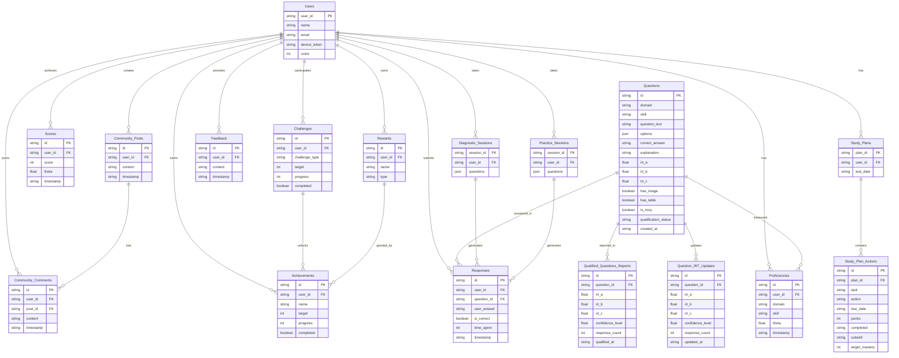

# Updated ERD

<figure><figcaption></figcaption></figure>

Let’s create an **Entity-Relationship Diagram (ERD)** for the **SAT Smart Prep App** by **Learner Labs** using **Mermaid** syntax, reflecting the latest database schema as of the most recent updates. The ERD will include all tables, their fields, and relationships, capturing the structure of the database after incorporating changes such as the **IRT 3-Parameter Logistic (3PL) model** support, **mastery targets**, and new tables like `Question_IRT_Updates` and `Qualified_Questions_Reports`. This ERD will provide a visual representation of the database schema, making it easier to understand the relationships between entities.

***

### ERD in Mermaid Syntax

Below is the ERD for the SAT Smart Prep App, including all tables, their fields, and relationships. You can render this diagram using a Mermaid-compatible tool (e.g., Mermaid Live Editor, GitHub, or a compatible IDE).

***

### Explanation of the ERD

#### Entities and Fields

* **Users**: The central entity, storing user information such as `user_id`, `name`, `email`, `device_token`, and `coins` for gamification.
* **Study\_Plans**: Stores user-specific study plans, linked to `Users` via `user_id`, with a `test_date` for scheduling.
* **Study\_Plan\_Actions**: Represents individual tasks in a study plan, including `task`, `due_date`, `points`, `completed`, `subskill`, and `target_mastery` (added for mastery targets).
* **Proficiencies**: Stores `theta` scores for each user, domain, and subskill, used for progress monitoring and Study Plan task allocation.
* **Questions**: Stores SAT questions, updated with IRT 3PL parameters (`irt_a`, `irt_b`, `irt_c`), metadata (`has_image`, `has_table`, `is_mcq`), and `qualification_status`.
* **Question\_IRT\_Updates**: Stores updated IRT parameters as responses are collected, with `confidence_level` and `response_count` to determine qualification.
* **Qualified\_Questions\_Reports**: Stores weekly reports of questions that have reached the 0.90 confidence threshold for qualification.
* **Responses**: Stores user responses to questions, linked to `Users` and `Questions`, with `time_spent` for pacing analytics.
* **Scores**: Tracks overall scores from full-length tests, used for progress monitoring and score improvement guarantee.
* **Challenges**, **Achievements**, **Rewards**: Support gamification features, linked to `Users`.
* **Feedback**, **Community\_Posts**, **Community\_Comments**: Support user feedback and social features.
* **Diagnostic\_Sessions**, **Practice\_Sessions**: Store sessions for the Diagnostic Test and practice/full-length tests, respectively, with a JSON array of question IDs.

#### Relationships

* **Users** has a one-to-many relationship with `Study_Plans`, `Proficiencies`, `Responses`, `Scores`, `Challenges`, `Achievements`, `Rewards`, `Feedback`, `Community_Posts`, `Community_Comments`, `Diagnostic_Sessions`, and `Practice_Sessions`.
* **Study\_Plans** has a one-to-many relationship with `Study_Plan_Actions`.
* **Questions** has a one-to-many relationship with `Responses`, `Proficiencies` (via responses), `Question_IRT_Updates`, and `Qualified_Questions_Reports`.
* **Challenges** has a one-to-many relationship with `Achievements` (unlocking achievements).
* **Rewards** has a one-to-many relationship with `Achievements` (granted by achievements).
* **Community\_Posts** has a one-to-many relationship with `Community_Comments`.
* **Diagnostic\_Sessions** and **Practice\_Sessions** have a one-to-many relationship with `Responses` (generating responses).

***

### Summary

This ERD provides a comprehensive visual representation of the latest database schema for the SAT Smart Prep App, including all tables, fields, and relationships. It reflects the recent updates for the IRT 3PL model, mastery targets, and new tables for IRT parameter updates and reporting. You can render this diagram in a Mermaid-compatible tool to visualize the database structure. Let me know if you’d like to make any adjustments or explore specific aspects further!
